# Epic: Codex Browser Tool Support via MCP

> **Sub-issues:** TBD (Phases 0–2)

## Goal

After this epic is complete, the Codex agent supports browser tools (form snapshot, click, etc.) via MCP servers — matching the Gemini agent's existing capability. When a caller enables `tools.browser`, the Codex agent writes a `.codex/config.toml` inside the sandbox with MCP server transport credentials, allowing `codex exec` to connect to the browser-tool relay and interact with the user's browser.

## Why

- **Feature parity:** The Gemini agent already supports browser tools via MCP. Codex should offer the same capability so callers can choose either agent without losing functionality.
- **Codex CLI natively supports MCP:** The CLI reads `~/.codex/config.toml` with `[mcp_servers.<name>]` tables for STDIO servers — the same mechanism Gemini uses via `.gemini/settings.json`.
- **Shared snapshot:** The `create-browser-tool-snapshot.mjs` script already installs the Codex CLI and builds the browser-tool MCP server into the sandbox. Only the Codex-specific config file is missing.
- **Minimal delta:** The Gemini implementation is the proven template. This epic mirrors that pattern with TOML instead of JSON.

## Architecture Overview


## Key Design Decisions

### TOML vs JSON

Codex CLI uses `~/.codex/config.toml` (TOML format), while Gemini uses `~/.gemini/settings.json` (JSON). The project already uses `@iarna/toml` in `sandbox-agent/cli` and `sandbox-agent/web`. The `packages/sandbox-agent` package needs this dependency added.

### Config file structure

```toml
[mcp_servers.browser_tool_relay]
command = "node"
args = ["/vercel/sandbox/packages/browser-tool/dist/mcp-server/index.js"]
cwd = "/vercel/sandbox"

[mcp_servers.browser_tool_relay.env]
BROWSER_TOOL_RELAY_URL = ""
BROWSER_TOOL_RELAY_SESSION_ID = ""
BROWSER_TOOL_RELAY_TOKEN = ""
```

The `env` values are empty placeholders in the snapshot. `prepareSandbox` patches them at runtime with actual relay credentials.

### Env passthrough pattern

Matches the Gemini agent exactly: the full `env` record from `CodexAgentOptions` is spread into every MCP server's `env` block. This passes through `BROWSER_TOOL_RELAY_URL`, `BROWSER_TOOL_RELAY_SESSION_ID`, `BROWSER_TOOL_RELAY_TOKEN`, `VERCEL_OIDC_TOKEN`, and any Vercel protection headers.

## Package / Directory Structure

```
packages/sandbox-agent/
├── package.json                            ← EXISTING (add @iarna/toml dep)
├── src/
│   ├── agents/
│   │   ├── codex-agent.ts                  ← EXISTING (add browser tool support)
│   │   ├── codex-agent.test.ts             ← EXISTING (add browser tool tests)
│   │   └── gemini-agent.ts                 ← EXISTING (reference only)
│   └── index.ts                            ← EXISTING (no changes)
packages/web/scripts/
│   └── create-browser-tool-snapshot.mjs    ← EXISTING (add Codex config.toml)
sandbox-agent/web/app/agents/[slug]/snapshots/[snapshotId]/chat/api/
│   └── route.ts                            ← EXISTING (pass browser opts to Codex)
```

## Task Dependency Graph

```mermaid
flowchart LR
    T0["Phase 0: Snapshot — write .codex/config.toml"]
    T1["Phase 1: Agent — browser tool support"]
    T2["Phase 2: Route handler — wire Codex browser opts"]

    T0 --> T1
    T1 --> T2

    style T0 fill:#1a1a2e,stroke:#00d9ff,color:#ffffff
    style T1 fill:#1a1a2e,stroke:#00d9ff,color:#ffffff
    style T2 fill:#1a1a2e,stroke:#00d9ff,color:#ffffff
```



- **Phases are sequential** — Phase 1 needs the snapshot config from Phase 0; Phase 2 needs the agent API from Phase 1.

## Task Status

| Phase | Task File | Status | Description |
|---|---|---|---|
| 0 | [phase-0-snapshot-codex-config.md](./phase-0-snapshot-codex-config.md) | 🔲 TODO | Write `.codex/config.toml` with MCP server config into the snapshot |
| 1 | [phase-1-agent-browser-tool.md](./phase-1-agent-browser-tool.md) | 🔲 TODO | Add `tools.browser` option and `prepareSandbox` TOML patching to Codex agent |
| 2 | [phase-2-route-handler.md](./phase-2-route-handler.md) | 🔲 TODO | Wire browser tool options in the sandbox-agent route handler for Codex |

> **How to work on this epic:** Read this file first to understand the full architecture.
> Then check the status table above. Pick the first `🔲 TODO` task whose dependencies
> (see dependency graph) are `✅ DONE`. Open that task file and follow its instructions.
> When done, update the status in this table to `✅ DONE`.

## Key Conventions

- **Monorepo:** pnpm workspaces, `tsup` for building, `biome` for formatting
- **TypeScript:** `strict`, target `ES2022`, module `ESNext`, moduleResolution `Bundler`
- **Zod version:** `4.3.6`
- **Test runner:** `vitest`
- **TOML library:** `@iarna/toml` (already used in `sandbox-agent/cli` and `sandbox-agent/web`)
- **Pattern to follow:** `gemini-agent.ts` browser tool implementation (the exact same pattern, adapted for TOML)

## Existing Code Reference

| File | Relevance |
|---|---|
| `packages/sandbox-agent/src/agents/gemini-agent.ts` | **Primary reference** — the browser tool pattern to replicate |
| `packages/sandbox-agent/src/agents/gemini-agent.test.ts` | **Test reference** — browser tool test patterns to replicate |
| `packages/sandbox-agent/src/agents/codex-agent.ts` | **Primary file to modify** — add browser tool support |
| `packages/sandbox-agent/src/agents/codex-agent.test.ts` | **Tests to modify** — add browser tool test cases |
| `packages/sandbox-agent/package.json` | **Modify** — add `@iarna/toml` dependency |
| `packages/web/scripts/create-browser-tool-snapshot.mjs` | **Modify** — write `.codex/config.toml` alongside Gemini settings |
| `sandbox-agent/web/app/agents/[slug]/snapshots/[snapshotId]/chat/api/route.ts` | **Modify** — pass browser opts to Codex agent |
| `packages/sandbox-agent/src/chat-run.ts` | `ChatAgent` interface — no changes needed |

## Codex MCP Configuration Reference

### config.toml format (from https://developers.openai.com/codex/mcp/)

```toml
[mcp_servers.server_name]
command = "npx"
args = ["-y", "@upstash/context7-mcp"]

[mcp_servers.server_name.env]
MY_ENV_VAR = "MY_ENV_VALUE"
```

STDIO server fields: `command` (required), `args`, `env`, `env_vars`, `cwd`.

### Sandbox paths

- Config file: `/home/vercel-sandbox/.codex/config.toml`
- MCP server entry point: `/vercel/sandbox/packages/browser-tool/dist/mcp-server/index.js`
- Working directory: `/vercel/sandbox`
