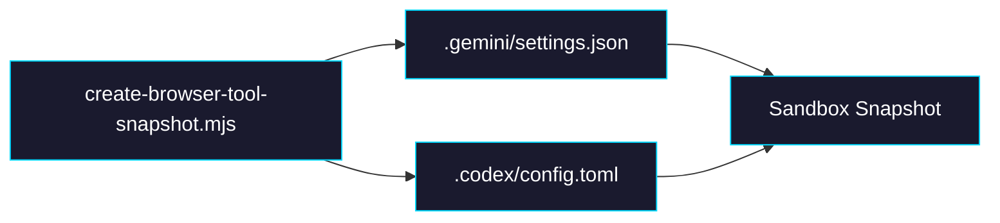

# Phase 0: Snapshot — Write `.codex/config.toml`

> **Epic:** [AGENTS.md](./AGENTS.md)
> **Dependencies:** None
> **Blocks:** Phase 1

## Objective

Add a `.codex/config.toml` file to the browser-tool sandbox snapshot so that the Codex CLI discovers the browser-tool MCP server at startup. The config contains the MCP server command/args with empty `env` placeholders — actual relay credentials are injected at runtime by `prepareSandbox` (Phase 1).

## What You're Building



## Deliverables

### 1. `packages/web/scripts/create-browser-tool-snapshot.mjs`

Add a Codex config write step immediately after the existing Gemini settings write (after line 294). The Codex CLI reads `~/.codex/config.toml`, which in the sandbox maps to `/home/vercel-sandbox/.codex/config.toml`.

**Add after the `console.log("[snapshot] writing gemini settings.json...");` block (lines 288–294):**

```javascript
const codexConfigToml = `[mcp_servers.browser_tool_relay]
command = "node"
args = ["${mcpServerDistPath}"]
cwd = "${SANDBOX_ROOT}"

[mcp_servers.browser_tool_relay.env]
`;

console.log("[snapshot] writing codex config.toml...");
await sandbox.writeFiles([
  {
    path: "/home/vercel-sandbox/.codex/config.toml",
    content: Buffer.from(codexConfigToml),
  },
]);
```

**Key details:**
- Uses the same `mcpServerDistPath` variable already defined on line 271
- Uses the same `SANDBOX_ROOT` variable for `cwd`
- The `[mcp_servers.browser_tool_relay.env]` section is intentionally empty — `prepareSandbox` (Phase 1) will patch in actual relay credentials at runtime
- No TOML library needed here — the config is simple enough to template as a string

### 2. Validation step update

The existing validation step (lines 257–269) already checks `which codex` and `codex --version`. No additional validation is needed for the config file — Codex CLI silently ignores config if MCP servers fail to connect, and the file is a simple static template.

## Verification

1. **Script runs successfully:**
   ```bash
   # This creates a real sandbox snapshot — run only when you have Vercel Sandbox access
   cd packages/web
   node scripts/create-browser-tool-snapshot.mjs
   ```
   Verify the output includes `[snapshot] writing codex config.toml...` between the Gemini settings write and the snapshot creation.

2. **Manual check** — After snapshot creation, reconnect to the sandbox and verify:
   ```bash
   cat /home/vercel-sandbox/.codex/config.toml
   ```
   Should output the TOML config with `mcp_servers.browser_tool_relay` and empty env section.

## Files to Create/Modify

| File | Action |
|---|---|
| `packages/web/scripts/create-browser-tool-snapshot.mjs` | **Modify** — add Codex config.toml write after Gemini settings.json write |

## Done Criteria

- [ ] `create-browser-tool-snapshot.mjs` writes `/home/vercel-sandbox/.codex/config.toml` with `[mcp_servers.browser_tool_relay]` config
- [ ] The TOML references the correct `mcpServerDistPath` and `SANDBOX_ROOT`
- [ ] The `[mcp_servers.browser_tool_relay.env]` section is present (empty — to be patched at runtime)
- [ ] Update the status in [AGENTS.md](./AGENTS.md) to `✅ DONE`
