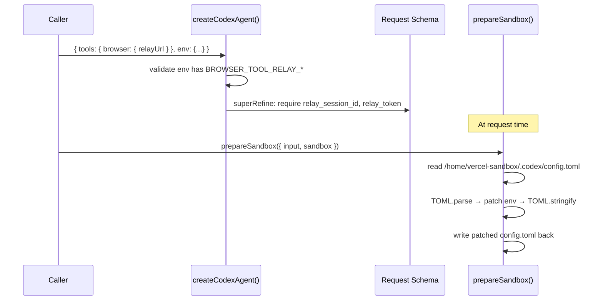

# Phase 1: Agent — Browser Tool Support

> **Epic:** [AGENTS.md](./AGENTS.md)
> **Dependencies:** Phase 0 (snapshot must contain `.codex/config.toml`)
> **Blocks:** Phase 2

## Objective

Add `tools.browser` option to the Codex agent, mirroring the Gemini agent's implementation. When browser is enabled, the agent reads `.codex/config.toml` from the sandbox, patches the MCP server's `env` section with relay credentials, and writes it back. The request schema also gains `relay_session_id` and `relay_token` fields with conditional validation.

## What You're Building



## Deliverables

### 1. `packages/sandbox-agent/package.json` — Add `@iarna/toml` dependency

Add `@iarna/toml` to `dependencies` (not devDependencies — it's needed at runtime for TOML parsing in `prepareSandbox`):

```json
"dependencies": {
  "@iarna/toml": "3.0.0",
  "@vercel/sandbox": "1.6.0",
  "zod": "4.3.6"
}
```

Then run `pnpm install` from the repo root.

### 2. `packages/sandbox-agent/src/agents/codex-agent.ts` — Full implementation

Mirror the Gemini agent's structure. The changes are:

#### a. Add imports

```typescript
import * as TOML from "@iarna/toml";
```

#### b. Add config path constant

```typescript
const CODEX_CONFIG_PATH = "/home/vercel-sandbox/.codex/config.toml";
```

#### c. Add TOML types

```typescript
interface CodexConfig {
  mcp_servers?: Record<string, {
    command?: string;
    args?: string[];
    cwd?: string;
    env?: Record<string, string>;
    [key: string]: unknown;
  }>;
  [key: string]: unknown;
}
```

#### d. Extend `codexRequestSchema`

Add `relay_session_id` and `relay_token` optional fields:

```typescript
const codexRequestSchema = z.object({
  message: z.string().min(1),
  session_id: z.string().min(1).optional(),
  sandbox_id: z.string().min(1).optional(),
  relay_session_id: z.string().min(1).optional(),
  relay_token: z.string().min(1).optional(),
});
```

#### e. Extend `CodexAgentOptions`

Add `tools` option matching Gemini's pattern:

```typescript
export type CodexAgentOptions = {
  snapshotId?: string;
  env?: Record<string, string>;
  tools?: {
    browser?: {
      relayUrl?: string;
    };
  };
};
```

#### f. Add `patchCodexConfigTransportEnv` function

Reads the existing `.codex/config.toml`, merges relay env vars into every MCP server's `env`, and writes it back:

```typescript
async function patchCodexConfigTransportEnv(
  sandbox: Sandbox,
  bridgeTransportEnv: Record<string, string>,
): Promise<void> {
  const buffer = await sandbox.readFileToBuffer({
    path: CODEX_CONFIG_PATH,
  });
  if (!buffer) {
    throw new Error(
      `Codex config not found in sandbox at ${CODEX_CONFIG_PATH}. Ensure the snapshot contains a pre-configured config.toml.`,
    );
  }

  const config: CodexConfig = TOML.parse(
    new TextDecoder().decode(buffer),
  ) as CodexConfig;

  if (config.mcp_servers) {
    for (const server of Object.values(config.mcp_servers)) {
      server.env = { ...server.env, ...bridgeTransportEnv };
    }
  }

  await sandbox.writeFiles([
    {
      path: CODEX_CONFIG_PATH,
      content: Buffer.from(TOML.stringify(config as TOML.JsonMap)),
    },
  ]);
}
```

#### g. Add `createCodexRequestSchema` function

Conditional validation — when browser is enabled, `relay_session_id` and `relay_token` are required:

```typescript
function createCodexRequestSchema(
  browserEnabled: boolean,
): z.ZodType<CodexAgentRequest> {
  if (!browserEnabled) {
    return codexRequestSchema;
  }

  return codexRequestSchema.superRefine((value, ctx) => {
    if (!value.relay_session_id) {
      ctx.addIssue({
        code: "custom",
        path: ["relay_session_id"],
        message: "relay_session_id is required when tools.browser is enabled.",
      });
    }
    if (!value.relay_token) {
      ctx.addIssue({
        code: "custom",
        path: ["relay_token"],
        message: "relay_token is required when tools.browser is enabled.",
      });
    }
  });
}
```

#### h. Add `assertBrowserToolRelayCredentials` function

```typescript
function assertBrowserToolRelayCredentials(
  parsed: CodexAgentRequest,
): asserts parsed is CodexAgentRequest & {
  relay_session_id: string;
  relay_token: string;
} {
  if (!parsed.relay_session_id || !parsed.relay_token) {
    throw new Error("relay_session_id and relay_token are required.");
  }
}
```

#### i. Update `createCodexAgent` function

Add browser tool validation at construction time and implement `prepareSandbox`:

```typescript
export function createCodexAgent(
  options: CodexAgentOptions = {},
): ChatAgent<CodexAgentRequest> {
  const env = options.env ?? {};
  const snapshotId =
    options.snapshotId?.trim() || requiredEnv(env, "SANDBOX_SNAPSHOT_ID");

  const apiKey = env.CODEX_API_KEY?.trim() || env.OPENAI_API_KEY?.trim();
  if (!apiKey) {
    throw new Error(
      "Missing required environment variable: CODEX_API_KEY or OPENAI_API_KEY",
    );
  }

  const browserToolEnabled = options.tools?.browser !== undefined;
  const browserToolRelayUrl = options.tools?.browser?.relayUrl?.trim();
  if (browserToolEnabled) {
    requiredEnv(env, "BROWSER_TOOL_RELAY_URL");
    requiredEnv(env, "BROWSER_TOOL_RELAY_SESSION_ID");
    requiredEnv(env, "BROWSER_TOOL_RELAY_TOKEN");
  }
  if (browserToolEnabled && !browserToolRelayUrl) {
    throw new Error("tools.browser.relayUrl is empty.");
  }

  return {
    requestSchema: createCodexRequestSchema(browserToolEnabled),
    snapshotId,
    async prepareSandbox({ input, sandbox }): Promise<void> {
      if (!browserToolEnabled) {
        return;
      }

      requiredEnv(env, "VERCEL_OIDC_TOKEN");

      assertBrowserToolRelayCredentials(input);

      await patchCodexConfigTransportEnv(sandbox, env);
    },
    createCommand({ input }) {
      // (existing command logic — unchanged)
    },
    createStdoutMapper() {
      return createCodexStdoutMapper();
    },
  };
}
```

### 3. `packages/sandbox-agent/src/agents/codex-agent.test.ts` — Add browser tool tests

Add test cases mirroring `gemini-agent.test.ts`. The key tests to add:

#### a. Does not require relay fields when browser is disabled (existing behavior preserved)

Already covered by existing tests — just verify no regression.

#### b. Requires relay fields when browser tool is configured

```typescript
it("requires relay fields in request schema when browser tool is configured", () => {
  const agent = createCodexAgent({
    snapshotId: "snapshot-codex",
    env: {
      OPENAI_API_KEY: "sk-test-key",
      SANDBOX_SNAPSHOT_ID: "snapshot-codex",
      BROWSER_TOOL_RELAY_URL: "https://relay.example.com/agent-api/relay/",
      BROWSER_TOOL_RELAY_SESSION_ID: "relay-session",
      BROWSER_TOOL_RELAY_TOKEN: "relay-token",
    },
    tools: {
      browser: {
        relayUrl: "https://relay.example.com/agent-api/relay/",
      },
    },
  });
  const parsed = agent.requestSchema.safeParse({ message: "hello" });
  expect(parsed.success).toBe(false);
});
```

#### c. Fails fast when browser transport env is incomplete

```typescript
it("fails fast when browser transport env is incomplete", () => {
  expect(() =>
    createCodexAgent({
      snapshotId: "snapshot-codex",
      env: {
        OPENAI_API_KEY: "sk-test-key",
        SANDBOX_SNAPSHOT_ID: "snapshot-codex",
        BROWSER_TOOL_RELAY_URL: "https://relay.example.com/agent-api/relay/",
      },
      tools: {
        browser: {
          relayUrl: "https://relay.example.com/agent-api/relay/",
        },
      },
    }),
  ).toThrow(/Missing required environment variable/);
});
```

#### d. Patches MCP env with relay credentials

```typescript
it("patches MCP env with relay credentials via prepareSandbox", async () => {
  const configToml = `[mcp_servers.browser_tool_relay]
command = "node"
args = ["./dist/index.js"]
cwd = "/vercel/sandbox"

[mcp_servers.browser_tool_relay.env]
EXISTING_KEY = "existing-value"
`;

  const readFileToBuffer = async () => Buffer.from(configToml);
  let writtenContent = "";
  const writeFiles = async (files: { content: Buffer }[]) => {
    writtenContent = files[0]?.content.toString("utf8") ?? "";
  };
  const sandbox = { readFileToBuffer, writeFiles } as unknown as Sandbox;

  const agent = createCodexAgent({
    snapshotId: "snapshot-codex",
    env: {
      OPENAI_API_KEY: "sk-test-key",
      SANDBOX_SNAPSHOT_ID: "snapshot-codex",
      BROWSER_TOOL_RELAY_URL: "https://relay.example.com/agent-api/relay/",
      BROWSER_TOOL_RELAY_SESSION_ID: "relay-session",
      BROWSER_TOOL_RELAY_TOKEN: "relay-token",
      VERCEL_OIDC_TOKEN: "oidc-token",
    },
    tools: {
      browser: {
        relayUrl: "https://relay.example.com/agent-api/relay/",
      },
    },
  });

  await agent.prepareSandbox({
    input: {
      message: "fill form",
      relay_session_id: "relay-session",
      relay_token: "relay-token",
    },
    sandbox,
  });

  const parsed = TOML.parse(writtenContent);
  const serverEnv = (parsed.mcp_servers as any).browser_tool_relay.env;
  expect(serverEnv).toMatchObject({
    EXISTING_KEY: "existing-value",
    BROWSER_TOOL_RELAY_URL: "https://relay.example.com/agent-api/relay/",
    BROWSER_TOOL_RELAY_SESSION_ID: "relay-session",
    BROWSER_TOOL_RELAY_TOKEN: "relay-token",
    VERCEL_OIDC_TOKEN: "oidc-token",
  });
});
```

## Verification

```bash
# Install new dependency
pnpm install

# Typecheck
pnpm --filter @giselles-ai/sandbox-agent run typecheck

# Run tests
pnpm --filter @giselles-ai/sandbox-agent run test

# Build
pnpm --filter @giselles-ai/sandbox-agent run build

# Format
pnpm --filter @giselles-ai/sandbox-agent run format
```

All commands must pass without errors.

## Files to Create/Modify

| File | Action |
|---|---|
| `packages/sandbox-agent/package.json` | **Modify** — add `@iarna/toml: 3.0.0` to `dependencies` |
| `packages/sandbox-agent/src/agents/codex-agent.ts` | **Modify** — add browser tool support (options, schema, prepareSandbox) |
| `packages/sandbox-agent/src/agents/codex-agent.test.ts` | **Modify** — add browser tool test cases |

## Done Criteria

- [ ] `@iarna/toml` added to `packages/sandbox-agent/package.json` dependencies
- [ ] `CodexAgentOptions` has `tools.browser.relayUrl` option
- [ ] Request schema conditionally requires `relay_session_id` and `relay_token` when browser enabled
- [ ] `prepareSandbox` reads, patches, and writes `.codex/config.toml` with transport env vars
- [ ] Construction fails fast if `BROWSER_TOOL_RELAY_*` env vars are missing when browser enabled
- [ ] All existing tests still pass (no regression)
- [ ] New browser tool tests pass
- [ ] `pnpm --filter @giselles-ai/sandbox-agent run typecheck` passes
- [ ] `pnpm --filter @giselles-ai/sandbox-agent run build` passes
- [ ] Update the status in [AGENTS.md](./AGENTS.md) to `✅ DONE`
