# Phase 2: Route Handler — Wire Codex Browser Options

> **Epic:** [AGENTS.md](./AGENTS.md)
> **Dependencies:** Phase 1 (Codex agent must support `tools.browser`)
> **Blocks:** None

## Objective

Update the sandbox-agent route handler to pass browser tool options to the Codex agent when the environment is configured for browser tools. Currently, the route handler creates the Codex agent with only `snapshotId` and API key env vars. After this phase, it mirrors the Gemini agent path by also passing `tools.browser` and relay env vars.

## What You're Building

```mermaid
flowchart LR
    Route["route.ts<br/>createRouteAgent()"]
    Gemini["createGeminiAgent()<br/>+ tools.browser ✅"]
    Codex["createCodexAgent()<br/>+ tools.browser 🆕"]

    Route --> Gemini
    Route --> Codex

    style Route fill:#1a1a2e,stroke:#00d9ff,color:#ffffff
    style Gemini fill:#1a1a2e,stroke:#00d9ff,color:#ffffff
    style Codex fill:#1a1a2e,stroke:#00d9ff,color:#ffffff
```



## Deliverables

### 1. `sandbox-agent/web/app/agents/[slug]/snapshots/[snapshotId]/chat/api/route.ts`

The `createRouteAgent` function (lines 49–99) currently creates the Codex agent without any browser tool options. Update the Codex branch to mirror the Gemini branch's browser tool wiring.

**Current Codex branch (lines 58–89):**

```typescript
if (agentType === "codex") {
  // ... creates agent with only snapshotId and env (OPENAI_API_KEY, CODEX_API_KEY)
}
```

**Modified Codex branch:**

Add browser tool relay env vars to the `env` object and pass `tools.browser` when the relay URL is configured:

```typescript
if (agentType === "codex") {
  const createCodexAgent = (
    sandboxAgentLib as {
      createCodexAgent?: (options: {
        snapshotId?: string;
        env?: Record<string, string>;
        tools?: {
          browser?: {
            relayUrl?: string;
          };
        };
      }) => ChatAgent<{
        message: string;
        session_id?: string;
        sandbox_id?: string;
        relay_session_id?: string;
        relay_token?: string;
      }>;
    }
  ).createCodexAgent;

  if (!createCodexAgent) {
    throw new Error(
      "Missing required export: createCodexAgent from @giselles-ai/sandbox-agent.",
    );
  }

  const openAiApiKey = process.env.OPENAI_API_KEY?.trim();
  const codexApiKey = process.env.CODEX_API_KEY?.trim();
  const relayUrl = process.env.BROWSER_TOOL_RELAY_URL?.trim();
  const env = {
    ...sharedEnv,
    ...(openAiApiKey ? { OPENAI_API_KEY: openAiApiKey } : {}),
    ...(codexApiKey ? { CODEX_API_KEY: codexApiKey } : {}),
    ...(relayUrl ? { BROWSER_TOOL_RELAY_URL: relayUrl } : {}),
    ...(process.env.BROWSER_TOOL_RELAY_SESSION_ID?.trim()
      ? { BROWSER_TOOL_RELAY_SESSION_ID: process.env.BROWSER_TOOL_RELAY_SESSION_ID.trim() }
      : {}),
    ...(process.env.BROWSER_TOOL_RELAY_TOKEN?.trim()
      ? { BROWSER_TOOL_RELAY_TOKEN: process.env.BROWSER_TOOL_RELAY_TOKEN.trim() }
      : {}),
    ...(process.env.VERCEL_OIDC_TOKEN?.trim()
      ? { VERCEL_OIDC_TOKEN: process.env.VERCEL_OIDC_TOKEN.trim() }
      : {}),
    ...(process.env.VERCEL_PROTECTION_BYPASS?.trim()
      ? { VERCEL_PROTECTION_BYPASS: process.env.VERCEL_PROTECTION_BYPASS.trim() }
      : {}),
    ...(process.env.GISELLE_PROTECTION_PASSWORD?.trim()
      ? { GISELLE_PROTECTION_PASSWORD: process.env.GISELLE_PROTECTION_PASSWORD.trim() }
      : {}),
  };

  return createCodexAgent({
    snapshotId: trimmedSnapshotId,
    env,
    ...(relayUrl ? { tools: { browser: { relayUrl } } } : {}),
  });
}
```

**Key details:**
- Browser tool is enabled only when `BROWSER_TOOL_RELAY_URL` is set in the environment
- All relay-related env vars are passed through the `env` object (same as Gemini)
- The type assertion for `createCodexAgent` is updated to include the `tools` and relay credential fields
- When `BROWSER_TOOL_RELAY_URL` is not set, behavior is identical to before (no `tools` option → browser disabled)

### 2. Request body relay fields

The route handler's `ChatRequestBody` type (line 8) and `parseRequest` function already handle `message`, `session_id`, and `sandbox_id`. The `relay_session_id` and `relay_token` fields need to be passed through from the request body to the agent's `prepareSandbox` input.

Check that the `prepareSandbox` call on line 320–327 passes these fields. Currently it passes:

```typescript
await agent.prepareSandbox({
  input: {
    message: prompt,
    session_id: sessionId,
    sandbox_id: sandboxId,
  },
  sandbox,
});
```

This needs to also include `relay_session_id` and `relay_token` from the request body when present:

```typescript
await agent.prepareSandbox({
  input: {
    message: prompt,
    session_id: sessionId,
    sandbox_id: sandboxId,
    ...(body.relay_session_id ? { relay_session_id: body.relay_session_id } : {}),
    ...(body.relay_token ? { relay_token: body.relay_token } : {}),
  },
  sandbox,
});
```

Also add `relay_session_id` and `relay_token` to the `ChatRequestBody` type:

```typescript
type ChatRequestBody = {
  message?: string;
  session_id?: string;
  sandbox_id?: string;
  agent_type?: string;
  snapshot_id?: string;
  relay_session_id?: string;
  relay_token?: string;
  files?: Array<{...}>;
};
```

## Verification

```bash
# Typecheck the sandbox-agent web app
cd sandbox-agent/web
pnpm exec tsc --noEmit

# Build (if applicable)
pnpm build
```

**Manual test scenarios:**

1. **Without browser tool** — Set `AGENT_TYPE=codex` without `BROWSER_TOOL_RELAY_URL`. POST to the chat endpoint. Codex should run normally without MCP. No regression.

2. **With browser tool** — Set `AGENT_TYPE=codex` with all `BROWSER_TOOL_RELAY_*` env vars. POST with `relay_session_id` and `relay_token` in the body. The agent should patch `.codex/config.toml` and Codex should attempt to connect to the MCP server.

## Files to Create/Modify

| File | Action |
|---|---|
| `sandbox-agent/web/app/agents/[slug]/snapshots/[snapshotId]/chat/api/route.ts` | **Modify** — pass browser tool options and relay env to Codex agent |

## Done Criteria

- [ ] `createRouteAgent` passes `tools.browser` and relay env vars to `createCodexAgent` when `BROWSER_TOOL_RELAY_URL` is set
- [ ] `ChatRequestBody` includes `relay_session_id` and `relay_token` fields
- [ ] `prepareSandbox` input includes relay credentials from the request body
- [ ] Typecheck passes
- [ ] Existing non-browser Codex requests still work (no regression)
- [ ] Update the status in [AGENTS.md](./AGENTS.md) to `✅ DONE`
