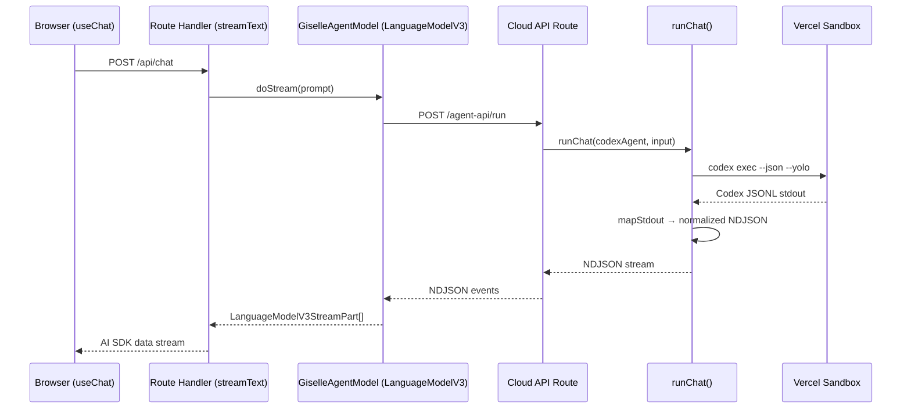
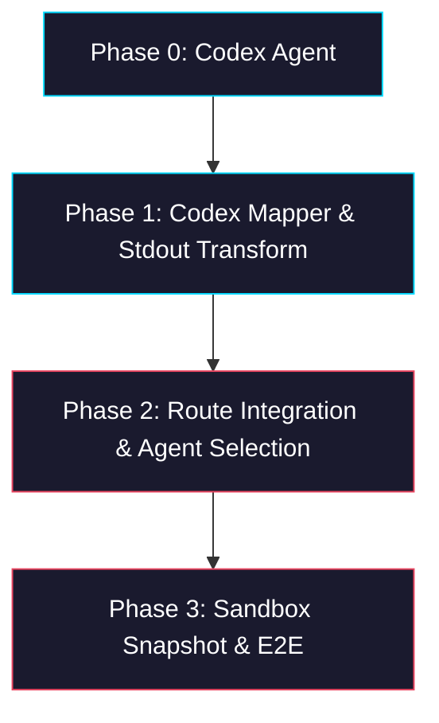

# Epic: Codex CLI Integration

> **Sub-issues:** TBD (Phases 0–3)

## Goal

Add OpenAI Codex CLI as a second agent backend alongside the existing Gemini CLI. After this epic is complete, the system can run either `gemini` or `codex exec --json` inside a Vercel Sandbox, with Codex's JSONL output normalized to the same NDJSON event format the `giselle-provider` already consumes. Agent selection is driven by configuration, requiring zero changes to the frontend or `giselle-provider`.

## Why

- **Model diversity:** Reduces vendor lock-in; lets users choose between Gemini and OpenAI models.
- **Minimal effort:** The existing `ChatAgent` abstraction in `packages/sandbox-agent` is designed for exactly this — adding a new CLI backend is a 2–3 day task.
- **No frontend changes:** By normalizing Codex output to the standard NDJSON format at the sandbox layer, `giselle-provider` and the React UI remain untouched.
- **Future-proof:** The Codex App Server (experimental) can replace the CLI later without changing the integration surface.

## Architecture Overview



## Codex JSONL → Normalized NDJSON Mapping

| Codex JSONL Event | Key Fields | Normalized NDJSON Event | Notes |
|---|---|---|---|
| `session.created` | `id`, `model` | `init` (`session_id`, `modelId`) | Session ID for potential resume |
| `message.output_text.delta` | `delta` | `message` (`role:assistant`, `content`, `delta:true`) | Streaming text delta |
| `message.output_text.done` | `text` | `message` (`role:assistant`, `content`, `delta:false`) | Final text block |
| `response.completed` | `usage` | _(finish signal)_ | Token usage; stream ends |
| `error` | `message` | `stderr` (`content`) | Error events |

> **Note:** The exact Codex JSONL event schema should be verified against the installed CLI version. The `codex exec --json` format may evolve. Run `codex exec --json --help` or test with a simple prompt to capture real output before implementing.

## Package / Directory Structure

```
packages/
├── sandbox-agent/                    ← EXISTING (modified)
│   ├── src/
│   │   ├── agents/
│   │   │   ├── gemini-agent.ts       ← EXISTING (no changes)
│   │   │   ├── gemini-agent.test.ts  ← EXISTING (no changes)
│   │   │   ├── codex-agent.ts        ← NEW (Phase 0)
│   │   │   ├── codex-agent.test.ts   ← NEW (Phase 0)
│   │   │   ├── codex-mapper.ts       ← NEW (Phase 1)
│   │   │   └── codex-mapper.test.ts  ← NEW (Phase 1)
│   │   ├── chat-run.ts              ← EXISTING (modified in Phase 1)
│   │   ├── chat-run.test.ts         ← EXISTING (modified in Phase 1)
│   │   └── index.ts                 ← EXISTING (modified in Phase 0)
│   └── package.json                 ← EXISTING (no changes expected)
├── giselle-provider/                 ← EXISTING (no changes)
├── browser-tool/                     ← EXISTING (no changes)
└── web/                              ← EXISTING (no changes)

sandbox-agent/
└── web/
    └── app/
        └── agents/[slug]/snapshots/[snapshotId]/chat/api/
            └── route.ts              ← EXISTING (modified in Phase 2)
```

## Task Dependency Graph



- **Phases are sequential** — each depends on the previous.
- Phase 0 can be started immediately.

## Task Status

| Phase | Task File | Status | Description |
|---|---|---|---|
| 0 | [phase-0-codex-agent.md](./phase-0-codex-agent.md) | 🔲 TODO | `createCodexAgent()` implementing `ChatAgent` interface |
| 1 | [phase-1-codex-mapper.md](./phase-1-codex-mapper.md) | 🔲 TODO | Codex JSONL → normalized NDJSON mapper + stdout transform in `runChat` |
| 2 | [phase-2-route-integration.md](./phase-2-route-integration.md) | 🔲 TODO | Agent selection in `sandbox-agent/web` route + env configuration |
| 3 | [phase-3-snapshot-e2e.md](./phase-3-snapshot-e2e.md) | 🔲 TODO | Sandbox snapshot with Codex CLI + end-to-end verification |

> **How to work on this epic:** Read this file first to understand the full architecture.
> Then check the status table above. Pick the first `🔲 TODO` task whose dependencies
> (see dependency graph) are `✅ DONE`. Open that task file and follow its instructions.
> When done, update the status in this table to `✅ DONE`.

## Key Conventions

- **Monorepo:** pnpm workspaces, `tsup` for building, `biome` for formatting
- **TypeScript:** `strict`, target `ES2022`, module `ESNext`, moduleResolution `Bundler`
- **Zod version:** `4.3.6` (used throughout the monorepo)
- **Test runner:** `vitest` (v4.0.18)
- **ChatAgent pattern:** Follow `gemini-agent.ts` exactly — same factory shape, same `requiredEnv()` helper, same test patterns
- **Sandbox:** `@vercel/sandbox@1.6.0`
- **Codex CLI flags:** `exec --json --yolo --skip-git-repo-check` (plus `--ephemeral` if supported)

## Existing Code Reference

| File | Relevance |
|---|---|
| `packages/sandbox-agent/src/agents/gemini-agent.ts` | **Primary pattern to follow** — `createCodexAgent` mirrors this |
| `packages/sandbox-agent/src/agents/gemini-agent.test.ts` | Test pattern to follow |
| `packages/sandbox-agent/src/chat-run.ts` | `ChatAgent` interface, `runChat()` — extend with stdout mapper |
| `packages/sandbox-agent/src/index.ts` | Export surface — add `createCodexAgent` |
| `packages/giselle-provider/src/ndjson-mapper.ts` | Target NDJSON event format — Codex mapper must produce this format |
| `packages/giselle-provider/src/types.ts` | `SessionMetadata`, `LiveConnection` types (no changes needed) |
| `sandbox-agent/web/app/agents/[slug]/snapshots/[snapshotId]/chat/api/route.ts` | Route to modify for agent selection |

## Codex CLI Reference

### Key CLI Flags

| Flag | Purpose |
|---|---|
| `exec` | One-shot execution mode (no interactive REPL) |
| `--json` | Machine-readable JSONL output on stdout |
| `--yolo` | Full auto-approval — skip all confirmation prompts |
| `--skip-git-repo-check` | Allow execution in non-git directories |
| `--ephemeral` | Don't persist session files (sandbox is ephemeral anyway) |

### Environment Variables

| Variable | Purpose |
|---|---|
| `CODEX_API_KEY` or `OPENAI_API_KEY` | OpenAI API key for Codex CLI authentication |

### Config File

Codex uses `~/.codex/config.toml` for configuration including MCP servers. For Phase 0, no config file is needed. MCP server configuration can be added later if browser-tool integration is required.
