# Phase 0: Codex Agent Implementation

> **Epic:** [AGENTS.md](./AGENTS.md)
> **Dependencies:** None (can start immediately)
> **Blocks:** Phase 1

## Objective

Create `createCodexAgent()` — a `ChatAgent` factory function that configures the Codex CLI to run inside a Vercel Sandbox. This mirrors `createGeminiAgent()` in structure, schema validation, and test coverage. The agent does NOT handle output mapping (that's Phase 1); it only defines the command, args, env, and request schema.

## What You're Building

```mermaid
flowchart LR
    Factory["createCodexAgent(options)"] --> Agent["ChatAgent&#60;CodexAgentRequest&#62;"]
    Agent --> Schema["requestSchema (Zod)"]
    Agent --> Prepare["prepareSandbox()"]
    Agent --> Command["createCommand()"]
    Command --> CLI["codex exec --json --yolo ..."]

    style Factory fill:#1a1a2e,stroke:#00d9ff,color:#ffffff
    style Agent fill:#1a1a2e,stroke:#00d9ff,color:#ffffff
    style CLI fill:#1a1a2e,stroke:#e94560,color:#ffffff
```



## Deliverables

### 1. `packages/sandbox-agent/src/agents/codex-agent.ts`

Read `packages/sandbox-agent/src/agents/gemini-agent.ts` first and follow its exact pattern.

```typescript
import type { Sandbox } from "@vercel/sandbox";
import { z } from "zod";
import type { ChatAgent } from "../chat-run";

const codexRequestSchema = z.object({
	message: z.string().min(1),
	session_id: z.string().min(1).optional(),
	sandbox_id: z.string().min(1).optional(),
});

export type CodexAgentRequest = z.infer<typeof codexRequestSchema>;

export type CodexAgentOptions = {
	snapshotId?: string;
	env?: Record<string, string>;
};

function requiredEnv(env: Record<string, string>, name: string): string {
	const value = env[name]?.trim();
	if (!value) {
		throw new Error(`Missing required environment variable: ${name}`);
	}
	return value;
}

export function createCodexAgent(
	options: CodexAgentOptions = {},
): ChatAgent<CodexAgentRequest> {
	const env = options.env ?? {};
	const snapshotId =
		options.snapshotId?.trim() || requiredEnv(env, "SANDBOX_SNAPSHOT_ID");

	// Accept either CODEX_API_KEY or OPENAI_API_KEY
	const apiKey =
		env.CODEX_API_KEY?.trim() ||
		env.OPENAI_API_KEY?.trim();
	if (!apiKey) {
		throw new Error(
			"Missing required environment variable: CODEX_API_KEY or OPENAI_API_KEY",
		);
	}

	return {
		requestSchema: codexRequestSchema,
		snapshotId,
		async prepareSandbox(_input: {
			input: CodexAgentRequest;
			sandbox: Sandbox;
		}): Promise<void> {
			// No sandbox preparation needed for initial Codex integration.
			// MCP server config can be added here later if browser-tool is needed.
		},
		createCommand({ input }) {
			const args = [
				"exec",
				"--json",
				"--yolo",
				"--skip-git-repo-check",
				input.message,
			];

			return {
				cmd: "codex",
				args,
				env: {
					OPENAI_API_KEY: apiKey,
				},
			};
		},
	};
}
```

**Key differences from Gemini agent:**

| Aspect | Gemini | Codex |
|---|---|---|
| CLI command | `gemini` | `codex` |
| Sub-command | _(none)_ | `exec` |
| Message arg | `--prompt <msg>` | positional (last arg) |
| Output format | `--output-format stream-json` | `--json` |
| Auto-approve | `--approval-mode yolo` | `--yolo` |
| Session resume | `--resume <id>` | Not supported in `exec` mode |
| API key env | `GEMINI_API_KEY` | `OPENAI_API_KEY` (or `CODEX_API_KEY`) |
| Git check skip | _(not needed)_ | `--skip-git-repo-check` |
| MCP config | `~/.gemini/settings.json` | `~/.codex/config.toml` (future) |
| Browser tool | Full relay integration | Not yet (future phase) |

> **Important:** Verify the exact CLI argument syntax by running `codex exec --help` before implementing. The positional message argument placement may vary.

### 2. `packages/sandbox-agent/src/agents/codex-agent.test.ts`

Follow the pattern from `gemini-agent.test.ts`:

```typescript
import type { Sandbox } from "@vercel/sandbox";
import { describe, expect, it } from "vitest";
import { createCodexAgent } from "./codex-agent";

describe("createCodexAgent", () => {
	it("creates agent with valid env", () => {
		const agent = createCodexAgent({
			snapshotId: "snapshot-codex",
			env: {
				OPENAI_API_KEY: "sk-test-key",
				SANDBOX_SNAPSHOT_ID: "snapshot-codex",
			},
		});
		expect(agent.snapshotId).toBe("snapshot-codex");
		expect(agent.requestSchema.safeParse({ message: "hello" }).success).toBe(
			true,
		);
	});

	it("accepts CODEX_API_KEY as alternative", () => {
		const agent = createCodexAgent({
			snapshotId: "snapshot-codex",
			env: {
				CODEX_API_KEY: "sk-test-key",
				SANDBOX_SNAPSHOT_ID: "snapshot-codex",
			},
		});
		const command = agent.createCommand({ input: { message: "hello" } });
		expect(command.env).toMatchObject({ OPENAI_API_KEY: "sk-test-key" });
	});

	it("throws when no API key is provided", () => {
		expect(() =>
			createCodexAgent({
				snapshotId: "snapshot-codex",
				env: {
					SANDBOX_SNAPSHOT_ID: "snapshot-codex",
				},
			}),
		).toThrow(/Missing required environment variable/);
	});

	it("generates correct command args", () => {
		const agent = createCodexAgent({
			snapshotId: "snapshot-codex",
			env: {
				OPENAI_API_KEY: "sk-test-key",
				SANDBOX_SNAPSHOT_ID: "snapshot-codex",
			},
		});
		const command = agent.createCommand({
			input: { message: "build a form" },
		});
		expect(command.cmd).toBe("codex");
		expect(command.args).toEqual([
			"exec",
			"--json",
			"--yolo",
			"--skip-git-repo-check",
			"build a form",
		]);
		expect(command.env).toMatchObject({
			OPENAI_API_KEY: "sk-test-key",
		});
	});

	it("rejects empty message", () => {
		const agent = createCodexAgent({
			snapshotId: "snapshot-codex",
			env: {
				OPENAI_API_KEY: "sk-test-key",
				SANDBOX_SNAPSHOT_ID: "snapshot-codex",
			},
		});
		expect(agent.requestSchema.safeParse({ message: "" }).success).toBe(false);
	});

	it("prepareSandbox is a no-op", async () => {
		const sandbox = {} as unknown as Sandbox;
		const agent = createCodexAgent({
			snapshotId: "snapshot-codex",
			env: {
				OPENAI_API_KEY: "sk-test-key",
				SANDBOX_SNAPSHOT_ID: "snapshot-codex",
			},
		});
		await expect(
			agent.prepareSandbox({ input: { message: "hello" }, sandbox }),
		).resolves.toBeUndefined();
	});
});
```

### 3. `packages/sandbox-agent/src/index.ts` — Add export

Add the `createCodexAgent` export alongside the existing `createGeminiAgent`:

```typescript
export { createCodexAgent } from "./agents/codex-agent";
```

## Verification

Run these commands from the repo root:

```bash
# 1. Type-check the package
pnpm --filter @giselles-ai/sandbox-agent typecheck

# 2. Run tests (includes new codex-agent tests)
pnpm --filter @giselles-ai/sandbox-agent test

# 3. Build the package
pnpm --filter @giselles-ai/sandbox-agent build

# 4. Ensure full monorepo build still passes
pnpm build
```

All commands should succeed with zero errors.

## Files to Create/Modify

| File | Action |
|---|---|
| `packages/sandbox-agent/src/agents/codex-agent.ts` | **Create** |
| `packages/sandbox-agent/src/agents/codex-agent.test.ts` | **Create** |
| `packages/sandbox-agent/src/index.ts` | **Modify** (add `createCodexAgent` export) |

## Done Criteria

- [ ] `codex-agent.ts` implements `ChatAgent<CodexAgentRequest>` with `createCodexAgent()` factory
- [ ] Request schema validates `message` (required), `session_id` and `sandbox_id` (optional)
- [ ] `createCommand()` produces correct `codex exec --json --yolo --skip-git-repo-check <message>` args
- [ ] API key resolution supports both `CODEX_API_KEY` and `OPENAI_API_KEY`
- [ ] All tests pass: `pnpm --filter @giselles-ai/sandbox-agent test`
- [ ] Typecheck passes: `pnpm --filter @giselles-ai/sandbox-agent typecheck`
- [ ] `createCodexAgent` is exported from `packages/sandbox-agent/src/index.ts`
- [ ] Update the status in [AGENTS.md](./AGENTS.md) to `✅ DONE`
