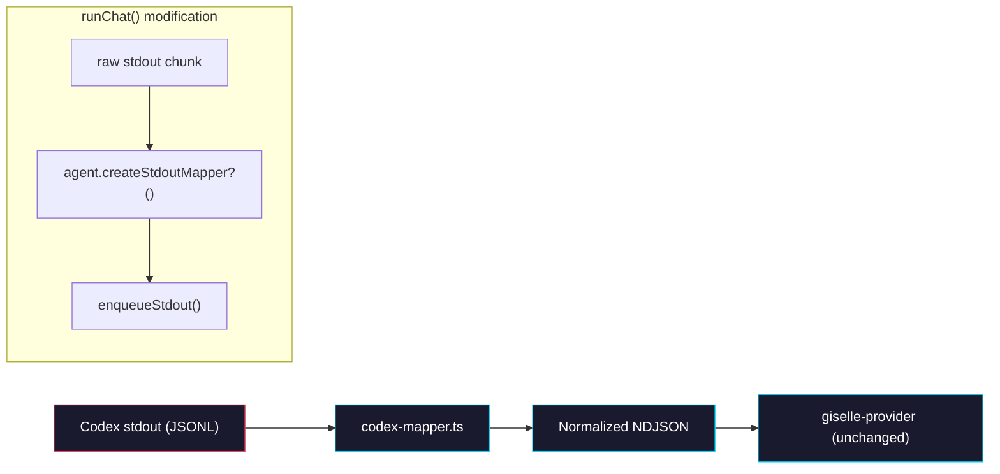

# Phase 1: Codex Mapper & Stdout Transform

> **Epic:** [AGENTS.md](./AGENTS.md)
> **Dependencies:** Phase 0 (Codex agent must exist)
> **Blocks:** Phase 2

## Objective

Create a mapper that converts Codex CLI JSONL output events into the normalized NDJSON format that `giselle-provider/ndjson-mapper.ts` already consumes. Then extend the `ChatAgent` interface and `runChat()` to support an optional stdout transformation, so the Codex agent's raw output is transparently normalized before reaching the client.

## What You're Building



## Deliverables

### 1. `packages/sandbox-agent/src/agents/codex-mapper.ts`

A stateful line-based mapper that:
1. Buffers partial lines (JSONL may arrive in arbitrary chunks)
2. Parses each complete JSON line
3. Maps Codex events to the normalized NDJSON format

> **Before implementing:** Run `codex exec --json "say hello"` locally to capture real JSONL output. Verify the event types and field names below match the actual CLI output. Adjust the mapping table if needed.

```typescript
/**
 * Stateful mapper for Codex CLI JSONL output.
 *
 * Converts Codex events into the normalized NDJSON format that
 * giselle-provider/ndjson-mapper.ts expects.
 */
export type CodexStdoutMapper = {
	/** Feed a raw stdout chunk. Returns normalized NDJSON lines (each ending with \n). */
	push(chunk: string): string[];
	/** Flush any remaining buffered content. */
	flush(): string[];
};

export function createCodexStdoutMapper(): CodexStdoutMapper {
	let buffer = "";

	function mapEvent(event: Record<string, unknown>): Record<string, unknown> | null {
		const type = event.type;

		// session.created → init
		if (type === "session.created") {
			return {
				type: "init",
				session_id: event.id ?? undefined,
				modelId: event.model ?? undefined,
			};
		}

		// message.output_text.delta → message (delta)
		if (type === "message.output_text.delta") {
			return {
				type: "message",
				role: "assistant",
				content: event.delta ?? "",
				delta: true,
			};
		}

		// message.output_text.done → message (full)
		if (type === "message.output_text.done") {
			return {
				type: "message",
				role: "assistant",
				content: event.text ?? "",
				delta: false,
			};
		}

		// response.completed → no direct mapping (stream finishes naturally)
		// Token usage is logged but the stream end is handled by process exit.
		if (type === "response.completed") {
			return null;
		}

		// error → stderr
		if (type === "error") {
			return {
				type: "stderr",
				content: typeof event.message === "string"
					? event.message
					: JSON.stringify(event),
			};
		}

		// Unknown events are silently dropped.
		return null;
	}

	function processLines(text: string): string[] {
		buffer += text;
		const lines = buffer.split("\n");
		// Last element is incomplete if it doesn't end with \n
		buffer = lines.pop() ?? "";

		const results: string[] = [];
		for (const line of lines) {
			const trimmed = line.trim();
			if (trimmed.length === 0) continue;

			let parsed: Record<string, unknown>;
			try {
				parsed = JSON.parse(trimmed);
			} catch {
				continue;
			}

			const mapped = mapEvent(parsed);
			if (mapped) {
				results.push(`${JSON.stringify(mapped)}\n`);
			}
		}
		return results;
	}

	return {
		push(chunk: string): string[] {
			return processLines(chunk);
		},
		flush(): string[] {
			if (buffer.trim().length === 0) return [];
			const remaining = buffer;
			buffer = "";
			return processLines(`${remaining}\n`);
		},
	};
}
```

**Mapping Reference:**

| Codex Event (`type`) | Normalized Event (`type`) | Field Mapping |
|---|---|---|
| `session.created` | `init` | `event.id` → `session_id`, `event.model` → `modelId` |
| `message.output_text.delta` | `message` | `role: "assistant"`, `event.delta` → `content`, `delta: true` |
| `message.output_text.done` | `message` | `role: "assistant"`, `event.text` → `content`, `delta: false` |
| `response.completed` | _(dropped)_ | Stream finishes on process exit |
| `error` | `stderr` | `event.message` → `content` |
| _(other)_ | _(dropped)_ | Silently ignored |

> **Note:** This mapping table is based on the Codex CLI Responses API streaming format. If the actual `codex exec --json` output uses a different event schema (e.g., the App Server protocol with `thread.started`, `item.started`, etc.), update the mapper accordingly. The key principle is: verify with real CLI output first.

### 2. Extend `ChatAgent` with optional `createStdoutMapper`

Modify `packages/sandbox-agent/src/chat-run.ts` to add an optional `createStdoutMapper` method to the `ChatAgent` interface:

```typescript
// Add to the ChatAgent type (after createCommand):
export type StdoutMapper = {
	push(chunk: string): string[];
	flush(): string[];
};

export type ChatAgent<TRequest extends BaseChatRequest> = {
	requestSchema: z.ZodType<TRequest>;
	snapshotId?: string;
	prepareSandbox(input: { input: TRequest; sandbox: Sandbox }): Promise<void>;
	createCommand(input: { input: TRequest }): ChatCommand;
	/** Optional stdout mapper for normalizing CLI output format. */
	createStdoutMapper?(): StdoutMapper;
};
```

### 3. Update `runChat()` to use the mapper

In the `runChat()` function, if the agent provides a `createStdoutMapper`, use it to transform stdout chunks before enqueueing:

Find the stdout `Writable` handler (around line 135–140):

```typescript
// BEFORE:
stdout: new Writable({
    write(chunk, _encoding, callback) {
        const text =
            typeof chunk === "string" ? chunk : chunk.toString("utf8");
        enqueueStdout(text);
        callback();
    },
}),
```

Replace with:

```typescript
// AFTER:
stdout: new Writable({
    write(chunk, _encoding, callback) {
        const text =
            typeof chunk === "string" ? chunk : chunk.toString("utf8");
        if (mapper) {
            for (const line of mapper.push(text)) {
                enqueueStdout(line);
            }
        } else {
            enqueueStdout(text);
        }
        callback();
    },
}),
```

Also add mapper initialization near the top of the async block (after sandbox creation):

```typescript
const mapper = input.agent.createStdoutMapper?.();
```

And flush the mapper in the `finally` block before closing:

```typescript
} finally {
    if (mapper) {
        for (const line of mapper.flush()) {
            enqueueStdout(line);
        }
    }
    input.signal.removeEventListener("abort", onAbort);
    close();
}
```

### 4. Wire the mapper into `codex-agent.ts`

Add the `createStdoutMapper` method to the Codex agent (modify the file created in Phase 0):

```typescript
import { createCodexStdoutMapper } from "./codex-mapper";

// Inside the returned ChatAgent object:
createStdoutMapper() {
    return createCodexStdoutMapper();
},
```

### 5. `packages/sandbox-agent/src/agents/codex-mapper.test.ts`

```typescript
import { describe, expect, it } from "vitest";
import { createCodexStdoutMapper } from "./codex-mapper";

describe("createCodexStdoutMapper", () => {
	it("maps session.created to init", () => {
		const mapper = createCodexStdoutMapper();
		const lines = mapper.push(
			JSON.stringify({ type: "session.created", id: "sess_123", model: "o4-mini" }) + "\n",
		);
		expect(lines).toHaveLength(1);
		const event = JSON.parse(lines[0]);
		expect(event).toEqual({
			type: "init",
			session_id: "sess_123",
			modelId: "o4-mini",
		});
	});

	it("maps message.output_text.delta to message delta", () => {
		const mapper = createCodexStdoutMapper();
		const lines = mapper.push(
			JSON.stringify({ type: "message.output_text.delta", delta: "Hello" }) + "\n",
		);
		expect(lines).toHaveLength(1);
		const event = JSON.parse(lines[0]);
		expect(event).toEqual({
			type: "message",
			role: "assistant",
			content: "Hello",
			delta: true,
		});
	});

	it("maps message.output_text.done to message full", () => {
		const mapper = createCodexStdoutMapper();
		const lines = mapper.push(
			JSON.stringify({ type: "message.output_text.done", text: "Hello world" }) + "\n",
		);
		expect(lines).toHaveLength(1);
		const event = JSON.parse(lines[0]);
		expect(event).toEqual({
			type: "message",
			role: "assistant",
			content: "Hello world",
			delta: false,
		});
	});

	it("maps error to stderr", () => {
		const mapper = createCodexStdoutMapper();
		const lines = mapper.push(
			JSON.stringify({ type: "error", message: "API rate limited" }) + "\n",
		);
		expect(lines).toHaveLength(1);
		const event = JSON.parse(lines[0]);
		expect(event).toEqual({
			type: "stderr",
			content: "API rate limited",
		});
	});

	it("drops response.completed events", () => {
		const mapper = createCodexStdoutMapper();
		const lines = mapper.push(
			JSON.stringify({ type: "response.completed", usage: {} }) + "\n",
		);
		expect(lines).toHaveLength(0);
	});

	it("drops unknown events", () => {
		const mapper = createCodexStdoutMapper();
		const lines = mapper.push(
			JSON.stringify({ type: "some.unknown.event" }) + "\n",
		);
		expect(lines).toHaveLength(0);
	});

	it("handles multiple events in one chunk", () => {
		const mapper = createCodexStdoutMapper();
		const chunk = [
			JSON.stringify({ type: "session.created", id: "s1", model: "o4-mini" }),
			JSON.stringify({ type: "message.output_text.delta", delta: "Hi" }),
		].join("\n") + "\n";
		const lines = mapper.push(chunk);
		expect(lines).toHaveLength(2);
	});

	it("buffers partial lines across chunks", () => {
		const mapper = createCodexStdoutMapper();
		const full = JSON.stringify({ type: "message.output_text.delta", delta: "Hi" });
		// Split in the middle
		const part1 = full.slice(0, 10);
		const part2 = full.slice(10) + "\n";

		expect(mapper.push(part1)).toHaveLength(0);
		const lines = mapper.push(part2);
		expect(lines).toHaveLength(1);
		expect(JSON.parse(lines[0]).content).toBe("Hi");
	});

	it("flush processes remaining buffer", () => {
		const mapper = createCodexStdoutMapper();
		mapper.push(JSON.stringify({ type: "message.output_text.delta", delta: "end" }));
		// No trailing newline — still in buffer
		const lines = mapper.flush();
		expect(lines).toHaveLength(1);
		expect(JSON.parse(lines[0]).content).toBe("end");
	});

	it("flush returns empty when buffer is empty", () => {
		const mapper = createCodexStdoutMapper();
		expect(mapper.flush()).toHaveLength(0);
	});

	it("skips malformed JSON lines", () => {
		const mapper = createCodexStdoutMapper();
		const lines = mapper.push("not json\n");
		expect(lines).toHaveLength(0);
	});
});
```

## Verification

```bash
# 1. Type-check
pnpm --filter @giselles-ai/sandbox-agent typecheck

# 2. Run all tests (both gemini-agent and codex-agent/mapper)
pnpm --filter @giselles-ai/sandbox-agent test

# 3. Build
pnpm --filter @giselles-ai/sandbox-agent build

# 4. Full monorepo build (ensures ChatAgent type change doesn't break consumers)
pnpm build
```

All commands should succeed with zero errors. The existing `gemini-agent` tests must continue to pass (the `createStdoutMapper` is optional, so the Gemini agent doesn't need changes).

## Files to Create/Modify

| File | Action |
|---|---|
| `packages/sandbox-agent/src/agents/codex-mapper.ts` | **Create** |
| `packages/sandbox-agent/src/agents/codex-mapper.test.ts` | **Create** |
| `packages/sandbox-agent/src/chat-run.ts` | **Modify** (add `StdoutMapper` type, optional `createStdoutMapper` to `ChatAgent`, update `runChat`) |
| `packages/sandbox-agent/src/agents/codex-agent.ts` | **Modify** (add `createStdoutMapper` method) |

## Done Criteria

- [ ] `codex-mapper.ts` maps all documented Codex events to normalized NDJSON format
- [ ] `CodexStdoutMapper` handles buffering, partial lines, and flush correctly
- [ ] `ChatAgent` type includes optional `createStdoutMapper?(): StdoutMapper`
- [ ] `runChat()` uses mapper when provided, passes through raw stdout when not
- [ ] `codex-agent.ts` returns `createCodexStdoutMapper()` from `createStdoutMapper()`
- [ ] All existing Gemini tests still pass unchanged
- [ ] All new mapper tests pass
- [ ] `pnpm build` succeeds across the entire monorepo
- [ ] Update the status in [AGENTS.md](./AGENTS.md) to `✅ DONE`
