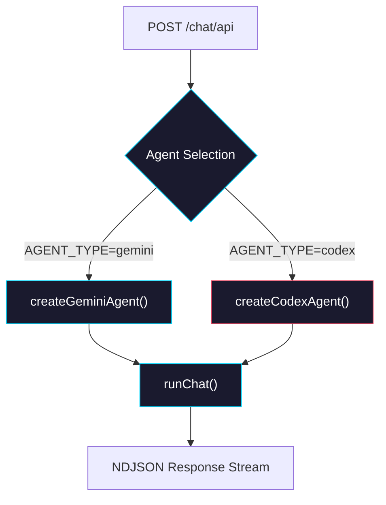

# Phase 2: Route Integration & Agent Selection

> **Epic:** [AGENTS.md](./AGENTS.md)
> **Dependencies:** Phase 1 (mapper + stdout transform must be complete)
> **Blocks:** Phase 3

## Objective

Wire the Codex agent into the `sandbox-agent/web` route handler so that the system can select between Gemini and Codex agents based on configuration. The external API surface remains unchanged — `giselle-provider` and the React frontend require no modifications.

## What You're Building



## Deliverables

### 1. Refactor `sandbox-agent/web` chat route to use `ChatAgent` + `runChat`

The current route at `sandbox-agent/web/app/agents/[slug]/snapshots/[snapshotId]/chat/api/route.ts` inlines all sandbox + CLI logic directly. Refactor it to use the `runChat()` function from `@giselles-ai/sandbox-agent` with agent selection.

**Read these files first:**
- `sandbox-agent/web/app/agents/[slug]/snapshots/[snapshotId]/chat/api/route.ts` — current inline implementation
- `packages/sandbox-agent/src/chat-run.ts` — `runChat()` function
- `packages/sandbox-agent/src/agents/gemini-agent.ts` — `createGeminiAgent()`
- `packages/sandbox-agent/src/agents/codex-agent.ts` — `createCodexAgent()` (from Phase 0)

**Agent selection strategy:**

Use an environment variable `AGENT_TYPE` to select the agent:

```typescript
type AgentType = "gemini" | "codex";

function resolveAgentType(): AgentType {
	const value = process.env.AGENT_TYPE?.trim().toLowerCase();
	if (value === "codex") return "codex";
	return "gemini"; // Default to Gemini for backward compatibility
}
```

**Key considerations for the refactor:**
- The existing route has file upload logic (`incomingFiles`, `sanitizeFilename`) that runs before the CLI command. This must be preserved when using `runChat`.
- The existing route also has post-command logic (find `.pptx` artifacts). Consider moving this to a `ChatAgent` hook or keeping it as route-level logic.
- The `runChat()` function already handles sandbox creation, abort signals, and streaming. Leverage it instead of the inline implementation.
- If `runChat()` cannot accommodate all the route's needs (e.g., file uploads, artifact scanning), the simplest approach is to keep the route mostly as-is but replace the hardcoded `gemini` command with a call to the selected agent's `createCommand()`.

**Minimal change approach (recommended):**

Rather than a full refactor to `runChat()`, make the minimal change: extract agent selection into the existing route structure.

```typescript
// At the top of route.ts:
import {
	createGeminiAgent,
	createCodexAgent,
	type ChatCommand,
} from "@giselles-ai/sandbox-agent";

function resolveAgentType(): "gemini" | "codex" {
	const value = process.env.AGENT_TYPE?.trim().toLowerCase();
	if (value === "codex") return "codex";
	return "gemini";
}

function createAgentCommand(message: string, sessionId?: string): ChatCommand {
	const agentType = resolveAgentType();

	if (agentType === "codex") {
		const agent = createCodexAgent({
			env: {
				OPENAI_API_KEY: process.env.OPENAI_API_KEY ?? "",
				SANDBOX_SNAPSHOT_ID: "unused", // snapshotId comes from URL param
			},
		});
		return agent.createCommand({ input: { message } });
	}

	// Default: Gemini
	const agent = createGeminiAgent({
		env: {
			GEMINI_API_KEY: process.env.GEMINI_API_KEY ?? "",
			SANDBOX_SNAPSHOT_ID: "unused",
		},
	});
	return agent.createCommand({ input: { message, session_id: sessionId } });
}
```

Then in the route's `POST` handler, replace the hardcoded Gemini command:

```typescript
// BEFORE:
await sandbox.runCommand({
    cmd: "gemini",
    args,
    env: { GEMINI_API_KEY: process.env.GEMINI_API_KEY ?? "" },
    ...
});

// AFTER:
const command = createAgentCommand(prompt, sessionId);
// If the agent has a stdout mapper, create it
const mapper = resolveAgentType() === "codex"
    ? createCodexStdoutMapper()
    : null;

await sandbox.runCommand({
    cmd: command.cmd,
    args: command.args,
    env: command.env ?? {},
    stdout: new Writable({
        write(chunk, _encoding, callback) {
            const text = typeof chunk === "string" ? chunk : chunk.toString("utf8");
            if (mapper) {
                for (const line of mapper.push(text)) {
                    enqueueText(line);
                }
            } else {
                enqueueText(text);
            }
            callback();
        },
    }),
    stderr: ..., // unchanged
    signal: abortController.signal,
});

// Flush mapper at the end
if (mapper) {
    for (const line of mapper.flush()) {
        enqueueText(line);
    }
}
```

### 2. Update Gemini settings write for agent-specific config

The current route writes `~/.gemini/settings.json` unconditionally. Skip this when using Codex:

```typescript
if (resolveAgentType() === "gemini") {
    await sandbox.writeFiles([
        {
            path: "/home/vercel-sandbox/.gemini/settings.json",
            content: Buffer.from(
                `{ "security": { "auth": { "selectedType": "gemini-api-key" } } }`,
            ),
        },
    ]);
}
```

### 3. Environment variables

Document the required environment variables:

| Variable | Required For | Default |
|---|---|---|
| `AGENT_TYPE` | Agent selection | `"gemini"` |
| `GEMINI_API_KEY` | Gemini agent | _(required when AGENT_TYPE=gemini)_ |
| `OPENAI_API_KEY` | Codex agent | _(required when AGENT_TYPE=codex)_ |
| `SANDBOX_SNAPSHOT_ID` | Both | _(required)_ |

### 4. Export `ChatCommand` type from `packages/sandbox-agent`

If `ChatCommand` is not already exported, add it to `packages/sandbox-agent/src/index.ts`:

```typescript
export {
	type BaseChatRequest,
	type ChatAgent,
	type ChatCommand,
	type RunChatInput,
	type StdoutMapper,
	runChat,
} from "./chat-run";
```

## Verification

```bash
# 1. Type-check sandbox-agent package
pnpm --filter @giselles-ai/sandbox-agent typecheck

# 2. Type-check sandbox-agent web app
cd sandbox-agent/web && pnpm exec tsc --noEmit

# 3. Run sandbox-agent tests
pnpm --filter @giselles-ai/sandbox-agent test

# 4. Build everything
pnpm build
```

### Manual Verification (if sandbox access is available)

1. Set `AGENT_TYPE=gemini` → verify existing Gemini flow works unchanged
2. Set `AGENT_TYPE=codex` + `OPENAI_API_KEY=sk-...` → verify Codex agent runs and output is normalized NDJSON
3. Confirm that the `giselle-provider` (downstream consumer) processes the normalized Codex output without errors

## Files to Create/Modify

| File | Action |
|---|---|
| `sandbox-agent/web/app/agents/[slug]/snapshots/[snapshotId]/chat/api/route.ts` | **Modify** (add agent selection, use `createCommand()`, add stdout mapper for Codex) |
| `packages/sandbox-agent/src/index.ts` | **Modify** (export `ChatCommand`, `StdoutMapper` types if not already exported) |

## Done Criteria

- [ ] Route handler selects between Gemini and Codex based on `AGENT_TYPE` env var
- [ ] Default agent is Gemini (backward compatible)
- [ ] Codex agent output goes through `createCodexStdoutMapper()` before streaming
- [ ] Gemini settings file only written when agent is Gemini
- [ ] Existing Gemini flow works exactly as before
- [ ] `pnpm build` succeeds across the entire monorepo
- [ ] Update the status in [AGENTS.md](./AGENTS.md) to `✅ DONE`
