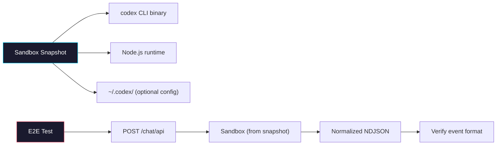

# Phase 3: Sandbox Snapshot & E2E Verification

> **Epic:** [AGENTS.md](./AGENTS.md)
> **Dependencies:** Phase 2 (route integration must be complete)

## Objective

Create a Vercel Sandbox snapshot that has the Codex CLI pre-installed and verify the full end-to-end flow: browser → `giselle-provider` → Cloud API route → Codex CLI in sandbox → normalized NDJSON → streamed response.

## What You're Building

A sandbox snapshot image with the Codex CLI installed and configured, plus end-to-end validation that the entire pipeline works.



## Deliverables

### 1. Codex CLI Sandbox Snapshot

Updated in:

- `packages/web/scripts/create-browser-tool-snapshot.mjs`
- `package.json` (`snapshot:browser-tool:codex`)
- `README.md` (snapshot command docs)

Implementation requirements:

- Add `SNAPSHOT_AGENT=codex` branch support.
- Install `@openai/codex` and validate with `codex --version`.
- Skip writing `/home/vercel-sandbox/.gemini/settings.json` for Codex snapshots.
- Preserve existing browser-tool MCP upload/build path.

Snapshot acceptance checks:

- PASS if script prints `snapshotId` and exits successfully.
- PASS if final validation confirms `codex` is available and returns version.
- PASS if the resulting snapshot can run `codex` in the image.

### 2. Environment configuration documentation

Updated in:

- `packages/web/.env.example`
- `README.md`

Doc expectations:

```bash
AGENT_TYPE=gemini
OPENAI_API_KEY=
CODEX_API_KEY=
GEMINI_API_KEY=
SANDBOX_SNAPSHOT_ID=
```

### 3. E2E verification checklist

Perform these manual checks and record PASS/FAIL:

#### 3a. Standalone Codex CLI test

```bash
# In a local sandbox or development environment:
OPENAI_API_KEY=sk-... codex exec --json --yolo --skip-git-repo-check "Say hello world"
```

PASS criteria:

- Process exits successfully.
- Output is JSONL.
- Output includes `session.created`-style init and message events.
- If event types differ from expected, update:
  - `packages/sandbox-agent/src/agents/codex-mapper.ts`
  - `packages/sandbox-agent/src/agents/codex-mapper.test.ts`

#### 3b. Sandbox execution test

1. Create a sandbox from the Codex snapshot (`snapshotId` from step 1).
2. Run:
   `OPENAI_API_KEY=sk-... codex exec --json --yolo --skip-git-repo-check "What is 2+2?"`
3. Verify JSONL output streams and exits normally.

#### 3c. Route integration test

1. Start `sandbox-agent/web` with `AGENT_TYPE=codex` and `OPENAI_API_KEY=sk-...`.
2. POST to the chat endpoint:
   ```bash
   curl -N -X POST http://localhost:3000/agents/<slug>/snapshots/<snapshotId>/chat/api \
     -H "Content-Type: application/json" \
     -d '{"message": "What is 2+2?"}'
   ```
3. PASS criteria:
   - Content-Type is `application/x-ndjson`.
   - First event is `sandbox`.
   - Followed by normalized `init`.
   - At least one `message` event is present.
   - No raw Codex JSONL leaks when mapped.

#### 3d. Full stack test (via giselle-provider)

1. Start `sandbox-agent/web` as Cloud API and `packages/web` as consumer.
2. Ensure self-hosted env uses `AGENT_TYPE=codex` and `SANDBOX_SNAPSHOT_ID` from phase 3.
3. Send a chat message from UI.
4. PASS criteria:
   - Assistant text streams in the UI.
   - No JSON parse/streaming errors in browser console.
   - No hard failures in server logs.
   - Session ID propagation remains unchanged (`init` event present).

#### 3e. File-upload transform check

1. Include a `files` payload in the chat request.
2. Confirm uploaded file paths are prepended to prompt text (`Available files in the sandbox`).
3. Confirm stream remains mapped (`init`, `message`) and UI behavior is still valid.

### 4. Known limitations to document

- **No session resume:** Codex `exec` mode is one-shot; `session_id` is not used for resume.
- **No browser-tool MCP integration:** The Codex path does not configure `browser_tool_relay`.
- **`BASE_SNAPSHOT_ID` caveat:** If a pre-existing base snapshot is supplied, the script still validates/installs the selected snapshot CLI into the working snapshot.

## Files to Create/Modify

| File | Action |
|---|---|
| `package.json` | **Modify** (add `snapshot:browser-tool:codex`) |
| `packages/web/scripts/create-browser-tool-snapshot.mjs` | **Modify** (Codex install/validation branch + conditional settings file write) |
| `packages/web/.env.example` | **Modify** (document `AGENT_TYPE`, `OPENAI_API_KEY`, `CODEX_API_KEY`) |
| `README.md` | **Modify** (document Codex snapshot command + runtime env vars) |
| `packages/sandbox-agent/src/agents/codex-mapper.ts` | **Modify only if needed** (if CLI event format differs from current mapping) |

## Verification

```bash
# Snapshot creation
pnpm snapshot:browser-tool:codex

# Optional unit verification
pnpm --filter @giselles-ai/sandbox-agent test
```

## Done Criteria

- [x] Snapshot script supports `SNAPSHOT_AGENT=codex`.
- [x] `snapshot:browser-tool:codex` command exists.
- [x] Snapshot with Codex CLI installed is documented.
- [x] Codex CLI verification (`codex --version`, `codex exec --json ...`) is documented.
- [ ] Route correctly streams normalized NDJSON when `AGENT_TYPE=codex`.
- [ ] `giselle-provider` consumer renders streamed Codex text without regression.
- [ ] Codex output mapper has been verified against real output.
- [ ] Environment variables are documented in README/.env example.
- [ ] Known limitations are documented.
