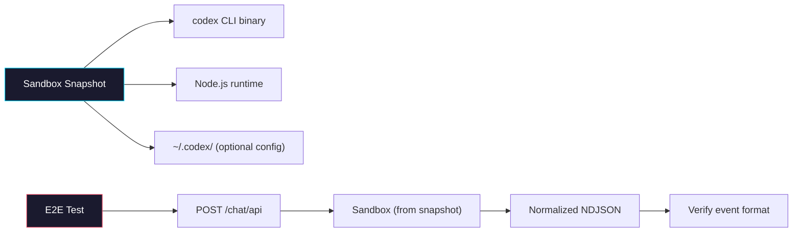

# Phase 3: Sandbox Snapshot & E2E Verification

> **Epic:** [AGENTS.md](./AGENTS.md)
> **Dependencies:** Phase 2 (route integration must be complete)

## Objective

Create a Vercel Sandbox snapshot that has the Codex CLI pre-installed and verify the full end-to-end flow: browser → `giselle-provider` → Cloud API route → Codex CLI in sandbox → normalized NDJSON → streamed response.

## What You're Building

A sandbox snapshot image with the Codex CLI installed and configured, plus end-to-end validation that the entire pipeline works.



## Deliverables

### 1. Codex CLI Sandbox Snapshot

**Option A: npm global install in snapshot build**

Create or extend the snapshot build script to install Codex CLI:

```bash
# Inside the sandbox during snapshot creation:
npm install -g @openai/codex
codex --version  # Verify installation
```

**Option B: Add to existing snapshot build script**

Check existing snapshot scripts in `scripts/` (e.g., `create-browser-tool-snapshot.mjs`). Follow the same pattern to create a Codex-compatible snapshot. The snapshot should include:

- Node.js runtime (already in base image)
- `codex` CLI binary (installed globally via npm)
- Working directory at `/vercel/sandbox`

**Snapshot requirements:**
- `codex --version` runs successfully
- `codex exec --json --yolo --skip-git-repo-check "echo hello"` produces JSONL output
- No pre-configured API key (injected at runtime via env var)

### 2. Environment configuration documentation

Create or update a section in the project README or a `.env.example` file documenting:

```bash
# Agent selection (default: gemini)
AGENT_TYPE=codex

# Codex agent configuration
OPENAI_API_KEY=sk-...

# Sandbox snapshot with Codex CLI installed
SANDBOX_SNAPSHOT_ID=snap_...

# (Existing Gemini config — unchanged)
# GEMINI_API_KEY=...
```

### 3. E2E verification checklist

Perform the following manual verification steps:

#### 3a. Standalone Codex CLI test

```bash
# In a local sandbox or development environment:
OPENAI_API_KEY=sk-... codex exec --json --yolo --skip-git-repo-check "Say hello world"
```

Expected: JSONL output with events like `session.created`, `message.output_text.delta`, `message.output_text.done`, `response.completed`.

Capture this output and verify it matches the mapping table in [AGENTS.md](./AGENTS.md). If event types differ, update the mapper in `codex-mapper.ts`.

#### 3b. Sandbox execution test

1. Create a sandbox from the Codex snapshot
2. Run `codex exec --json --yolo --skip-git-repo-check "What is 2+2?"` inside the sandbox with `OPENAI_API_KEY` env var
3. Verify JSONL output streams correctly through the sandbox

#### 3c. Route integration test

1. Start `sandbox-agent/web` with `AGENT_TYPE=codex` and `OPENAI_API_KEY=sk-...`
2. Send a POST request to the chat API endpoint:
   ```bash
   curl -X POST http://localhost:3000/agents/<slug>/snapshots/<snapshotId>/chat/api \
     -H "Content-Type: application/json" \
     -d '{"message": "What is 2+2?"}'
   ```
3. Verify the response is streaming NDJSON with normalized event types (`init`, `message`, etc.)

#### 3d. Full stack test (via giselle-provider)

1. Start both `sandbox-agent/web` (as Cloud API) and `packages/web` (consumer app)
2. Configure the consumer to point at the Cloud API
3. Use the browser UI to send a message
4. Verify:
   - Text streams correctly in the chat interface
   - No errors in browser console or server logs
   - Session ID is propagated correctly

### 4. Known limitations to document

- **No session resume:** Codex `exec` mode is one-shot; `session_id` is not used for resume (unlike Gemini's `--resume` flag). Multi-turn conversations require the full message history to be sent each time.
- **No browser-tool integration:** The Codex agent does not configure MCP servers for browser-tool relay. This is a future enhancement.
- **No file upload transformation:** The file upload logic in the route prepends file paths to the Gemini prompt. Verify this works for Codex or adjust the prompt format if needed.

## Files to Create/Modify

| File | Action |
|---|---|
| Snapshot build script (TBD) | **Create or Modify** (add Codex CLI installation) |
| `.env.example` or README section | **Modify** (document Codex env vars) |
| `packages/sandbox-agent/src/agents/codex-mapper.ts` | **Modify** (if real CLI output differs from assumed format) |

## Verification

```bash
# Final full build to confirm nothing is broken
pnpm build

# Run all tests
pnpm --filter @giselles-ai/sandbox-agent test
```

## Done Criteria

- [ ] Sandbox snapshot with Codex CLI installed exists and is documented
- [ ] `codex exec --json` runs successfully inside the snapshot
- [ ] Route correctly streams normalized NDJSON when `AGENT_TYPE=codex`
- [ ] `giselle-provider` processes Codex output without errors (text streams to UI)
- [ ] Codex event mapping is verified against real CLI output (mapper updated if needed)
- [ ] Environment variables are documented
- [ ] Known limitations are documented
- [ ] Update the status in [AGENTS.md](./AGENTS.md) to `✅ DONE`
