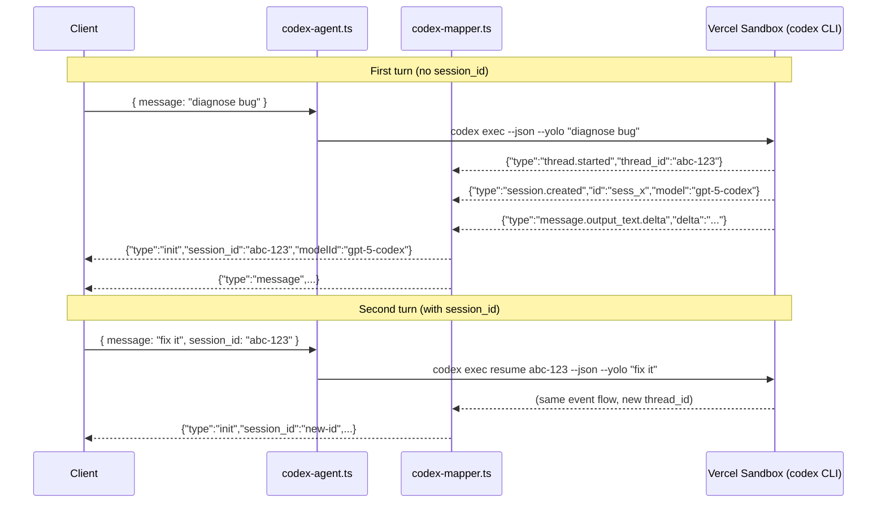

# Epic: Codex Session Resume Support

> **Sub-issues:** TBD (Phases 0–1)

## Goal

After this epic is complete, the Codex agent can resume previous conversation context using `codex exec resume <SESSION_ID>`. When a client provides a `session_id` from a previous turn, the agent passes it to the CLI's `resume` subcommand, allowing the model to reference prior conversation history and file changes within the same sandbox.

## Why

- **Conversation continuity:** Currently every Codex invocation is stateless — the model has zero memory of prior turns. Resume enables multi-turn workflows ("diagnose the bug" → "now fix it").
- **Parity with Gemini agent:** `gemini-agent.ts` already uses `--resume` when `session_id` is provided. Codex should follow the same pattern.
- **Minimal change:** The CLI natively supports `codex exec resume <SESSION_ID>`. Only the arg construction and mapper need updating — no changes to `chat-run.ts`, the provider, or the frontend.
- **Sessions persist in sandbox:** `~/.codex/sessions/` is written to the sandbox filesystem and preserved via snapshots, so resume works naturally across sandbox reuse.

## Architecture Overview



## Key Design Decisions

### `thread_id` vs `session.created.id`

The `codex exec --json` output emits two ID-bearing events:

| Event | Field | Example | Used for |
|---|---|---|---|
| `thread.started` | `thread_id` | `0199a213-81c0-7800-8aa1-bbab2a035a53` | `codex exec resume <SESSION_ID>` |
| `session.created` | `id` | `sess_abc123` | OpenAI API session (not usable for CLI resume) |

**The `thread_id` from `thread.started` is the correct value for `codex exec resume`.** The mapper must extract this and emit it as the `session_id` in the `init` event.

### Event ordering

Real CLI output (verified locally) emits events in this order:
1. `thread.started` — contains `thread_id` (the resumable ID)
2. `session.created` — contains API session `id` and `model`
3. `turn.started`
4. `item.*` / `message.*` events
5. `turn.completed`

The mapper must handle `thread.started` first and use its `thread_id` as the canonical `session_id`. When `session.created` arrives, it should add `modelId` without overwriting the `session_id`.

## Package / Directory Structure

```
packages/sandbox-agent/src/agents/
├── codex-mapper.ts         ← EXISTING (modified in Phase 0)
├── codex-mapper.test.ts    ← EXISTING (modified in Phase 0)
├── codex-agent.ts          ← EXISTING (modified in Phase 1)
└── codex-agent.test.ts     ← EXISTING (modified in Phase 1)
```

No new files. No changes to `chat-run.ts`, `index.ts`, or downstream packages.

## Task Dependency Graph


- **Phases are sequential** — Phase 1 depends on Phase 0 (the mapper must emit the correct `session_id` before the agent can use it).

## Task Status

| Phase | Task File | Status | Description |
|---|---|---|---|
| 0 | [phase-0-mapper-thread-started.md](./phase-0-mapper-thread-started.md) | ✅ DONE | Map `thread.started` to extract resumable `thread_id` as `session_id` |
| 1 | [phase-1-agent-resume.md](./phase-1-agent-resume.md) | 🔲 TODO | Use `codex exec resume <session_id>` when `session_id` is provided |

> **How to work on this epic:** Read this file first to understand the full architecture.
> Then check the status table above. Pick the first `🔲 TODO` task whose dependencies
> (see dependency graph) are `✅ DONE`. Open that task file and follow its instructions.
> When done, update the status in this table to `✅ DONE`.

## Key Conventions

- **Monorepo:** pnpm workspaces, `tsup` for building, `biome` for formatting
- **TypeScript:** `strict`, target `ES2022`, module `ESNext`, moduleResolution `Bundler`
- **Zod version:** `4.3.6`
- **Test runner:** `vitest`
- **Pattern to follow:** `gemini-agent.ts` session resume via `--resume` flag (lines 152–154)

## Existing Code Reference

| File | Relevance |
|---|---|
| `packages/sandbox-agent/src/agents/codex-mapper.ts` | **Primary file to modify** — add `thread.started` handling |
| `packages/sandbox-agent/src/agents/codex-mapper.test.ts` | Tests to update for new event mapping |
| `packages/sandbox-agent/src/agents/codex-agent.ts` | **Primary file to modify** — branch command args for resume |
| `packages/sandbox-agent/src/agents/codex-agent.test.ts` | Tests to update for resume command generation |
| `packages/sandbox-agent/src/agents/gemini-agent.ts` | **Reference** — lines 152–154 show the `--resume` pattern |
| `packages/sandbox-agent/src/chat-run.ts` | `ChatAgent` interface — no changes needed |

## Codex CLI Resume Reference

### CLI syntax

```bash
# First run
codex exec --json --yolo --skip-git-repo-check "diagnose the bug"
# Resume with follow-up prompt
codex exec resume <SESSION_ID> --json --yolo --skip-git-repo-check "fix the bug"
```

### JSON event containing the resumable ID

```json
{"type":"thread.started","thread_id":"0199a213-81c0-7800-8aa1-bbab2a035a53"}
```

Source: https://developers.openai.com/codex/noninteractive/ and https://developers.openai.com/codex/cli/reference/
