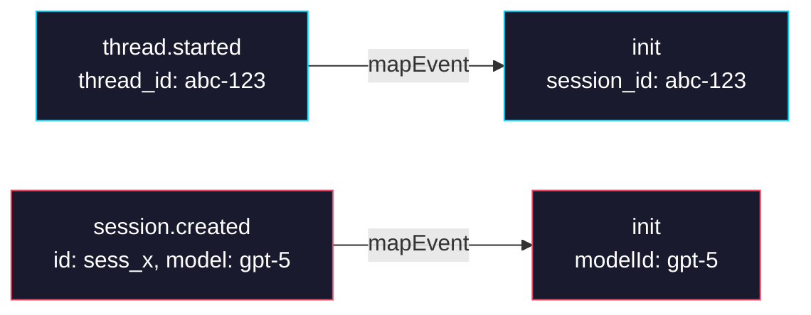

# Phase 0: Mapper — `thread.started` Support

> **Epic:** [AGENTS.md](./AGENTS.md)
> **Dependencies:** None
> **Blocks:** Phase 1

## Objective

Update `codex-mapper.ts` to extract the resumable `thread_id` from the `thread.started` event and emit it as `session_id` in the `init` event. Modify the `session.created` handler to only emit `modelId` (without overwriting the `session_id`). This ensures downstream consumers receive the correct CLI-resumable ID.

## What You're Building



## Deliverables

### 1. `packages/sandbox-agent/src/agents/codex-mapper.ts`

Update the `mapEvent` function with two changes:

**Add `thread.started` handling** (before the existing `session.created` block):

```typescript
if (type === "thread.started") {
	return {
		type: "init",
		session_id: event.thread_id ?? undefined,
	};
}
```

**Modify `session.created` handling** to only emit `modelId` (remove `session_id`):

```typescript
if (type === "session.created") {
	return {
		type: "init",
		modelId: event.model ?? undefined,
	};
}
```

This ensures:
- `thread.started` (arrives first) sets the canonical `session_id` for resume
- `session.created` (arrives second) adds `modelId` without overwriting `session_id`

### 2. `packages/sandbox-agent/src/agents/codex-mapper.test.ts`

Update and add tests:

**Update the existing "maps supported Codex events" test** to include `thread.started` and reflect the changed `session.created` output:

```typescript
it("maps supported Codex events to normalized NDJSON", () => {
	const mapper = createCodexStdoutMapper();
	const events = [
		'{"type":"thread.started","thread_id":"thread-abc-123"}',
		'{"type":"session.created","id":"session-1","model":"codex-small"}',
		'{"type":"message.output_text.delta","delta":"Hello"}',
		'{"type":"message.output_text.done","text":"!"}',
		'{"type":"error","message":"Oops"}',
	].join("\n");

	const lines = mapper.push(`${events}\n`);

	expect(lines).toEqual([
		`${JSON.stringify({
			type: "init",
			session_id: "thread-abc-123",
		})}\n`,
		`${JSON.stringify({
			type: "init",
			modelId: "codex-small",
		})}\n`,
		`${JSON.stringify({
			type: "message",
			role: "assistant",
			content: "Hello",
			delta: true,
		})}\n`,
		`${JSON.stringify({
			type: "message",
			role: "assistant",
			content: "!",
			delta: false,
		})}\n`,
		`${JSON.stringify({ type: "stderr", content: "Oops" })}\n`,
	]);
});
```

**Add a dedicated test for `thread.started`:**

```typescript
it("maps thread.started to init with session_id", () => {
	const mapper = createCodexStdoutMapper();
	const lines = mapper.push(
		'{"type":"thread.started","thread_id":"0199a213-81c0-7800-8aa1-bbab2a035a53"}\n',
	);

	expect(lines).toEqual([
		`${JSON.stringify({
			type: "init",
			session_id: "0199a213-81c0-7800-8aa1-bbab2a035a53",
		})}\n`,
	]);
});
```

**Add a test confirming `session.created` no longer emits `session_id`:**

```typescript
it("maps session.created to init with only modelId", () => {
	const mapper = createCodexStdoutMapper();
	const lines = mapper.push(
		'{"type":"session.created","id":"sess_abc","model":"gpt-5-codex"}\n',
	);

	expect(lines).toEqual([
		`${JSON.stringify({
			type: "init",
			modelId: "gpt-5-codex",
		})}\n`,
	]);
});
```

## Verification

1. **Unit tests:**
   ```bash
   cd packages/sandbox-agent && pnpm test
   ```
   All tests pass, including the updated and new mapper tests.

2. **Type check:**
   ```bash
   cd packages/sandbox-agent && pnpm typecheck
   ```

3. **Manual verification:**
   - Confirm `thread.started` → `init` with `session_id` (no `modelId`)
   - Confirm `session.created` → `init` with `modelId` (no `session_id`)
   - Confirm other events (`message.output_text.delta`, `error`, etc.) are unaffected

## Files to Create/Modify

| File | Action |
|---|---|
| `packages/sandbox-agent/src/agents/codex-mapper.ts` | **Modify** — add `thread.started` handler, remove `session_id` from `session.created` handler |
| `packages/sandbox-agent/src/agents/codex-mapper.test.ts` | **Modify** — update existing test, add 2 new tests |

## Done Criteria

- [ ] `mapEvent` handles `thread.started` → `{ type: "init", session_id: thread_id }`
- [ ] `mapEvent` handles `session.created` → `{ type: "init", modelId: model }` (no `session_id`)
- [ ] Existing mapper tests updated and passing
- [ ] Two new tests added and passing
- [ ] `pnpm test` and `pnpm typecheck` pass in `packages/sandbox-agent`
- [ ] Update the status in [AGENTS.md](./AGENTS.md) to `✅ DONE`
