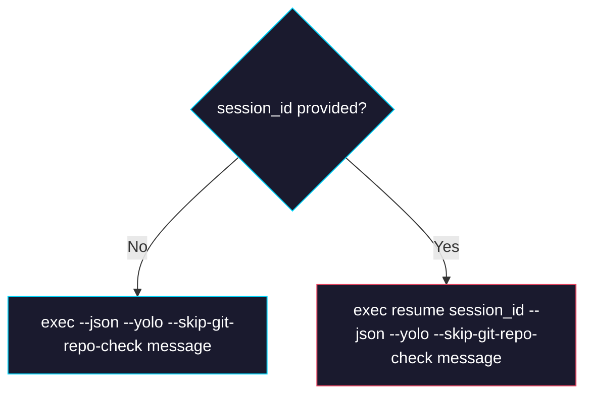

# Phase 1: Agent — `exec resume` Command

> **Epic:** [AGENTS.md](./AGENTS.md)
> **Dependencies:** Phase 0 (mapper emits correct `session_id` from `thread.started`)
> **Blocks:** None

## Objective

Update `codex-agent.ts` so that when the request includes a `session_id`, the agent constructs `codex exec resume <session_id> --json --yolo --skip-git-repo-check <message>` instead of `codex exec --json --yolo --skip-git-repo-check <message>`. This mirrors how `gemini-agent.ts` handles `--resume`.

## What You're Building



## Deliverables

### 1. `packages/sandbox-agent/src/agents/codex-agent.ts`

Update the `createCommand` method to branch on `input.session_id`:

```typescript
createCommand({ input }) {
	const args: string[] = ["exec"];

	if (input.session_id) {
		args.push("resume", input.session_id);
	}

	args.push("--json", "--yolo", "--skip-git-repo-check", input.message);

	return {
		cmd: "codex",
		args,
		env: {
			OPENAI_API_KEY: apiKey,
		},
	};
},
```

This produces:
- **Without `session_id`:** `codex exec --json --yolo --skip-git-repo-check "message"`
- **With `session_id`:** `codex exec resume <session_id> --json --yolo --skip-git-repo-check "message"`

### 2. `packages/sandbox-agent/src/agents/codex-agent.test.ts`

**Update the existing "generates correct command args" test** to explicitly name it as the no-session case (no code change needed, the existing test already covers this path).

**Add a new test for the resume path:**

```typescript
it("generates resume command args when session_id is provided", () => {
	const agent = createCodexAgent({
		snapshotId: "snapshot-codex",
		env: {
			OPENAI_API_KEY: "sk-test-key",
			SANDBOX_SNAPSHOT_ID: "snapshot-codex",
		},
	});
	const command = agent.createCommand({
		input: {
			message: "fix the bug",
			session_id: "0199a213-81c0-7800-8aa1-bbab2a035a53",
		},
	});
	expect(command.cmd).toBe("codex");
	expect(command.args).toEqual([
		"exec",
		"resume",
		"0199a213-81c0-7800-8aa1-bbab2a035a53",
		"--json",
		"--yolo",
		"--skip-git-repo-check",
		"fix the bug",
	]);
	expect(command.env).toMatchObject({
		OPENAI_API_KEY: "sk-test-key",
	});
});
```

**Add a test confirming `session_id` is ignored when undefined:**

```typescript
it("does not use resume when session_id is undefined", () => {
	const agent = createCodexAgent({
		snapshotId: "snapshot-codex",
		env: {
			OPENAI_API_KEY: "sk-test-key",
			SANDBOX_SNAPSHOT_ID: "snapshot-codex",
		},
	});
	const command = agent.createCommand({
		input: { message: "hello", session_id: undefined },
	});
	expect(command.args).toEqual([
		"exec",
		"--json",
		"--yolo",
		"--skip-git-repo-check",
		"hello",
	]);
});
```

## Verification

1. **Unit tests:**
   ```bash
   cd packages/sandbox-agent && pnpm test
   ```
   All tests pass, including the new resume tests.

2. **Type check:**
   ```bash
   cd packages/sandbox-agent && pnpm typecheck
   ```

3. **Manual verification (if sandbox is available):**
   - First turn: Send `{ message: "say hello" }` → receive `init` event with `session_id`
   - Second turn: Send `{ message: "what did you just say?", session_id: "<id from above>", sandbox_id: "<sandbox from above>" }` → Codex references the prior conversation

## Files to Create/Modify

| File | Action |
|---|---|
| `packages/sandbox-agent/src/agents/codex-agent.ts` | **Modify** — branch `createCommand` args on `session_id` |
| `packages/sandbox-agent/src/agents/codex-agent.test.ts` | **Modify** — add 2 new tests for resume args |

## Done Criteria

- [ ] `createCommand` produces `exec resume <id> ...` when `session_id` is provided
- [ ] `createCommand` produces `exec ...` (no resume) when `session_id` is absent
- [ ] Existing agent tests still pass unchanged
- [ ] Two new tests added and passing
- [ ] `pnpm test` and `pnpm typecheck` pass in `packages/sandbox-agent`
- [ ] Update the status in [AGENTS.md](./AGENTS.md) to `✅ DONE`
