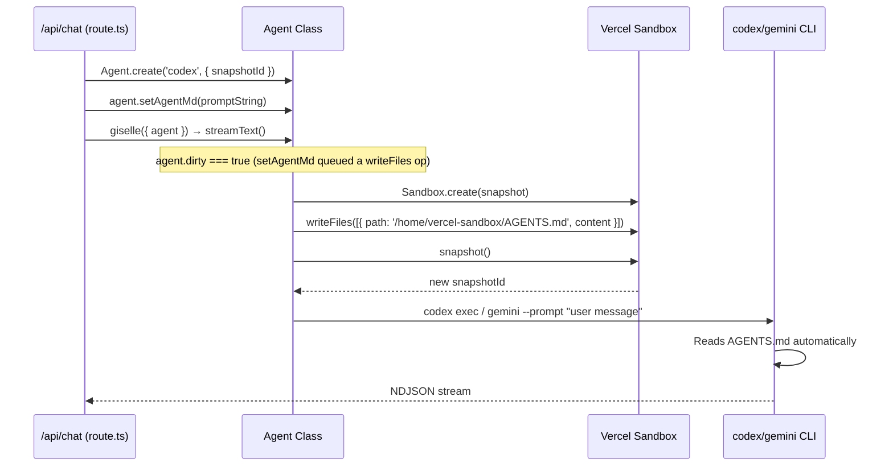
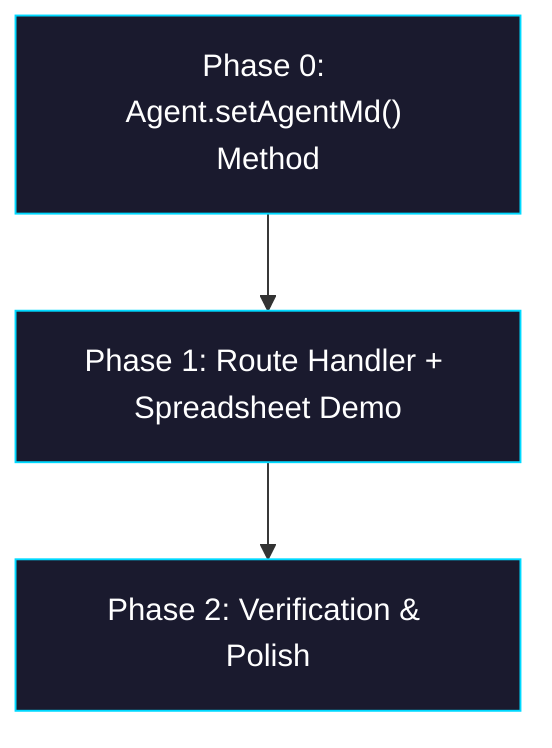

# Epic: Custom Agent Prompt via AGENTS.md Injection

> **Sub-issues:** Phases 0–2

## Goal

After this epic, each demo page can provide a **custom system prompt** to the sandbox agent by calling `agent.setAgentMd()` on the `Agent` class. This injects an `AGENTS.md` file into the sandbox snapshot so the CLI agent (codex/gemini) reads it automatically. Users can then write casual, short prompts (e.g. "直近12ヶ月のzod, yup, joiのnpmダウンロード数をまとめて") instead of verbose instructions that spell out form-filling mechanics.

## Why

- Current suggested prompts in the spreadsheet demo are too verbose — users must describe UI mechanics ("Use the header fields for…", "Use the row fields for…") in every message.
- The sandbox agent (codex/gemini CLI) has no context about the form layout or what tools are available, so users must provide all context themselves.
- Both Codex and Gemini CLI natively read `AGENTS.md` from the working directory, so injecting this file is the most natural way to add persistent context.
- A dedicated `setAgentMd()` method on `Agent` encapsulates this convention — callers don't need to know the file path or encoding details.

## Architecture Overview



## Package / Directory Structure

```
packages/
├── sandbox-agent/
│   └── src/
│       ├── agent.ts               ← MODIFY — add setAgentMd() method
│       ├── agent.test.ts          ← MODIFY — add setAgentMd() tests
│       └── index.ts               ← EXISTING (no changes)
└── web/
    └── app/
        ├── api/chat/
        │   └── route.ts           ← MODIFY — call agent.setAgentMd() in resolveAgent()
        └── demo/spreadsheet/
            ├── page.tsx           ← MODIFY — pass prompt in providerOptions, simplify SUGGESTED_PROMPTS
            └── _components/
                └── chat-panel.tsx ← EXISTING (no changes)
```

## Task Dependency Graph



- **Phases are sequential** — each depends on the previous.

## Task Status

| Phase | Task File | Status | Description |
|---|---|---|---|
| 0 | [phase-0-set-agent-md.md](./phase-0-set-agent-md.md) | ✅ DONE | Add `setAgentMd()` method to `Agent` class + unit tests |
| 1 | [phase-1-integration.md](./phase-1-integration.md) | ✅ DONE | Wire up route handler + spreadsheet demo with custom prompt |
| 2 | [phase-2-verification.md](./phase-2-verification.md) | 🔲 TODO | End-to-end verification and prompt tuning |

> **How to work on this epic:** Read this file first to understand the full architecture.
> Then check the status table above. Pick the first `🔲 TODO` task whose dependencies
> (see dependency graph) are `✅ DONE`. Open that task file and follow its instructions.
> When done, update the status in this table to `✅ DONE`.

## Key Conventions

- **Monorepo:** pnpm workspaces, `tsup` for building, `biome` for formatting
- **TypeScript:** `strict`, target `ES2022`, module `ESNext`, moduleResolution `Bundler`
- **Testing:** `vitest`, mock `@vercel/sandbox` with `vi.mock()` (see `agent.test.ts`)
- **Breaking changes OK:** pre-launch project — prioritize shipping fast
- **Codex CLI:** reads `AGENTS.md` from the working directory automatically
- **Gemini CLI:** reads `AGENTS.md` from the working directory automatically

## Existing Code Reference

| File | Relevance |
|---|---|
| `packages/sandbox-agent/src/agent.ts` | `Agent` class — add `setAgentMd()` here, follows `addFiles()` pattern |
| `packages/sandbox-agent/src/agent.test.ts` | Existing tests — follow mock patterns for new tests |
| `packages/web/app/api/chat/route.ts` | `resolveAgent()` — call `setAgentMd()` when prompt is provided |
| `packages/web/app/demo/spreadsheet/page.tsx` | `SUGGESTED_PROMPTS` and `providerOptions` — consumer |
| `packages/giselle-provider/src/giselle-agent-model.ts` L369–371 | `doStream()` — calls `agent.prepare()` when dirty; no changes needed |
