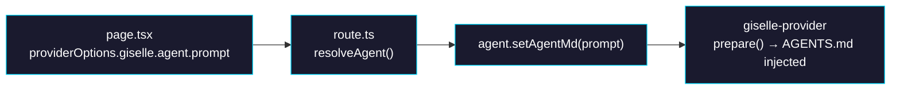

# Phase 1: Route Handler + Spreadsheet Demo Integration

> **Epic:** [AGENTS.md](./AGENTS.md)
> **Dependencies:** Phase 0 (`setAgentMd()` exists on `Agent` class)
> **Blocks:** Phase 2

## Objective

Wire up the full flow: the spreadsheet demo page passes a system prompt via `providerOptions`, the route handler reads it and calls `agent.setAgentMd()`, and the suggested prompts are simplified to casual short phrases.

## What You're Building



## Deliverables

### 1. Modify `packages/web/app/api/chat/route.ts` — `resolveAgent()`

Extract `prompt` from `agentOptions` and call `setAgentMd()`:

**Current code** (L119–135):
```typescript
function resolveAgent(body: ChatRequestBody): Agent {
  const providerOptions = asRecord(body.providerOptions);
  const giselleOptions = asRecord(providerOptions?.giselle);
  const agentOptions = asRecord(giselleOptions?.agent);

  const type =
    resolveAgentType(agentOptions?.type) ??
    resolveAgentType(process.env.AGENT_TYPE);
  const snapshotId =
    resolveAgentSnapshotId(agentOptions?.snapshotId) ??
    resolveAgentSnapshotId(process.env.SANDBOX_SNAPSHOT_ID) ??
    requiredEnv("SANDBOX_SNAPSHOT_ID");

  return Agent.create(type ?? "gemini", {
    snapshotId,
  });
}
```

**Updated code:**
```typescript
function resolveAgent(body: ChatRequestBody): Agent {
  const providerOptions = asRecord(body.providerOptions);
  const giselleOptions = asRecord(providerOptions?.giselle);
  const agentOptions = asRecord(giselleOptions?.agent);

  const type =
    resolveAgentType(agentOptions?.type) ??
    resolveAgentType(process.env.AGENT_TYPE);
  const snapshotId =
    resolveAgentSnapshotId(agentOptions?.snapshotId) ??
    resolveAgentSnapshotId(process.env.SANDBOX_SNAPSHOT_ID) ??
    requiredEnv("SANDBOX_SNAPSHOT_ID");

  const agent = Agent.create(type ?? "gemini", { snapshotId });

  const prompt = asNonEmptyString(agentOptions?.prompt);
  if (prompt) {
    agent.setAgentMd(prompt);
  }

  return agent;
}
```

### 2. Modify `packages/web/app/demo/spreadsheet/page.tsx`

#### 2a. Add system prompt constant

Add before `SUGGESTED_PROMPTS`:

```typescript
const SPREADSHEET_AGENT_PROMPT = `You are a spreadsheet assistant. You fill a web-based spreadsheet form using browser tools.

## Form Layout
- The form has a header row (top) and data rows below.
- Header fields are for column names (e.g., package names, language names).
- Row fields are for data values corresponding to each column.

## How to Work
1. When the user asks you to fill data, first call getFormSnapshot to see the current form fields.
2. Decide how to organize the data into columns and rows based on the user's request.
3. Use executeFormActions to fill the header fields with column names and row fields with data.
4. If the user asks for data you need to look up (e.g., npm downloads, GitHub stats), research it first, then fill the form.

## Important
- Keep column headers short and clear.
- The user will give casual requests. Infer the best spreadsheet layout from context.
- Always fill the form — don't just describe what you would do.`;
```

#### 2b. Pass prompt via providerOptions

**Current:**
```typescript
transport: new DefaultChatTransport({
  api: "/api/chat",
  body: {
    providerOptions: {
      giselle: {
        agent: { type: "codex" },
      },
    },
  },
}),
```

**Updated:**
```typescript
transport: new DefaultChatTransport({
  api: "/api/chat",
  body: {
    providerOptions: {
      giselle: {
        agent: { type: "codex", prompt: SPREADSHEET_AGENT_PROMPT },
      },
    },
  },
}),
```

#### 2c. Simplify SUGGESTED_PROMPTS

**Updated:**
```typescript
const SUGGESTED_PROMPTS = [
  {
    label: "GitHub repo comparison",
    prompt: "next.js, react, svelte のGitHubリポジトリを比較して。コミット数、PR、コントリビューター数など。",
  },
  {
    label: "npm download trends",
    prompt: "直近12ヶ月のzod, yup, joiのnpmダウンロード数をまとめて",
  },
  {
    label: "Language comparison",
    prompt: "Python, JavaScript, Rust を比較して。型システム、パッケージマネージャー、主な用途など。",
  },
] as const;
```

## Verification

1. **TypeScript build:**
   ```bash
   pnpm turbo build --filter=@giselles-ai/web
   ```
2. **Biome lint:**
   ```bash
   pnpm biome check packages/web/app/api/chat/route.ts packages/web/app/demo/spreadsheet/page.tsx
   ```

## Files to Create/Modify

| File | Action |
|---|---|
| `packages/web/app/api/chat/route.ts` | **Modify** — update `resolveAgent()` to call `setAgentMd()` |
| `packages/web/app/demo/spreadsheet/page.tsx` | **Modify** — add prompt constant, pass in providerOptions, simplify suggestions |

## Done Criteria

- [ ] `resolveAgent()` calls `agent.setAgentMd(prompt)` when prompt is provided
- [ ] `SPREADSHEET_AGENT_PROMPT` constant defined in page.tsx
- [ ] Prompt passed via `providerOptions.giselle.agent.prompt`
- [ ] `SUGGESTED_PROMPTS` simplified to casual short phrases
- [ ] Build and lint pass
- [ ] Update the status in [AGENTS.md](./AGENTS.md) to `✅ DONE`
