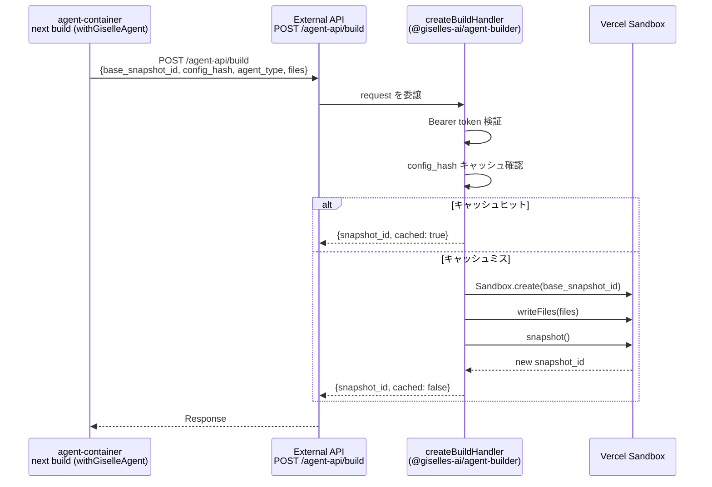

# Epic: External API — `POST /agent-api/build` エンドポイント追加

> **GitHub Discussion:** [#5356](https://github.com/route06/giselle-division/discussions/5356)
> **Amp Thread (agent-container 側の実装):** https://ampcode.com/threads/T-019cbc1b-72f3-7240-a384-a296b760807d

## Goal

External API (studio.giselles.ai) に `POST /agent-api/build` エンドポイントを追加する。`@giselles-ai/agent-builder/next-server` の `createBuildHandler` をインポートしてルートハンドラとしてマウントするだけ。ロジックはすべてライブラリ側に実装済み。

## Why

- agent-container の `withGiselleAgent` プラグインが `next build` 時に `POST /agent-api/build` を呼ぶ
- このエンドポイントが External API 側に存在しないと、ビルド時の snapshot 作成が動作しない
- Vercel Sandbox の snapshot は **Team-scoped** なので、External API 側で Sandbox 操作を行うことが必須

## Architecture Overview



## What `createBuildHandler` Does (Reference)

ライブラリが全ロジックを提供する。External API 側のコードは最小限：

```ts
// ライブラリのインポートとマウントだけ
import { createBuildHandler } from "@giselles-ai/agent-builder/next-server";

const handler = createBuildHandler({
  verifyToken: (token) => token === process.env.AGENT_BUILD_API_TOKEN,
});

// フレームワークに合わせて handler(request) を呼ぶ
```

### Request/Response 仕様

**Request:**
```
POST /agent-api/build
Authorization: Bearer <token>
Content-Type: application/json

{
  "base_snapshot_id": "snap_xxx",
  "config_hash": "a1b2c3d4e5f67890",   // 16-char hex
  "agent_type": "gemini" | "codex",
  "files": [
    { "path": "/home/vercel-sandbox/.codex/AGENTS.md", "content": "..." }
  ]
}
```

**Response (200):**
```json
{ "snapshot_id": "snap_yyy", "cached": true | false }
```

**Error Responses:**
- `401` — `{ "ok": false, "message": "Missing authorization token." }` or `"Invalid authorization token."`
- `400` — `{ "ok": false, "message": "Invalid build request." }`
- `500` — `{ "ok": false, "message": "Build failed: ..." }`

### Handler の型

```ts
type BuildHandlerConfig = {
  verifyToken?: (token: string) => boolean | Promise<boolean>;
};

// createBuildHandler(config?) => (request: Request) => Promise<Response>
```

## Task Status

| Phase | Task File | Status | Description |
|---|---|---|---|
| 0 | [phase-0-add-dependency.md](./phase-0-add-dependency.md) | 🔲 TODO | `@giselles-ai/agent-builder` パッケージを依存に追加 |
| 1 | [phase-1-build-endpoint.md](./phase-1-build-endpoint.md) | 🔲 TODO | `POST /agent-api/build` ルートハンドラ作成 |
| 2 | [phase-2-auth-token.md](./phase-2-auth-token.md) | 🔲 TODO | 認証トークンの環境変数設定と `verifyToken` 実装 |

> **How to work on this epic:** Read this file first to understand the architecture.
> Then check the status table above. Pick the first `🔲 TODO` task whose dependencies
> are `✅ DONE`. Open that task file and follow its instructions.
> When done, update the status in this table to `✅ DONE`.

## Key Points

- **パッケージバージョン:** `@giselles-ai/agent-builder` は agent-container リポジトリで `0.1.0` としてビルド済み。npm publish 済みか、Git 依存で参照するか確認が必要
- **`@vercel/sandbox`:** `createBuildHandler` 内部で使用。External API の依存に既に入っているはず（`/agent-api/run` で使用中）
- **認証:** agent-container 側は `EXTERNAL_AGENT_API_BEARER_TOKEN` 環境変数からトークンを送信。External API 側で同じトークンを検証する
- **既存パターン:** `/agent-api/run` エンドポイントが既に存在するので、同じルーティングパターンに従う

## Existing Code Reference

| Resource | Relevance |
|---|---|
| 既存の `/agent-api/run` ルートハンドラ | 同じディレクトリ・パターンで `/agent-api/build` を追加する |
| `@giselles-ai/agent-builder/next-server` exports | `createBuildHandler`, `BuildHandlerConfig` 型 |
| Amp Thread T-019cbc1b-72f3-7240-a384-a296b760807d | agent-container 側の全実装詳細 |

## Environment Variables

| Variable | Side | Description |
|---|---|---|
| `EXTERNAL_AGENT_API_BEARER_TOKEN` | agent-container (送信側) | Bearer token for build API auth |
| `AGENT_BUILD_API_TOKEN` (or equivalent) | External API (受信側) | 同じトークンを検証に使う。変数名はプロジェクト規約に合わせる |
