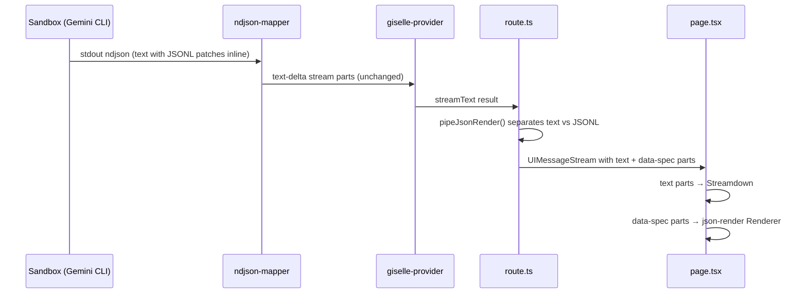
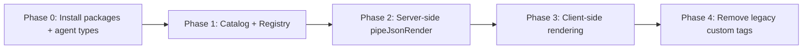

# Epic: json-render Inline Mode Integration

## Goal

After this epic is complete, `@giselles-ai/agent` supports an optional `catalog` field in `defineAgent()`. When a catalog is provided, the agent's system prompt automatically includes json-render inline mode instructions. The chat-app renders AI-generated rich UI components (charts, cards, tables, etc.) via json-render's `Renderer`, while plain text continues to render via Streamdown. The existing custom HTML tag approach (`<bar-chart>`, `<line-chart>`, `<pie-chart>`, `<step>`, `<callout>`) is replaced by catalog-defined components.

## Why

- The current custom tag approach requires manually writing HTML tag documentation in `agentMd` and hand-building parser/renderer code in `chat-message.tsx` for every new component
- json-render provides a catalog system where component definitions (Zod schemas) automatically generate AI prompts — single source of truth
- json-render supports interactive UI (forms, inputs, state binding) which custom HTML tags cannot do
- Inline mode allows mixing regular Markdown text with rich UI blocks naturally

Benefits:
- Adding new UI components requires only a catalog entry + React component — no prompt editing
- Type-safe props via Zod schemas eliminate malformed AI output
- Streaming support via JSONL patches (RFC 6902) with progressive rendering
- Path to interactive/generative UI (forms, dashboards) in future

## Architecture Overview



## Package / Directory Structure

```
packages/agent/src/
├── types.ts                                ← MODIFY: add catalog to AgentConfig/DefinedAgent
├── define-agent.ts                         ← MODIFY: merge catalog.prompt() into agentMd

apps/chat-app/
├── lib/
│   ├── agent.ts                            ← MODIFY: add catalog definition
│   ├── catalog.ts                          ← NEW: json-render catalog
│   └── registry.tsx                        ← NEW: json-render component registry
├── app/
│   ├── api/chat/route.ts                   ← MODIFY: wrap with pipeJsonRender
│   └── (main)/chats/
│       ├── page.tsx                        ← MODIFY: render data-spec parts
│       └── chat-message.tsx                ← MODIFY: remove custom chart/step/callout components
```

## Task Dependency Graph



All phases are sequential — each depends on the previous.

## Task Status

| Phase | Task File | Status | Description |
|---|---|---|---|
| 0 | [phase-0-packages-and-types.md](./phase-0-packages-and-types.md) | ✅ DONE | Install json-render packages, add `catalog` to agent types |
| 1 | [phase-1-catalog-and-registry.md](./phase-1-catalog-and-registry.md) | ✅ DONE | Define catalog with chart components, create React registry |
| 2 | [phase-2-server-pipe.md](./phase-2-server-pipe.md) | ✅ DONE | Wrap UIMessageStream with `pipeJsonRender` in route.ts |
| 3 | [phase-3-client-rendering.md](./phase-3-client-rendering.md) | ✅ DONE | Render data-spec parts via json-render Renderer in page.tsx |
| 4 | [phase-4-remove-legacy-tags.md](./phase-4-remove-legacy-tags.md) | ✅ DONE | Remove old custom tag components and prompt instructions |

> **How to work on this epic:** Read this file first to understand the full architecture.
> Then check the status table above. Pick the first `✅ DONE` task whose dependencies
> (see dependency graph) are `✅ DONE`. Open that task file and follow its instructions.
> When done, update the status in this table to `✅ DONE`.

## Key Conventions

- Monorepo: pnpm workspaces + Turborepo
- Framework: Next.js 16 (App Router, React Compiler enabled)
- AI: `@giselles-ai/agent` + `@giselles-ai/giselle-provider` + Vercel AI SDK (`ai` 6.x)
- Styling: Tailwind CSS v4
- Formatter: Biome
- TypeScript strict mode
- Path alias: `@/*` → project root
- Existing peer deps already satisfied: `react ^19`, `zod ^4`

## Existing Code Reference

| File | Relevance |
|---|---|
| `packages/agent/src/types.ts` | `AgentConfig` and `DefinedAgent` types — add optional `catalog` |
| `packages/agent/src/define-agent.ts` | `defineAgent()` — merge `catalog.prompt({ mode: "inline" })` into `agentMd` |
| `apps/chat-app/lib/agent.ts` | Current agent definition with manual custom tag prompt |
| `apps/chat-app/app/api/chat/route.ts` | Current route using `result.toUIMessageStreamResponse()` |
| `apps/chat-app/app/(main)/chats/page.tsx` | Current message rendering loop with `message.parts` |
| `apps/chat-app/app/(main)/chats/chat-message.tsx` | Custom tag components (StepIndicator, Callout, BarChart, LineChart, PieChart) |
| `packages/giselle-provider/src/ndjson-mapper.ts` | NDJSON → AI SDK stream parts mapper (no changes needed) |

## json-render API Reference

| API | Package | Purpose |
|---|---|---|
| `defineCatalog(schema, config)` | `@json-render/core` | Define components + actions available to AI |
| `catalog.prompt({ mode: "inline" })` | `@json-render/core` | Generate system prompt for inline mode |
| `pipeJsonRender(stream)` | `@json-render/core` | Separate text lines from JSONL patches in UIMessageStream |
| `defineRegistry(catalog, components)` | `@json-render/react` | Map catalog types to React components |
| `useJsonRenderMessage(parts)` | `@json-render/react` | Extract spec from message parts |
| `Renderer` | `@json-render/react` | Render a spec using registry |
| `StateProvider`, `VisibilityProvider` | `@json-render/react` | Required providers for Renderer |
| `schema` | `@json-render/react/schema` | React platform schema for `defineCatalog` |
