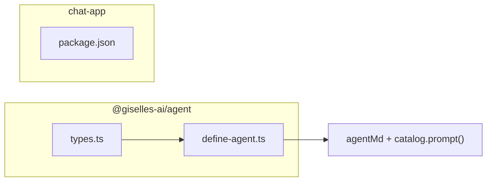

# Phase 0: Install Packages and Extend Agent Types

> **Epic:** [AGENTS.md](./AGENTS.md)
> **Dependencies:** None
> **Blocks:** Phase 1

## Objective

Install `@json-render/core` and `@json-render/react` into the relevant packages, and extend `AgentConfig` / `DefinedAgent` types to accept an optional `catalog`. When `catalog` is provided, `defineAgent()` appends the catalog's inline-mode prompt to `agentMd`.

## What You're Building



## Deliverables

### 1. Install packages

Add `@json-render/core` to `packages/agent/package.json` as a dependency (it is used at runtime to call `catalog.prompt()`).

Add `@json-render/core` and `@json-render/react` to `apps/chat-app/package.json` as dependencies.

Both packages require peer deps `zod ^4` and `react ^19` which are already satisfied.

Run `pnpm install` after editing package.json files.

### 2. `packages/agent/src/types.ts` — Add catalog type

The catalog type from `@json-render/core` exposes a `.prompt()` method. Rather than coupling the agent package to json-render's specific type, define a minimal interface:

```ts
/** Minimal interface for a json-render catalog. */
export type UICatalog = {
	prompt(options?: { mode?: "inline" | "standalone"; customRules?: string[] }): string;
};
```

Add `catalog` as optional to both `AgentConfig` and `DefinedAgent`:

In `AgentConfig`:
```ts
/** Optional json-render catalog for generative UI. */
catalog?: UICatalog;
```

In `DefinedAgent`:
```ts
readonly catalog?: UICatalog;
```

### 3. `packages/agent/src/define-agent.ts` — Merge catalog prompt

When `config.catalog` is provided, append `catalog.prompt({ mode: "inline" })` to the end of `agentMd`:

```ts
export function defineAgent(config: AgentConfig): DefinedAgent {
	const catalogPrompt = config.catalog?.prompt({ mode: "inline" });
	const agentMd = [config.agentMd, catalogPrompt].filter(Boolean).join("\n\n");

	return {
		agentType: config.agentType ?? "gemini",
		agentMd: agentMd || undefined,
		catalog: config.catalog,
		files: config.files ?? [],
		// ... rest unchanged
	};
}
```

### 4. `packages/agent/src/index.ts` — Export new type

Add `UICatalog` to the type exports:

```ts
export type { AgentConfig, AgentFile, AgentSetup, DefinedAgent, UICatalog } from "./types";
```

### 5. Unit test for catalog prompt merging

Create `packages/agent/src/__tests__/define-agent-catalog.test.ts`:

```ts
import { describe, expect, it } from "vitest";
import { defineAgent } from "../define-agent";

describe("defineAgent with catalog", () => {
	it("appends catalog prompt to agentMd", () => {
		const fakeCatalog = {
			prompt: ({ mode }: { mode?: string } = {}) =>
				`[catalog:${mode ?? "standalone"}]`,
		};
		const agent = defineAgent({
			agentMd: "You are a helper.",
			catalog: fakeCatalog,
		});
		expect(agent.agentMd).toContain("You are a helper.");
		expect(agent.agentMd).toContain("[catalog:inline]");
	});

	it("works without catalog", () => {
		const agent = defineAgent({ agentMd: "Base prompt." });
		expect(agent.agentMd).toBe("Base prompt.");
		expect(agent.catalog).toBeUndefined();
	});

	it("works with catalog but no agentMd", () => {
		const fakeCatalog = {
			prompt: () => "[catalog-prompt]",
		};
		const agent = defineAgent({ catalog: fakeCatalog });
		expect(agent.agentMd).toBe("[catalog-prompt]");
	});
});
```

## Verification

1. **Install:** `pnpm install` completes without errors
2. **Typecheck:** `pnpm --filter @giselles-ai/agent typecheck` passes
3. **Typecheck:** `pnpm --filter chat-app typecheck` passes
4. **Tests:** `pnpm --filter @giselles-ai/agent test` passes (including new test)
5. **Build:** `pnpm --filter @giselles-ai/agent build` succeeds

## Files to Create/Modify

| File | Action |
|---|---|
| `packages/agent/package.json` | **Modify** (add `@json-render/core` dependency) |
| `apps/chat-app/package.json` | **Modify** (add `@json-render/core`, `@json-render/react` dependencies) |
| `packages/agent/src/types.ts` | **Modify** (add `UICatalog`, `catalog` field) |
| `packages/agent/src/define-agent.ts` | **Modify** (merge catalog prompt into agentMd) |
| `packages/agent/src/index.ts` | **Modify** (export `UICatalog`) |
| `packages/agent/src/__tests__/define-agent-catalog.test.ts` | **Create** |

## Done Criteria

- [ ] `@json-render/core` is in `packages/agent` dependencies
- [ ] `@json-render/core` and `@json-render/react` are in `apps/chat-app` dependencies
- [ ] `UICatalog` type exists and is exported
- [ ] `defineAgent()` merges `catalog.prompt({ mode: "inline" })` when catalog is provided
- [ ] Unit test covers with-catalog, without-catalog, and catalog-without-agentMd cases
- [ ] All typecheck and test commands pass
- [ ] Update the status in [AGENTS.md](./AGENTS.md) to `✅ DONE`
