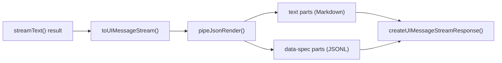

# Phase 2: Server-side pipeJsonRender

> **Epic:** [AGENTS.md](./AGENTS.md)
> **Dependencies:** Phase 1 (catalog and registry created)
> **Blocks:** Phase 3

## Objective

Modify the chat API route to pipe the UIMessageStream through `pipeJsonRender()`, which separates JSONL patch lines from regular text. After this phase, the stream sent to the client contains `data-spec` parts alongside text parts.

## What You're Building



## Deliverables

### 1. `apps/chat-app/app/api/chat/route.ts` — Wrap with pipeJsonRender

Change from direct `toUIMessageStreamResponse()` to `createUIMessageStream` + `pipeJsonRender`:

**Current code (lines 65–99):**
```ts
const result = streamText({
	model: giselle({ agent }),
	messages: await convertToModelMessages(messages),
	tools: browserTools,
	providerOptions: {
		giselle: {
			sessionId,
		},
	},
	abortSignal: request.signal,
});

return result.toUIMessageStreamResponse({
	headers: { ... },
	consumeSseStream: consumeStream,
	generateMessageId: createIdGenerator({ prefix: "msg", size: 16 }),
	onFinish: async ({ messages: generatedMessages }) => { ... },
});
```

**New code:**
```ts
import {
	consumeStream,
	convertToModelMessages,
	createIdGenerator,
	createUIMessageStream,
	createUIMessageStreamResponse,
	type InferUITools,
	streamText,
	type UIMessage,
	validateUIMessages,
} from "ai";
import { pipeJsonRender } from "@json-render/core";

// ... (auth, db logic unchanged) ...

const result = streamText({
	model: giselle({ agent }),
	messages: await convertToModelMessages(messages),
	tools: browserTools,
	providerOptions: {
		giselle: {
			sessionId,
		},
	},
	abortSignal: request.signal,
});

const messageStreamOptions = {
	generateMessageId: createIdGenerator({ prefix: "msg", size: 16 }),
	onFinish: async ({ messages: generatedMessages }) => {
		for (const generatedMessage of generatedMessages) {
			await db
				.insert(message)
				.values({
					publicId: generatedMessage.id,
					chatId: chatRecord.id,
					message: generatedMessage,
				})
				.onConflictDoNothing();
		}
	},
};

const stream = createUIMessageStream({
	execute: async ({ writer }) => {
		writer.merge(
			pipeJsonRender(result.toUIMessageStream(messageStreamOptions)),
		);
	},
});

return createUIMessageStreamResponse({
	stream,
	consumeSseStream: consumeStream,
	headers: {
		"x-giselle-session-id": sessionId,
		"x-giselle-chat-id": chatRecord.publicId,
	},
});
```

Key changes:
- Import `createUIMessageStream` and `createUIMessageStreamResponse` from `ai`
- Import `pipeJsonRender` from `@json-render/core`
- Wrap `result.toUIMessageStream()` with `pipeJsonRender()`
- Move `generateMessageId` and `onFinish` into `toUIMessageStream()` options (UI message generation concerns)
- Keep `consumeSseStream: consumeStream` on `createUIMessageStreamResponse()` (SSE consumption for abort propagation — `toUIMessageStream` does not accept this option)
- Use `createUIMessageStreamResponse()` for the final response with custom headers

> **Important:** Verify the exact API signatures against the installed `ai` and `@json-render/core` versions. The `createUIMessageStream` and `createUIMessageStreamResponse` APIs are from AI SDK v6.x. If the API differs, consult `opensrc/` or `node_modules` for the actual signatures.

## Verification

1. **Typecheck:** `pnpm --filter chat-app typecheck` passes
2. **Build:** `pnpm --filter chat-app build` succeeds
3. **Manual test:** Start the dev server, send a message. Verify:
   - Regular text responses still appear correctly
   - No errors in the server console
   - The stream completes without hanging

## Files to Create/Modify

| File | Action |
|---|---|
| `apps/chat-app/app/api/chat/route.ts` | **Modify** (wrap stream with pipeJsonRender) |

## Done Criteria

- [ ] `pipeJsonRender` wraps the UIMessageStream in route.ts
- [ ] `createUIMessageStream` + `createUIMessageStreamResponse` replace `toUIMessageStreamResponse`
- [ ] Regular text messages still stream correctly
- [ ] `pnpm --filter chat-app typecheck` passes
- [ ] Update the status in [AGENTS.md](./AGENTS.md) to `✅ DONE`
