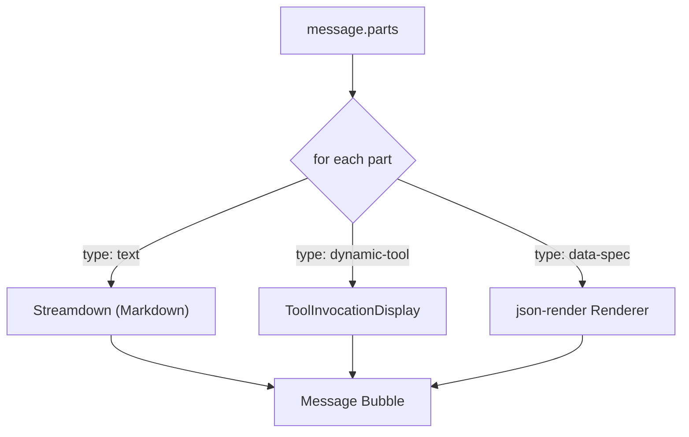

# Phase 3: Client-side Rendering

> **Epic:** [AGENTS.md](./AGENTS.md)
> **Dependencies:** Phase 2 (server pipes data-spec parts)
> **Blocks:** Phase 4

## Objective

Update the chat page to detect `data-spec` parts in messages and render them using json-render's `Renderer` with the registry from Phase 1. Text parts continue to use Streamdown. Both coexist within the same message bubble.

## What You're Building



## Deliverables

### 1. `apps/chat-app/app/(main)/chats/page.tsx` — Add data-spec rendering

Add json-render providers at the top level and handle `data-spec` parts in the message rendering loop.

**Add imports:**
```tsx
import { Renderer, StateProvider, VisibilityProvider } from "@json-render/react";
import { useJsonRenderMessage } from "@json-render/react";
import { registry } from "@/lib/registry";
```

**Wrap the message list with providers** (add `StateProvider` and `VisibilityProvider` around the messages area):

```tsx
<StateProvider initialState={{}}>
	<VisibilityProvider>
		{/* existing messages.map(...) */}
	</VisibilityProvider>
</StateProvider>
```

**Add a new component for rendering json-render specs within a message:**

```tsx
function JsonRenderBlock({ parts }: { parts: Array<{ type: string; [key: string]: unknown }> }) {
	const { spec } = useJsonRenderMessage(parts);
	if (!spec) return null;
	return <Renderer spec={spec} registry={registry} />;
}
```

**In the message rendering loop**, add a case for rendering json-render after the existing parts. The `useJsonRenderMessage` hook extracts the spec from all parts of a single message, so call it once per message rather than per-part:

```tsx
{messages.map((message) => (
	<div key={message.id} className={`rounded-lg px-4 py-3 ${...}`}>
		{message.parts.map((part, i) => {
			if (part.type === "dynamic-tool") {
				return <ToolInvocationDisplay key={...} ... />;
			}
			if (part.type === "text") {
				return <ChatMessage key={...} ... />;
			}
			return null;
		})}
		{/* Render json-render spec if any data-spec parts exist */}
		<JsonRenderBlock parts={message.parts} />
	</div>
))}
```

> **Note:** The exact shape of `message.parts` and how `data-spec` parts appear depends on the AI SDK version. Read the actual type definitions in `node_modules/ai` or `node_modules/@json-render/react` to confirm the `useJsonRenderMessage` input type. It may accept `UIMessage["parts"]` directly or require filtering.

### 2. Verify Streamdown coexistence

Text parts should continue to render via the existing `ChatMessage` component (which uses Streamdown). The json-render `Renderer` only handles the `data-spec` parts. Both should appear within the same message bubble — text first, then the rendered UI block below.

## Verification

1. **Typecheck:** `pnpm --filter chat-app typecheck` passes
2. **Build:** `pnpm --filter chat-app build` succeeds
3. **Manual test — text only:** Send a simple question like "Hello" → verify normal text response renders correctly via Streamdown
4. **Manual test — chart:** Ask "Show me a bar chart of monthly sales: Jan 100, Feb 200, Mar 150, Apr 300" → verify a bar chart renders via json-render Renderer below the text explanation
5. **Manual test — mixed:** Ask "Give me some tips and a pie chart of market share" → verify both text (with Streamdown formatting) and a pie chart appear in the same message
6. **Manual test — streaming:** Verify charts appear progressively as the stream completes, not only after the full response

## Files to Create/Modify

| File | Action |
|---|---|
| `apps/chat-app/app/(main)/chats/page.tsx` | **Modify** (add providers, JsonRenderBlock, data-spec handling) |

## Done Criteria

- [ ] `StateProvider` and `VisibilityProvider` wrap the messages area
- [ ] `JsonRenderBlock` component extracts spec via `useJsonRenderMessage` and renders via `Renderer`
- [ ] Text parts still render via Streamdown
- [ ] Charts render correctly when AI generates json-render JSONL patches
- [ ] `pnpm --filter chat-app typecheck` passes
- [ ] Update the status in [AGENTS.md](./AGENTS.md) to `✅ DONE`
