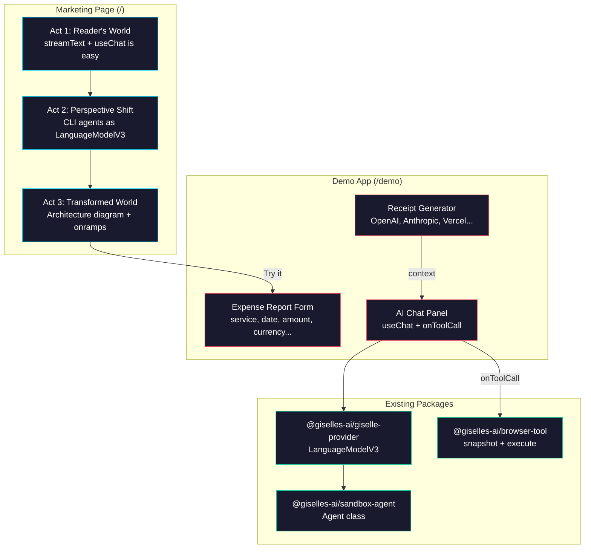
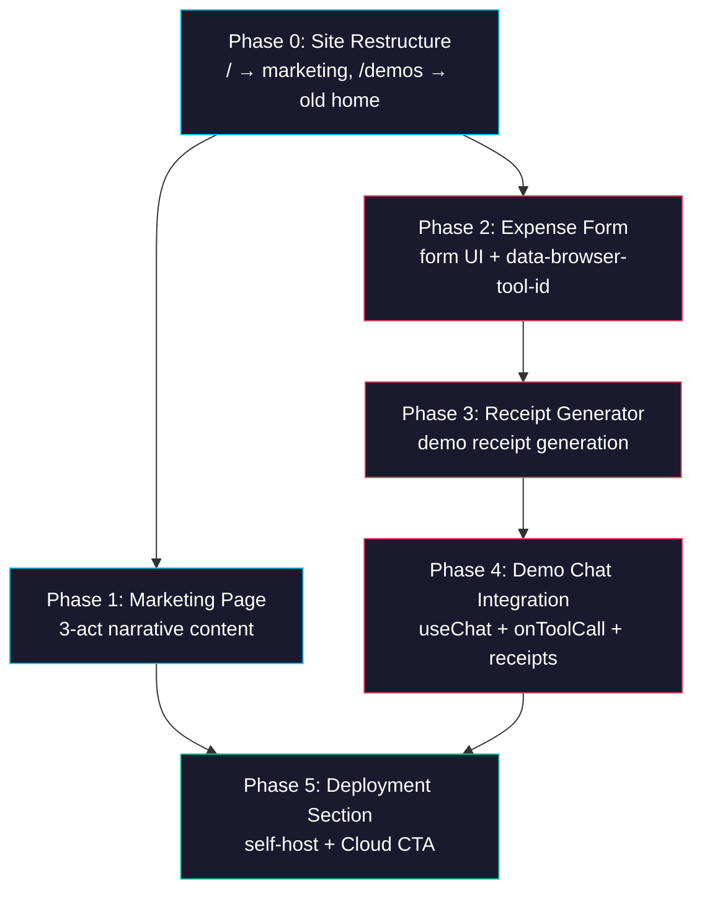

# Epic: Marketing Page — Narrative Landing Page + Expense Report Demo for OSS Launch

> **GitHub Discussion:** [#5353](https://github.com/route06/giselle-division/discussions/5353)

## Goal

Build a **narrative-driven marketing page** and an **expense report demo app** in `packages/web` for the public launch of three packages: `@giselles-ai/sandbox-agent`, `@giselles-ai/browser-tool`, and `@giselles-ai/giselle-provider`.

After this epic is complete, the site has:
- `/` — Marketing page (3-act narrative structure + link to live demo)
- `/demo` — Expense report demo app (form + AI chat + demo receipt generation)
- Existing demo pages — `/gemini-browser-tool`, `/codex-browser-tool`, etc. remain as-is

## Why

- A page that lists features is dead on arrival. We need to tell the project's "who" — a bridge between existing ecosystems, not a new framework
- Developers need a working demo to make it real. Expense reporting is a universal pain — everyone knows the tedium of transcribing PDF invoices into forms
- The contrast between the complex machinery underneath and a 20-line `route.ts` using `useChat()` is the transformation point

## Narrative Design Principles

Based on [writing-narrative-pages](../../.agents/skills/writing-narrative-pages):

1. **Disclose, Don't Explain** — Reveal vision and stance, not feature lists
2. **Transform, Don't Persuade** — Change the reader's understanding, don't argue them into agreement
3. **Expand Autonomy** — Show self-hosting first, respect the reader's independence

## Architecture Overview



## Directory Structure

```
packages/web/
├── app/
│   ├── page.tsx                          ← MODIFY (replace with marketing page)
│   ├── layout.tsx                        ← MODIFY (update metadata, font)
│   ├── globals.css                       ← MODIFY (add marketing styles)
│   ├── demo/                             ← NEW
│   │   └── page.tsx                      ← NEW (expense report demo)
│   ├── demos/                            ← NEW
│   │   └── page.tsx                      ← NEW (old home content moved here)
│   ├── api/chat/route.ts                 ← EXISTING (used as-is)
│   ├── gemini-browser-tool/              ← EXISTING
│   ├── codex-browser-tool/               ← EXISTING
│   └── ...                               ← EXISTING
└── package.json                          ← EXISTING (no new dependencies needed)
```

## Task Dependency Graph



- **Phase 0** is the prerequisite for everything (routing restructure)
- **Phase 1** and **Phase 2** can run in parallel after Phase 0
- **Phase 3** depends on Phase 2 (form must exist first)
- **Phase 4** depends on Phase 3 (receipts must exist first)
- **Phase 5** depends on both Phase 1 and Phase 4 (placed at page bottom)

## Task Status

| Phase | Task File | Status | Description |
|---|---|---|---|
| 0 | [phase-0-site-restructure.md](./phase-0-site-restructure.md) | ✅ DONE | Move `/` to `/demos`, set up marketing skeleton at `/` |
| 1 | [phase-1-marketing-narrative.md](./phase-1-marketing-narrative.md) | ✅ DONE | 3-act narrative content + code snippets |
| 2 | [phase-2-expense-form.md](./phase-2-expense-form.md) | 🔲 TODO | Expense report form UI with `data-browser-tool-id` attributes |
| 3 | [phase-3-receipt-generator.md](./phase-3-receipt-generator.md) | 🔲 TODO | Demo receipt generation (OpenAI, Anthropic, Vercel, Google Cloud, GitHub) |
| 4 | [phase-4-demo-chat.md](./phase-4-demo-chat.md) | 🔲 TODO | AI chat panel + onToolCall for form autofill |
| 5 | [phase-5-deployment-section.md](./phase-5-deployment-section.md) | 🔲 TODO | Self-host / Deploy Button / Cloud CTA |

> **How to work on this epic:** Read this file first to understand the full architecture.
> Then check the status table above. Pick the first `🔲 TODO` task whose dependencies
> (see dependency graph) are `✅ DONE`. Open that task file and follow its instructions.
> When done, update the status in this table to `✅ DONE`.

## Key Conventions

- **Monorepo:** pnpm workspaces, `tsup` for building, `biome` for formatting
- **Framework:** Next.js 16, React 19, Tailwind CSS 4
- **AI SDK:** `ai@6.0.68`, `@ai-sdk/react@3.0.70`
- **Existing dark theme:** `radial-gradient` background, `slate` color palette, `IBM Plex Sans` font
- **browser-tool integration:** `data-browser-tool-id` attribute identifies fields; `snapshot()` / `execute()` operate on the DOM
- **Chat API:** `/api/chat` route uses `streamText()` + `giselle()` provider

## Existing Code Reference

| File | Relevance |
|---|---|
| `packages/web/app/page.tsx` | Current home page — move to `/demos` |
| `packages/web/app/layout.tsx` | Root layout — update metadata |
| `packages/web/app/globals.css` | Dark theme styles — add marketing styles |
| `packages/web/app/api/chat/route.ts` | Chat API — used by demo; also quoted as code snippet on marketing page |
| `packages/web/app/gemini-browser-tool/page.tsx` | Existing demo — reference for `DemoForm`, `useChat`, `onToolCall` patterns |
| `packages/web/app/codex-browser-tool/page.tsx` | Existing demo — reference for Codex `useChat` pattern |
| `packages/browser-tool/src/dom/snapshot.ts` | `snapshot()` implementation — how `data-browser-tool-id` works |
| `packages/browser-tool/src/dom/executor.ts` | `execute()` implementation — `setNativeValue` + event dispatch |
| `packages/giselle-provider/src/index.ts` | `giselle()` factory — quoted in marketing page code example |
| `packages/sandbox-agent/src/agent.ts` | `Agent.create()` — quoted in code examples |

## Demo App Design (from Discussion #5353)

### Expense Report Form Fields

| Field | Type | Pre-filled | Notes |
|---|---|---|---|
| Service | select | ✅ (OpenAI) | OpenAI, Anthropic, Vercel, Google Cloud, GitHub |
| Date | date | Last month's date | AI infers from receipt |
| Amount | text | Empty | AI transcribes from receipt |
| Currency | select | USD | USD, JPY, EUR |
| Invoice Number | text | Empty | AI transcribes from receipt |
| Account Category | select | Communication | Communication, R&D, Cloud Infrastructure |
| Memo | textarea | Empty | AI infers and fills |

### Demo Receipt Data Generation

When a user selects services and clicks "Generate":
- Amount: randomized within a plausible range per service (OpenAI: $100–$500, Anthropic: $80–$400, etc.)
- Date: random date within the current month
- Invoice Number: unique `INV-XXXXX` format
- Currency: USD for all services

### What We Intentionally Don't Say

- No comparisons with other frameworks
- No future roadmap
- No exhaustive use-case lists (imply infinity from one concrete example)
