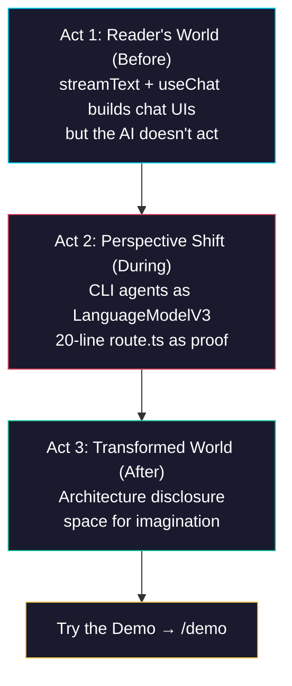

# Phase 1: Marketing Page — 3-Act Narrative Content

> **Epic:** [AGENTS.md](./AGENTS.md)
> **Dependencies:** Phase 0 (site restructure complete)
> **Parallel with:** Phase 2 (expense form)
> **Blocks:** Phase 5 (deployment section)

## Objective

Replace the Phase 0 skeleton in `packages/web/app/page.tsx` with full narrative content following the 3-act structure from Discussion #5353. The page applies the writing-narrative-pages principles: Disclose, Don't Explain / Transform, Don't Persuade / Expand Autonomy.

## What You're Building



## Deliverables

### 1. `packages/web/app/page.tsx` — **Modify**

Replace the Phase 0 skeleton with full narrative content. **The entire page is in English** for international reach as an OSS marketing page.

#### Act 1: Reader's World (Before)

Enter from the reader's existing situation — not from the product name.

Content direction:

> `streamText()` and `useChat()` — you can build a conversation UI in hours.
>
> But when your user faces a complex form, the AI knows exactly what to fill in.
> It just... doesn't.

- Paint a concrete scene the reader recognizes — not abstract "AI has limitations"
- The AI that stops in front of a form
- The gap between "knowing" and "doing"

#### Act 2: Perspective Shift (During)

The conceptual turn:

> What if CLI agent capabilities came through the `LanguageModelV3` interface?

The keyword `LanguageModelV3` is essential here. For AI SDK users: "Wait — a CLI agent becomes a LanguageModel?" For others: "It plugs into an existing interface."

**Prove it with code** — show the essential part of `route.ts`:

```ts
import { giselle } from "@giselles-ai/giselle-provider";
import { streamText, tool } from "ai";

const result = streamText({
  model: giselle({
    cloudApiUrl: "https://studio.giselles.ai",
    agent,
  }),
  messages: await convertToModelMessages(messages),
  tools,
});
```

Based on the actual `packages/web/app/api/chat/route.ts` L222–L232. The contrast between the complex machinery underneath and the simplicity of this code is the transformation point.

#### Act 3: Transformed World (After)

- "Here's what happens behind those 20 lines" — disclose the architecture
- Show the 3-package relationship (built with Tailwind, not an image):
  - `@giselles-ai/giselle-provider` — LanguageModelV3 wrapper
  - `@giselles-ai/browser-tool` — DOM snapshot + execute
  - `@giselles-ai/sandbox-agent` — CLI agent in Vercel Sandbox
- Leave room for imagination:
  > Form autofill is just the first use case.
  > Any operation your product has can be delegated to an agent.

#### CTA Section

- "Try the Demo" → `/demo`
- "View on GitHub" → repository link
- "Read the Docs" → getting-started doc (or repository README if docs don't exist yet)

### 2. Design Guidelines

- Preserve the existing dark theme (`radial-gradient` background, `slate` palette)
- Generous spacing between sections (`py-24` or more) — density prevents narrative transportation
- Code blocks: `bg-slate-950` + `border-slate-700`
- Accent colors: `cyan-400` (primary), `emerald-400` (secondary)
- Large font sizes: hero at `text-5xl` or above, body at `text-lg`
- Keep `lang="en"` on the HTML tag

## Verification

1. **Build check:**
   ```bash
   cd packages/web && pnpm build
   ```

2. **Typecheck:**
   ```bash
   cd packages/web && pnpm typecheck
   ```

3. **Manual verification:**
   - `/` displays the 3-act narrative
   - Code snippet is readable (syntax-highlighted or plainly formatted)
   - "Try the Demo" link points to `/demo`
   - Page is responsive on mobile
   - Benjamin Test: remove all product names — is it still worth reading?
   - Arendt Test: does it reveal a "who" or just list "whats"?

## Files to Create/Modify

| File | Action |
|---|---|
| `packages/web/app/page.tsx` | **Modify** (skeleton → full narrative content) |

## Done Criteria

- [ ] 3-act narrative content is displayed at `/`
- [ ] Act 2 contains a code snippet based on `route.ts`
- [ ] Act 3 contains an architecture overview
- [ ] CTA section links to `/demo`
- [ ] Responsive design works
- [ ] `pnpm build` and `pnpm typecheck` pass
- [ ] Update the status in [AGENTS.md](./AGENTS.md) to `✅ DONE`
