# Phase 2: Expense Report Form

> **Epic:** [AGENTS.md](./AGENTS.md)
> **Dependencies:** Phase 0 (site restructure complete)
> **Parallel with:** Phase 1 (marketing narrative)
> **Blocks:** Phase 3 (receipt generator)

## Objective

Implement the expense report form UI at `/demo`. This phase builds only the form and its state management — AI chat integration comes in Phase 4. Every field gets a `data-browser-tool-id` attribute so `@giselles-ai/browser-tool`'s `snapshot()` / `execute()` work correctly.

## What You're Building

```mermaid
flowchart LR
    subgraph "Expense Form (/demo)"
        Service["select: Service"]
        Date["input date: Date"]
        Amount["input text: Amount"]
        Currency["select: Currency"]
        Invoice["input text: Invoice Number"]
        Category["select: Account Category"]
        Memo["textarea: Memo"]
        Submit["button: Submit"]
    end

    style Service fill:#1a1a2e,stroke:#e94560,color:#ffffff
    style Date fill:#1a1a2e,stroke:#e94560,color:#ffffff
    style Amount fill:#1a1a2e,stroke:#e94560,color:#ffffff
    style Currency fill:#1a1a2e,stroke:#e94560,color:#ffffff
    style Invoice fill:#1a1a2e,stroke:#e94560,color:#ffffff
    style Category fill:#1a1a2e,stroke:#e94560,color:#ffffff
    style Memo fill:#1a1a2e,stroke:#e94560,color:#ffffff
    style Submit fill:#1a1a2e,stroke:#f5c542,color:#ffffff
```



## Deliverables

### 1. `packages/web/app/demo/page.tsx` — **Create**

A `"use client"` component with a 2-column layout: expense form on the left, chat panel placeholder on the right.

#### Field Definitions

| Field | `data-browser-tool-id` | HTML Type | Default Value | Options |
|---|---|---|---|---|
| Service | `service` | `<select>` | `"openai"` | OpenAI, Anthropic, Vercel, Google Cloud, GitHub |
| Date | `date` | `<input type="date">` | Last month's same day (e.g., if today is 2026-03-02, default is `"2026-02-02"`) | — |
| Amount | `amount` | `<input type="text">` | `""` (empty) | — |
| Currency | `currency` | `<select>` | `"USD"` | USD, JPY, EUR |
| Invoice Number | `invoice-number` | `<input type="text">` | `""` (empty) | — |
| Account Category | `category` | `<select>` | `"communication"` | Communication, R&D, Cloud Infrastructure |
| Memo | `memo` | `<textarea>` | `""` (empty) | — |

#### Layout

```
┌──────────────────────────────────────────────────────────┐
│  Expense Report  >  New Claim (copied from last month)   │
├───────────────────────────┬──────────────────────────────┤
│                           │                              │
│  Expense Report Form      │  💬 AI Assistant             │
│                           │                              │
│  Service: [OpenAI    ▼]   │  (implemented in Phase 4)    │
│  Date:    [2026-02-02  ]  │                              │
│  Amount:  [           ]   │  Chat panel placeholder      │
│  Currency:[USD       ▼]   │                              │
│  Invoice: [           ]   │                              │
│  Category:[Communication▼]│                              │
│  Memo:    [           ]   │                              │
│                           │                              │
│  [Submit]                 │                              │
│                           │                              │
└───────────────────────────┴──────────────────────────────┘
```

#### Implementation Pattern

Follow the existing `gemini-browser-tool/page.tsx` `DemoForm` component as the pattern:

- Each field managed with `useState`
- All fields have `data-browser-tool-id` attributes
- Proper `<label htmlFor>` + `<input id>` associations
- `onChange` handlers for controlled components
- Form `onSubmit` calls `event.preventDefault()`
- Dark theme styles: `border-slate-700`, `bg-slate-950/70`, `focus:border-cyan-400`

#### "Copied from Last Month" Effect

Default the date field to last month's date to simulate copying a previous claim. Service and category are pre-filled; amount and invoice number are empty (stale or unfilled from the copy). Show "New Claim (copied from last month)" in the header to convey the repetitive nature of expense reporting.

### 2. Chat Panel Placeholder

The right column will hold the AI chat in Phase 4. For now, render a placeholder:

```tsx
<div className="rounded-2xl border border-slate-700 bg-slate-950/90 p-4">
	<p className="text-xs uppercase tracking-[0.15em] text-cyan-300">
		AI Assistant
	</p>
	<p className="mt-4 text-sm text-slate-400">
		Chat panel will be implemented in Phase 4.
	</p>
</div>
```

## Verification

1. **Build check:**
   ```bash
   cd packages/web && pnpm build
   ```

2. **Typecheck:**
   ```bash
   cd packages/web && pnpm typecheck
   ```

3. **Manual verification:**
   - `/demo` displays the expense report form
   - All fields are interactive (type, select, textarea)
   - Date defaults to last month's date
   - Service defaults to OpenAI
   - Check DevTools for `data-browser-tool-id` attributes on all 7 fields
   - Test `snapshot()` in DevTools Console:
     ```js
     import('@giselles-ai/browser-tool/dom').then(m => console.log(m.snapshot()))
     ```
     → should return 7 fields

4. **Format check:**
   ```bash
   cd packages/web && pnpm format
   ```

## Files to Create/Modify

| File | Action |
|---|---|
| `packages/web/app/demo/page.tsx` | **Create** |

## Done Criteria

- [ ] Expense report form is displayed at `/demo`
- [ ] All 7 fields have `data-browser-tool-id` attributes
- [ ] Default values match spec (service=OpenAI, date=last month, amount=empty, etc.)
- [ ] 2-column layout (left: form, right: chat placeholder)
- [ ] All fields work as controlled components
- [ ] `pnpm build` and `pnpm typecheck` pass
- [ ] Update the status in [AGENTS.md](./AGENTS.md) to `✅ DONE`
