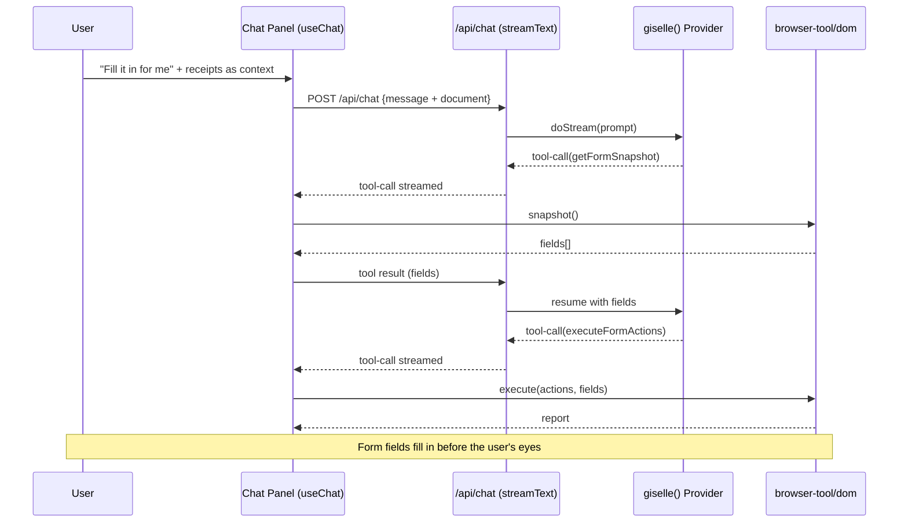

# Phase 4: Demo Chat Integration

> **Epic:** [AGENTS.md](./AGENTS.md)
> **Dependencies:** Phase 3 (receipt generator)
> **Parallel with:** None
> **Blocks:** Phase 5 (deployment section)

## Objective

Integrate the AI chat panel into the expense report demo. When a user types "Fill it in for me", the generated receipt data is sent as context to the agent, which calls `onToolCall` → `snapshot()` → `execute()` to autofill the form fields in real time.

## What You're Building



## Deliverables

### 1. `packages/web/app/demo/page.tsx` — **Modify**

Add chat functionality to the existing receipt generation UI.

#### Chat Integration Pattern

Follow the `gemini-browser-tool/page.tsx` implementation pattern exactly:

```tsx
import { useChat } from "@ai-sdk/react";
import { execute, snapshot } from "@giselles-ai/browser-tool/dom";
import {
	DefaultChatTransport,
	lastAssistantMessageIsCompleteWithToolCalls,
} from "ai";
```

#### `useChat` Configuration

```tsx
const { status, messages, error, sendMessage, addToolOutput } = useChat({
	transport: new DefaultChatTransport({
		api: "/api/chat",
	}),
	sendAutomaticallyWhen: lastAssistantMessageIsCompleteWithToolCalls,
	onToolCall: async ({ toolCall }) => {
		if (toolCall.dynamic) return;

		if (toolCall.toolName === "getFormSnapshot") {
			const fields = snapshot();
			addToolOutput({
				tool: "getFormSnapshot",
				toolCallId: toolCall.toolCallId,
				output: { fields },
			});
			return;
		}

		if (toolCall.toolName === "executeFormActions") {
			const { actions, fields } = parseExecuteInput(toolCall.input);
			const report = execute(actions, fields);
			addToolOutput({
				tool: "executeFormActions",
				toolCallId: toolCall.toolCallId,
				output: { report },
			});
			return;
		}
	},
});
```

#### Sending Receipts as Context

When the user sends a message, append the generated receipt data as a document:

```tsx
const handleSubmit = async (event: FormEvent) => {
	event.preventDefault();
	const trimmedMessage = input.trim();
	if (!trimmedMessage || isBusy) return;

	// Compose receipt data as document context
	const receiptDocument = receipts
		.map((r) =>
			[
				`Service: ${r.service}`,
				`Invoice Number: ${r.invoiceNumber}`,
				`Date: ${r.date}`,
				`Amount: $${r.amount.toFixed(2)}`,
				`Currency: ${r.currency}`,
				`Description: ${r.description}`,
			].join("\n")
		)
		.join("\n---\n");

	const composedPrompt = receiptDocument
		? `${trimmedMessage}\n\nDocument:\n${receiptDocument}`
		: trimmedMessage;

	await sendMessage({ text: composedPrompt });
	setInput("");
};
```

### 2. Chat Panel UI

Place the chat UI below the receipt generation section:

```
┌──────────────────────────┐
│  💬 AI Assistant          │
│                          │
│  [receipt generation UI] │
│  (from Phase 3)          │
│                          │
│  ── chat messages ───────│
│                          │
│  👤 Fill it in for me     │
│                          │
│  🤖 Reading the receipts… │
│     OpenAI: $240.00      │
│     INV-48271             │
│     Updating the form…   │
│                          │
│  ── chat input ──────────│
│  [ Type a message...   ] │
│  [Send]                  │
│                          │
└──────────────────────────┘
```

#### Required UI Elements

- Message list (`messages.map(...)`) — follow the `gemini-browser-tool/page.tsx` `renderedMessages` pattern
- Chat input field + Send button
- Status indicator (display `status` value)
- Error display (when `error` is present)

### 3. Helper Functions

Copy these helpers inline from `gemini-browser-tool/page.tsx` (same pattern as existing demos):

- `parseExecuteInput(value: unknown)` — parse executeFormActions input
- `textFromMessageParts(parts)` — join text parts from a message
- `isRecord(value: unknown)` — object type guard
- `toStringError(error: unknown)` — stringify error messages

Define them inline in `demo/page.tsx` (matching existing demo conventions).

## Verification

1. **Build check:**
   ```bash
   cd packages/web && pnpm build
   ```

2. **Typecheck:**
   ```bash
   cd packages/web && pnpm typecheck
   ```

3. **End-to-end manual test:**
   1. Navigate to `/demo`
   2. Check OpenAI and Anthropic, click "Generate" → receipt cards appear
   3. Type "Fill it in for me" in the chat input and click Send
   4. Agent runs `getFormSnapshot` → `executeFormActions` flow
   5. Form fields (amount, date, invoice number) fill in with receipt data
   6. Chat displays the agent's response

   ⚠️ This test requires environment variables (`EXTERNAL_AGENT_API_BEARER_TOKEN`, `SANDBOX_SNAPSHOT_ID`, etc.) and Cloud API connectivity. If you can't run the full flow locally, verify UI rendering and event wiring via build + typecheck.

## Files to Create/Modify

| File | Action |
|---|---|
| `packages/web/app/demo/page.tsx` | **Modify** (add chat functionality) |

## Done Criteria

- [ ] Chat input and Send button are displayed
- [ ] `useChat` connects to `/api/chat`
- [ ] `onToolCall` handles `getFormSnapshot` and `executeFormActions`
- [ ] Receipt data is sent as document context
- [ ] Message list is rendered
- [ ] Error handling is in place
- [ ] `pnpm build` and `pnpm typecheck` pass
- [ ] Update the status in [AGENTS.md](./AGENTS.md) to `✅ DONE`
