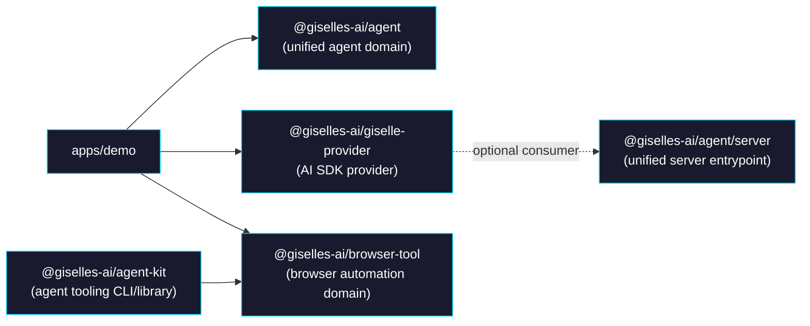
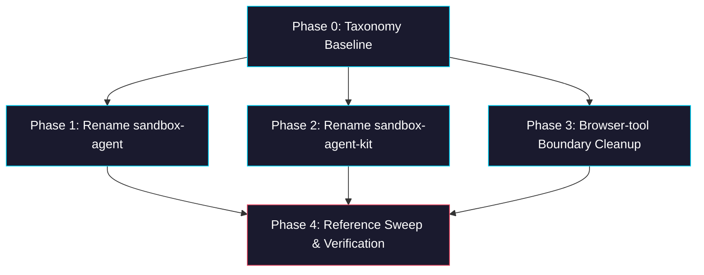

# Epic: `packages/` Structure Realignment

> **GitHub Epic:** #TBD · **Sub-issues:** #TBD-#TBD (Phases 0-4)

## Goal

`packages/` を「現役の公開・公開候補パッケージだけが並ぶ場所」として再定義し、名前と責務が一致した状態にする。完了後の構成は `agent`, `agent-kit`, `browser-tool`, `giselle-provider` の 4 パッケージに揃う。  
旧 `agent-builder` / `agent-runtime` 命名は、`unify-agent-package` エピックで `@giselles-ai/agent` に統合済みです。
`browser-tool` は意図的な multi-runtime package として明文化され、deprecated な `root/sandbox-agent/` は判断材料から外れる。

## Why

- `sandbox-*` という名前が現在の責務ではなく、過去の配置や実装経緯を表している
- `browser-tool` は 1 ドメインを扱っている一方で複数 runtime を跨ぐため、分割するか維持するかの判断基準を明文化しないと再び drift する
- README の package 構成説明が現状とズレており、packages 単位の mental model が崩れている
- 現役 package と補助 tooling の境界を揃えることで、新しい package を追加するときの命名規則を固定できる

## Architecture Overview



## Package / Directory Structure

```text
packages/
├── agent/                        ← 統合済みドメインパッケージ
├── agent-kit/                    ← NEW NAME (rename from sandbox-agent-kit/)
├── browser-tool/                 ← EXISTING (keep as a single domain package)
└── giselle-provider/             ← EXISTING (keep name)

docs/
└── package-taxonomy.md           ← NEW (package naming / boundary rules)

tasks/
└── package-structure-realignment/
    ├── AGENTS.md                 ← NEW (this epic)
    ├── phase-0-taxonomy-baseline.md
    ├── phase-1-agent-runtime-rename.md
    ├── phase-2-agent-kit-rename.md
    ├── phase-3-browser-tool-boundaries.md
    └── phase-4-reference-sweep.md

root/sandbox-agent/               ← DEPRECATED, OUT OF SCOPE
```

## Task Dependency Graph



Phase 1, Phase 2, Phase 3 can run in parallel after Phase 0. Phase 4 depends on all three.

## Task Status

| Phase | Task File | Status | Description |
|---|---|---|---|
| 0 | [phase-0-taxonomy-baseline.md](./phase-0-taxonomy-baseline.md) | ✅ DONE | 目的別の package taxonomy と README baseline を作る |
| 1 | [phase-1-agent-runtime-rename.md](./phase-1-agent-runtime-rename.md) | ✅ DONE | `sandbox-agent` → runtime 系統のリネームを完了する |
| 2 | [phase-2-agent-kit-rename.md](./phase-2-agent-kit-rename.md) | ✅ DONE | `packages/sandbox-agent-kit` を `agent-kit` に rename する |
| 3 | [phase-3-browser-tool-boundaries.md](./phase-3-browser-tool-boundaries.md) | ✅ DONE | `browser-tool` の multi-runtime 境界を package metadata と docs で固定する |
| 4 | [phase-4-reference-sweep.md](./phase-4-reference-sweep.md) | ✅ DONE | rename 後の参照 sweep と build/typecheck verification を行う |

> **How to work on this epic:** Read this file first to understand the full architecture.
> Then check the status table above. Pick the first `🔲 TODO` task whose dependencies
> (see dependency graph) are `✅ DONE`. Open that task file and follow its instructions.
> When done, update the status in this table to `✅ DONE`.

## Key Conventions

- Monorepo は `pnpm` workspace + `turbo` を使う
- package build は `tsup` ベース、型検査は package ごとの `tsc --noEmit`
- pre-public launch なので breaking rename は許容する。互換 shim は作らない
- `browser-tool` は 1 ドメインを複数 runtime に expose する package として扱う
- `root/sandbox-agent/` は deprecated なので、この epic の作業対象に含めない
- historical docs は必要なら注記を足すが、全面書き換えはしない

## Existing Code Reference

| File | Relevance |
|---|---|
| `packages/browser-tool/package.json` | multi-runtime exports と dependency surface の現状 |
| `packages/browser-tool/tsup.ts` | subpath ごとの build entry 定義 |
| `packages/browser-tool/src/react/index.ts` | React 専用 surface |
| `packages/browser-tool/src/relay/index.ts` | Node/server 専用 surface |
| `packages/giselle-provider/package.json` | keep 対象 package の基準 |
| `packages/giselle-provider/src/types.ts` | `AgentRef` の依存方向を確認する参照 |
| `packages/agent/package.json` | 統合 package の manifest（name/exports/deps） |
| `packages/agent/src/index.ts` | defineAgent / export surface の統合ポイント |
| `packages/agent/src/next/index.ts` | Next.js 向け export の統合ポイント |
| `packages/agent/src/server/index.ts` | サーバー向け export の統合ポイント |
| `packages/agent/src/agent.ts` | runtime の中核実装 |
| `packages/agent-kit/package.json` | tooling package の manifest / bin 定義 |
| `packages/agent-kit/src/build-snapshot.ts` | browser-tool 依存の補助 tooling としての責務 |
| `packages/agent-kit/src/cli.ts` | CLI name と help text の更新対象 |
| `README.md` | package structure と public story の現状説明 |

## Domain-Specific Reference

### Package Taxonomy Rules

| Category | Rule | Current / Target |
|---|---|---|
| Domain package | 1 つのプロダクト概念を表す。runtime が複数でも domain が 1 つなら subpath export で維持してよい | `browser-tool`, `giselle-provider`, `agent` |
| Integration package | 特定 framework / build step と結びつく | `agent/next` |
| Tooling package | 開発・snapshot 作成などの operator tooling | `agent-kit` |

### Rename Policy

| Current | Target | Reason |
|---|---|---|
| `sandbox-agent` | `agent` | 「sandbox 上で agent を動かすための runtime primitives」を統合 package で扱うため |
| `sandbox-agent-kit` | `agent-kit` | snapshot build に閉じない agent tooling 全般を扱える package 名にするため |

### Non-Goals

- `browser-tool` を `react` / `relay` / `mcp-server` の別 package に再分割しない
- deprecated な `root/sandbox-agent/` をこの epic で移行しない
- historical RFC / task docs の全面 rename は行わない
