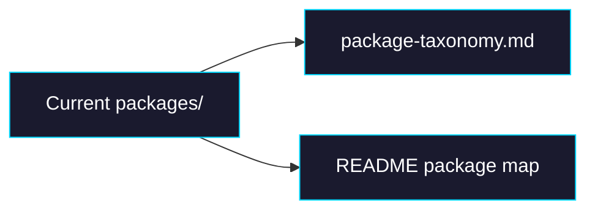

# Phase 0: Taxonomy Baseline

> **GitHub Issue:** #TBD · **Epic:** [AGENTS.md](./AGENTS.md)
> **Dependencies:** None
> **Parallel with:** None
> **Blocks:** Phase 1, Phase 2, Phase 3

## Objective

rename に入る前に、「どの package を残し、どういう基準で命名するか」を文書として固定する。ここではコードの移動はまだ行わず、README と専用 doc に active package の taxonomy と boundary を反映する。

## What You're Building



## Deliverables

### 1. `docs/package-taxonomy.md`

Create a short architecture note that captures the canonical package categories and rename map.

Use a structure like:

```md
# Package Taxonomy

## Scope

- This document covers only `packages/`
- `root/sandbox-agent/` is deprecated and out of scope

## Categories

| Package | Category | Runtime | Notes |
|---|---|---|---|
| `agent-builder` | integration | Node / Next.js build | Keep name |
| `sandbox-agent` | runtime | Node / Vercel Sandbox | Rename to `agent-runtime` |
| `sandbox-agent-kit` | tooling | Node CLI | Rename to `agent-snapshot-kit` |
| `browser-tool` | domain | browser / node / sandbox | Keep as one package |
| `giselle-provider` | domain | server | Keep name |
```

Add a “Decision” section that explicitly says:

- do not split `browser-tool` again right now
- prefer clearer names over compatibility
- historical docs may keep old names when clearly marked historical

### 2. `README.md`

Update only the package structure and package description sections so they reflect the target naming and the “active packages only” rule.

Replace the package tree block with something equivalent to:

```text
packages/
├── agent-builder/          # @giselles-ai/agent-builder — build-time integration
├── agent-runtime/          # @giselles-ai/agent-runtime — sandbox runtime primitives
├── agent-snapshot-kit/     # @giselles-ai/agent-snapshot-kit — snapshot build CLI/library
├── browser-tool/           # @giselles-ai/browser-tool — browser automation domain package
└── giselle-provider/       # @giselles-ai/giselle-provider — AI SDK provider
```

Add a small runtime matrix for `browser-tool`:

```md
| Export Path | Runtime |
|---|---|
| `@giselles-ai/browser-tool` | env-agnostic types / schemas |
| `@giselles-ai/browser-tool/dom` | browser |
| `@giselles-ai/browser-tool/react` | React client |
| `@giselles-ai/browser-tool/relay` | Node / server |
| `@giselles-ai/browser-tool/mcp-server` | sandbox / Node process |
```

### 3. `tasks/package-structure-realignment/AGENTS.md`

If Phase 0 changes the naming decision while being implemented, reflect it back into the epic file before marking this phase done.

## Verification

1. **Search checks**
   ```bash
   rg -n "root/sandbox-agent|sandbox-agent-kit|packages/web" README.md docs/package-taxonomy.md
   ```
   The new files should either avoid these names or mention them only as deprecated / historical.

2. **Manual review**
   1. Read the updated README package tree.
   2. Confirm every listed package exists in `packages/` or is a deliberate rename target.
   3. Confirm `root/sandbox-agent/` is explicitly out of scope.

## Files to Create/Modify

| File | Action |
|---|---|
| `docs/package-taxonomy.md` | **Create** |
| `README.md` | **Modify** (package tree and package role descriptions only) |
| `tasks/package-structure-realignment/AGENTS.md` | **Modify if needed** (sync the canonical naming decisions) |

## Done Criteria

- [ ] `docs/package-taxonomy.md` exists with category and rename tables
- [ ] `README.md` reflects the active `packages/` structure rather than historical layout
- [ ] `browser-tool` runtime matrix is documented
- [ ] `root/sandbox-agent/` is clearly marked out of scope
- [ ] Update the status in [AGENTS.md](./AGENTS.md) to `✅ DONE`
