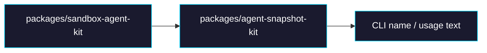

# Phase 2: Rename `sandbox-agent-kit` to `agent-snapshot-kit`

> **GitHub Issue:** #TBD · **Epic:** [AGENTS.md](./AGENTS.md)
> **Dependencies:** Phase 0
> **Parallel with:** Phase 1, Phase 3
> **Blocks:** Phase 4

## Objective

snapshot build tooling を “sandbox agent kit” ではなく “agent snapshot kit” として表現し直す。package name, directory name, CLI usage text を揃えて、browser-tool 向け snapshot builder であることを名前から分かるようにする。

## What You're Building



## Deliverables

### 1. `packages/agent-snapshot-kit/` directory

Move the package directory with history preserved:

```bash
git mv packages/sandbox-agent-kit packages/agent-snapshot-kit
```

### 2. `packages/agent-snapshot-kit/package.json`

Update the package identity:

```json
{
  "name": "@giselles-ai/agent-snapshot-kit",
  "bin": {
    "agent-snapshot-kit": "./dist/cli.js"
  },
  "repository": {
    "directory": "packages/agent-snapshot-kit"
  }
}
```

Do not change the library export surface in this phase. Keep:

```ts
export type { BuildSnapshotOptions } from "./build-snapshot";
export { buildSnapshot } from "./build-snapshot";
```

### 3. `packages/agent-snapshot-kit/src/cli.ts`

Update CLI help and usage strings:

```ts
const usage = `Usage:
  agent-snapshot-kit build-snapshot [options]
`;
```

Any log lines, comments, or examples that say `sandbox-agent-kit` should be updated to the new name.

### 4. `packages/agent-snapshot-kit/AGENTS.md`

Rename the package title and local development instructions so they point at the new directory:

```md
# agent-snapshot-kit

cd packages/agent-snapshot-kit
pnpm dev build-snapshot --local --repo-root ../..
```

## Verification

1. **Package checks**
   ```bash
   pnpm --filter @giselles-ai/agent-snapshot-kit typecheck
   pnpm --filter @giselles-ai/agent-snapshot-kit build
   ```

2. **Reference checks**
   ```bash
   rg -n "sandbox-agent-kit|@giselles-ai/sandbox-agent-kit" apps packages scripts README.md docs
   ```
   Old names should not remain in active files after this phase.

3. **CLI sanity check**
   ```bash
   node packages/agent-snapshot-kit/dist/cli.js --help
   ```
   Confirm the help text prints `agent-snapshot-kit build-snapshot`.

## Files to Create/Modify

| File | Action |
|---|---|
| `packages/sandbox-agent-kit/` | **Move** to `packages/agent-snapshot-kit/` |
| `packages/agent-snapshot-kit/package.json` | **Modify** (name, bin, repository path) |
| `packages/agent-snapshot-kit/src/cli.ts` | **Modify** (usage text) |
| `packages/agent-snapshot-kit/AGENTS.md` | **Modify** (package title and examples) |
| `README.md` | **Modify if referenced** |
| `docs/package-taxonomy.md` | **Modify** (finalized rename map) |

## Done Criteria

- [ ] `packages/agent-snapshot-kit/` exists and builds successfully
- [ ] Package name is `@giselles-ai/agent-snapshot-kit`
- [ ] CLI help uses `agent-snapshot-kit`
- [ ] No active files reference `sandbox-agent-kit`
- [ ] Update the status in [AGENTS.md](./AGENTS.md) to `✅ DONE`
