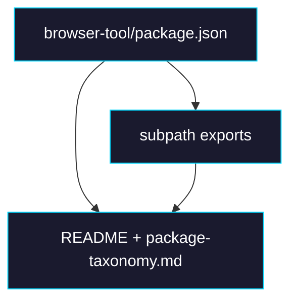

# Phase 3: Browser-tool Boundary Cleanup

> **GitHub Issue:** #TBD · **Epic:** [AGENTS.md](./AGENTS.md)
> **Dependencies:** Phase 0
> **Parallel with:** Phase 1, Phase 2
> **Blocks:** Phase 4

## Objective

`browser-tool` は split せず維持するが、その代わり runtime boundary を package metadata と documentation で固定する。`./react` だけが React を必要とする点を manifest に反映し、今後「再分割すべきか」を同じ議論に戻さない状態にする。

## What You're Building



## Deliverables

### 1. `packages/browser-tool/package.json`

Keep the existing export map, but make the React peer dependencies optional so non-React consumers of `./dom`, `./relay`, or `./mcp-server` are not forced into a React-shaped install surface.

Add:

```json
{
  "peerDependenciesMeta": {
    "react": { "optional": true },
    "react-dom": { "optional": true }
  }
}
```

Keep the current subpath export structure:

```json
{
  "exports": {
    ".": "./dist/index.js",
    "./dom": "./dist/dom/index.js",
    "./react": "./dist/react/index.js",
    "./relay": "./dist/relay/index.js",
    "./mcp-server": "./dist/mcp-server/index.js"
  }
}
```

### 2. `README.md`

Add or update a runtime boundary note near the package section:

```md
`@giselles-ai/browser-tool` intentionally remains a single package because it owns one domain:
browser automation. Runtime-specific entry points are separated by subpath exports.
Do not split this package further unless a subpath introduces incompatible mandatory dependencies.
```

### 3. `docs/package-taxonomy.md`

Add a decision record section:

```md
## Boundary Decision: browser-tool

- Keep as one package
- Use subpath exports to separate browser / react / relay / sandbox entry points
- Revisit only if install-time dependency leakage becomes a concrete problem again
```

## Verification

1. **Package checks**
   ```bash
   pnpm --filter @giselles-ai/browser-tool typecheck
   pnpm --filter @giselles-ai/browser-tool build
   ```

2. **Manifest checks**
   ```bash
   rg -n "peerDependenciesMeta|\"./react\"|\"./relay\"|\"./mcp-server\"" packages/browser-tool/package.json
   ```

3. **Manual review**
   1. Confirm `react` and `react-dom` remain peer dependencies.
   2. Confirm they are marked optional.
   3. Confirm the README clearly says why `browser-tool` stays as one package.

## Files to Create/Modify

| File | Action |
|---|---|
| `packages/browser-tool/package.json` | **Modify** (optional React peers) |
| `README.md` | **Modify** (boundary note and runtime matrix wording) |
| `docs/package-taxonomy.md` | **Modify** (browser-tool decision record) |

## Done Criteria

- [ ] `browser-tool` still builds with the same subpath exports
- [ ] `react` and `react-dom` are optional peers
- [ ] README explains why `browser-tool` remains a single package
- [ ] Taxonomy doc records the non-goal of splitting it again now
- [ ] Update the status in [AGENTS.md](./AGENTS.md) to `✅ DONE`
