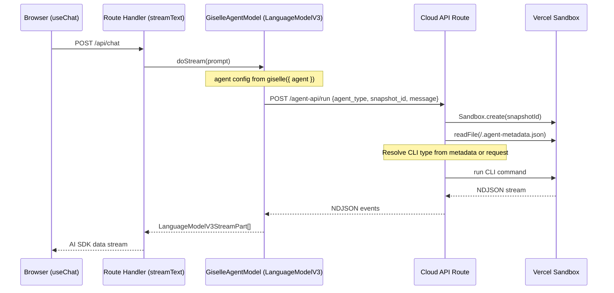
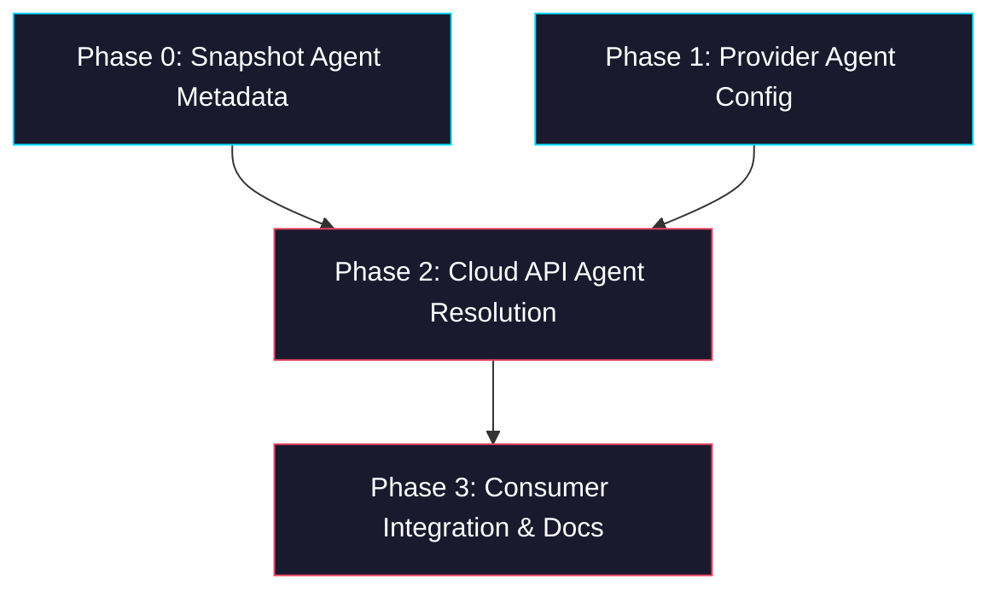

# Epic: Per-Request Agent Selection

> **Sub-issues:** TBD (Phases 0–3)

## Goal

Enable per-request agent selection so that a single API deployment can serve multiple agent backends (Gemini, Codex, custom snapshots) without redeployment. After this epic, developers specify which agent to use at the `giselle()` provider level, and the system resolves the CLI backend automatically — either from an explicit `agent.type` or from metadata baked into the snapshot itself. The `AGENT_TYPE` env var becomes a fallback default, not a hard constraint.

## Why

- **No-redeploy switching:** Currently `AGENT_TYPE` and `SANDBOX_SNAPSHOT_ID` are global env vars, so switching between Gemini and Codex requires redeployment. Developers should control this per-request.
- **Custom agents:** Users want to create custom agents (base CLI + skills/files/binaries) as snapshots and use them by `snapshotId` alone, without needing to know or specify the underlying CLI type.
- **Competitive edge:** Products like [sandboxagent.dev](https://sandboxagent.dev/) and [Cloudflare Agents API](https://developers.cloudflare.com/agents/api-reference/agents-api/) offer abstract coding agents but lack good UI integration. This project's strength is pairing flexible agent backends with AI SDK's UIMessage Protocol — per-request selection is essential for that.
- **Multi-tenant readiness:** A single deployment serving multiple agent types is a prerequisite for any multi-tenant or marketplace scenario.

## Architecture Overview



## Agent Resolution Strategy

The Cloud API route resolves the agent type using this priority chain:

| Priority | Source | Example |
|---|---|---|
| 1 | Snapshot metadata file (`/.agent-metadata.json`) | `{ "cli": "codex" }` baked into snapshot |
| 2 | Request body `agent_type` field | `{ "agent_type": "codex", "message": "..." }` |
| 3 | Environment variable `AGENT_TYPE` | `AGENT_TYPE=gemini` (deployment default) |

When a `snapshotId` is provided (via request or URL path), the route reads `/.agent-metadata.json` from the sandbox. If found, it takes precedence over everything else — the snapshot knows what it is.

## Package / Directory Structure

```
packages/
├── giselle-provider/                 ← EXISTING (modified)
│   └── src/
│       ├── types.ts                  ← MODIFIED (add agent config to GiselleProviderOptions)
│       ├── giselle-agent-model.ts    ← MODIFIED (pass agent config through connectCloudApi)
│       └── __tests__/
│           └── giselle-agent-model.test.ts ← MODIFIED (new test cases)
├── sandbox-agent/                    ← EXISTING (modified)
│   └── src/
│       ├── agents/
│       │   ├── agent-metadata.ts     ← NEW (read/write metadata helper)
│       │   └── agent-metadata.test.ts ← NEW
│       └── index.ts                  ← MODIFIED (export metadata helper)

sandbox-agent/
└── web/
    └── app/
        └── agents/[slug]/snapshots/[snapshotId]/chat/api/
            └── route.ts              ← MODIFIED (read agent_type from request + metadata)

scripts/
└── create-browser-tool-snapshot.mjs  ← MODIFIED (write /.agent-metadata.json)
```

## Task Dependency Graph



- **Phases 0 and 1 can run in parallel** — they have no dependencies on each other.
- Phase 2 depends on both Phase 0 and Phase 1.
- Phase 3 depends on Phase 2.

## Task Status

| Phase | Task File | Status | Description |
|---|---|---|---|
| 0 | [phase-0-snapshot-metadata.md](./phase-0-snapshot-metadata.md) | ✅ DONE | Bake `/.agent-metadata.json` into snapshots + read helper |
| 1 | [phase-1-provider-agent-config.md](./phase-1-provider-agent-config.md) | ✅ DONE | Add `agent` option to `giselle()` provider + pass through to Cloud API |
| 2 | [phase-2-cloud-api-resolution.md](./phase-2-cloud-api-resolution.md) | 🔲 TODO | Cloud API route reads agent type from metadata / request / env fallback |
| 3 | [phase-3-consumer-integration.md](./phase-3-consumer-integration.md) | 🔲 TODO | Wire up in `packages/web` consumer + update docs |

> **How to work on this epic:** Read this file first to understand the full architecture.
> Then check the status table above. Pick the first `🔲 TODO` task whose dependencies
> (see dependency graph) are `✅ DONE`. Open that task file and follow its instructions.
> When done, update the status in this table to `✅ DONE`.

## Key Conventions

- **Monorepo:** pnpm workspaces, `tsup` for building, `biome` for formatting
- **TypeScript:** `strict`, target `ES2022`, module `ESNext`, moduleResolution `Bundler`
- **Zod version:** `4.3.6` (used throughout the monorepo)
- **Test runner:** `vitest` (v4.0.18)
- **Sandbox:** `@vercel/sandbox@1.6.0`
- **AI SDK:** `ai` package with `LanguageModelV3` interface
- **Provider ID:** `"giselle"` (used in `providerOptions.giselle.*`)

## Existing Code Reference

| File | Relevance |
|---|---|
| `packages/giselle-provider/src/types.ts` | `GiselleProviderOptions`, `ConnectCloudApiParams` — add agent fields |
| `packages/giselle-provider/src/giselle-agent-model.ts` | `connectCloudApi()` method — pass agent config in POST body |
| `packages/giselle-provider/src/index.ts` | `giselle()` factory — public API surface |
| `packages/giselle-provider/src/__tests__/giselle-agent-model.test.ts` | Test patterns — follow for new test cases |
| `packages/sandbox-agent/src/agents/codex-agent.ts` | Codex agent factory — used by route |
| `packages/sandbox-agent/src/agents/gemini-agent.ts` | Gemini agent factory — used by route |
| `sandbox-agent/web/app/agents/[slug]/snapshots/[snapshotId]/chat/api/route.ts` | Cloud API route — `resolveAgentType()` + `createRouteAgent()` to modify |
| `scripts/create-browser-tool-snapshot.mjs` | Snapshot creation — add metadata file write |
| `packages/web/app/api/chat/route.ts` | Consumer route — wire up `agent` option in `giselle()` call |

## Agent Metadata Schema

```json
{
  "cli": "gemini" | "codex"
}
```

Written to `/.agent-metadata.json` at snapshot root. Intentionally minimal — can be extended later with fields like `version`, `capabilities`, `mcpServers`, etc.
