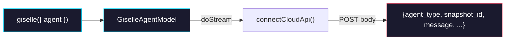

# Phase 1: Provider Agent Config

> **Epic:** [AGENTS.md](./AGENTS.md)
> **Dependencies:** None (can start immediately)
> **Parallel with:** Phase 0
> **Blocks:** Phase 2

## Objective

Add an `agent` option to the `giselle()` provider factory so that developers can specify which agent backend to use per model instance. The agent config flows through to the Cloud API POST body as `agent_type` and `snapshot_id` fields. No Cloud API route changes in this phase — that's Phase 2.

## What You're Building



Usage after this phase:

```typescript
// Default (backward-compatible — no agent specified)
giselle({ cloudApiUrl: "...", headers: {...} })

// Explicit agent type
giselle({ cloudApiUrl: "...", headers: {...}, agent: { type: "codex" } })

// Custom snapshot (type resolved from snapshot metadata by Cloud API)
giselle({ cloudApiUrl: "...", headers: {...}, agent: { snapshotId: "snap_xxx" } })

// Both (explicit override)
giselle({ cloudApiUrl: "...", headers: {...}, agent: { type: "codex", snapshotId: "snap_xxx" } })
```

## Deliverables

### 1. `packages/giselle-provider/src/types.ts` — Add agent config types

Add the agent config to `GiselleProviderOptions` and pass-through fields to `ConnectCloudApiParams`:

```typescript
// Add this type
export type GiselleAgentConfig = {
	type?: "gemini" | "codex";
	snapshotId?: string;
};

// Modify GiselleProviderOptions — add agent field
export type GiselleProviderOptions = {
	cloudApiUrl: string;
	headers?: Record<string, string>;
	deps?: Partial<GiselleProviderDeps>;
	agent?: GiselleAgentConfig;  // ← NEW
};

// Modify ConnectCloudApiParams — add agent fields
export type ConnectCloudApiParams = {
	endpoint: string;
	message: string;
	document?: string;
	sessionId?: string;
	sandboxId?: string;
	agentType?: string;     // ← NEW
	snapshotId?: string;    // ← NEW
	headers?: Record<string, string>;
	signal?: AbortSignal;
};
```

### 2. `packages/giselle-provider/src/giselle-agent-model.ts` — Pass agent config through

Modify the `connectCloudApi` private method to include agent fields in the request:

**In `connectCloudApi()` method** (around line 720):

```typescript
private async connectCloudApi(
    options: LanguageModelV3CallOptions,
    resumeData?: {
        sessionId?: string;
        sandboxId?: string;
    },
): Promise<LiveConnection> {
    const response = await this.deps.connectCloudApi({
        endpoint: buildCloudEndpoint(this.options.cloudApiUrl),
        message: this.extractUserMessage(options.prompt),
        sessionId: resumeData?.sessionId,
        sandboxId: resumeData?.sandboxId,
        agentType: this.options.agent?.type,        // ← NEW
        snapshotId: this.options.agent?.snapshotId,  // ← NEW
        headers: this.mergeCloudHeaders(options.headers),
        signal: options.abortSignal,
    });
    // ... rest unchanged
}
```

**In `createDefaultDeps()` `connectCloudApi`** (around line 212):

Add `agent_type` and `snapshot_id` to the POST body:

```typescript
body: JSON.stringify({
    type: "agent.run",
    message: params.message,
    document: params.document,
    session_id: params.sessionId,
    sandbox_id: params.sandboxId,
    agent_type: params.agentType,      // ← NEW
    snapshot_id: params.snapshotId,     // ← NEW
}),
```

### 3. `packages/giselle-provider/src/__tests__/giselle-agent-model.test.ts` — Add tests

Add test cases verifying agent config flows through to the Cloud API call. Follow the existing test patterns in the file.

```typescript
it("passes agent type to cloud API", async () => {
    const cloudReader = createNdjsonReader([
        { type: "init", session_id: "gem-agent" },
        { type: "message", role: "assistant", content: "Done", delta: false },
    ]);
    const connectCloudApi = vi.fn(async () => ({
        reader: cloudReader.reader,
        response: new Response(null, { status: 200 }),
    }));

    const model = new GiselleAgentModel({
        cloudApiUrl: "https://studio.giselles.ai",
        agent: { type: "codex" },
        deps: {
            connectCloudApi,
            sendRelayResponse: vi.fn(async () => undefined),
            createRelaySubscription: vi.fn(() => ({
                nextRequest: async () => ({}),
                close: async () => {},
            })),
        },
    });

    const result = await model.doStream(
        createCallOptions({
            prompt: createPromptWithUser("hello"),
        }),
    );
    await readAllParts(result.stream);

    expect(connectCloudApi).toHaveBeenCalledWith(
        expect.objectContaining({
            agentType: "codex",
        }),
    );
});

it("passes snapshot ID to cloud API", async () => {
    const cloudReader = createNdjsonReader([
        { type: "init", session_id: "gem-snap" },
        { type: "message", role: "assistant", content: "Hi", delta: false },
    ]);
    const connectCloudApi = vi.fn(async () => ({
        reader: cloudReader.reader,
        response: new Response(null, { status: 200 }),
    }));

    const model = new GiselleAgentModel({
        cloudApiUrl: "https://studio.giselles.ai",
        agent: { snapshotId: "snap_custom_123" },
        deps: {
            connectCloudApi,
            sendRelayResponse: vi.fn(async () => undefined),
            createRelaySubscription: vi.fn(() => ({
                nextRequest: async () => ({}),
                close: async () => {},
            })),
        },
    });

    const result = await model.doStream(
        createCallOptions({
            prompt: createPromptWithUser("hello"),
        }),
    );
    await readAllParts(result.stream);

    expect(connectCloudApi).toHaveBeenCalledWith(
        expect.objectContaining({
            snapshotId: "snap_custom_123",
            agentType: undefined,
        }),
    );
});

it("omits agent fields when no agent config provided", async () => {
    // Use existing test setup pattern — model without agent config
    const cloudReader = createNdjsonReader([
        { type: "init", session_id: "gem-none" },
        { type: "message", role: "assistant", content: "Ok", delta: false },
    ]);
    const connectCloudApi = vi.fn(async () => ({
        reader: cloudReader.reader,
        response: new Response(null, { status: 200 }),
    }));

    const model = new GiselleAgentModel({
        cloudApiUrl: "https://studio.giselles.ai",
        deps: {
            connectCloudApi,
            sendRelayResponse: vi.fn(async () => undefined),
            createRelaySubscription: vi.fn(() => ({
                nextRequest: async () => ({}),
                close: async () => {},
            })),
        },
    });

    const result = await model.doStream(
        createCallOptions({
            prompt: createPromptWithUser("test"),
        }),
    );
    await readAllParts(result.stream);

    expect(connectCloudApi).toHaveBeenCalledWith(
        expect.objectContaining({
            agentType: undefined,
            snapshotId: undefined,
        }),
    );
});
```

## Verification

```bash
# 1. Type-check the package
pnpm --filter @giselles-ai/giselle-provider typecheck

# 2. Run tests
pnpm --filter @giselles-ai/giselle-provider test

# 3. Build
pnpm --filter @giselles-ai/giselle-provider build

# 4. Full monorepo build (ensure no downstream breakage)
pnpm build
```

## Files to Create/Modify

| File | Action |
|---|---|
| `packages/giselle-provider/src/types.ts` | **Modify** (add `GiselleAgentConfig`, `agent` to options, fields to params) |
| `packages/giselle-provider/src/giselle-agent-model.ts` | **Modify** (pass agent fields in `connectCloudApi` and POST body) |
| `packages/giselle-provider/src/__tests__/giselle-agent-model.test.ts` | **Modify** (add agent config test cases) |

## Done Criteria

- [ ] `GiselleAgentConfig` type exported from `types.ts`
- [ ] `GiselleProviderOptions` accepts optional `agent` field
- [ ] `ConnectCloudApiParams` includes `agentType` and `snapshotId`
- [ ] `connectCloudApi()` passes `agent.type` → `agentType` and `agent.snapshotId` → `snapshotId`
- [ ] Default `connectCloudApi` impl includes `agent_type` and `snapshot_id` in POST body
- [ ] Backward-compatible: omitting `agent` works identically to current behavior
- [ ] All tests pass: `pnpm --filter @giselles-ai/giselle-provider test`
- [ ] Typecheck passes: `pnpm --filter @giselles-ai/giselle-provider typecheck`
- [ ] Update the status in [AGENTS.md](./AGENTS.md) to `✅ DONE`
