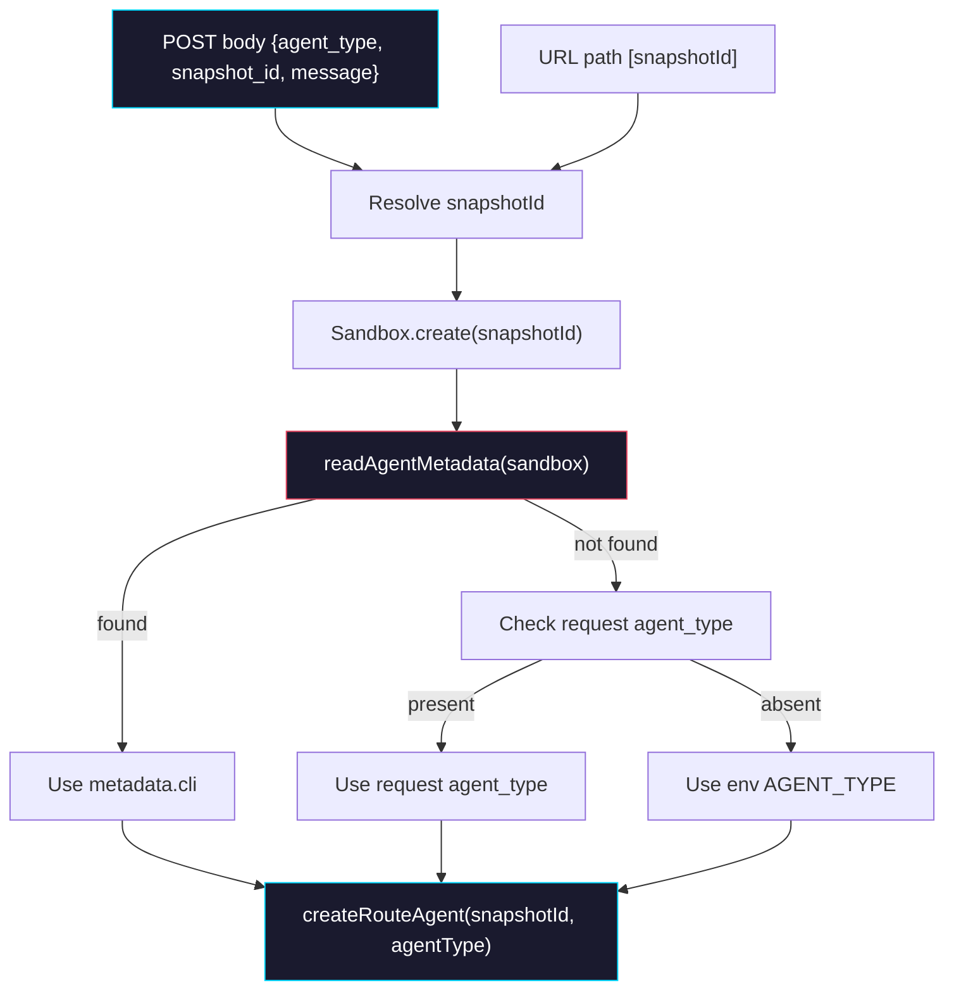

# Phase 2: Cloud API Agent Resolution

> **Epic:** [AGENTS.md](./AGENTS.md)
> **Dependencies:** Phase 0 (snapshot metadata) + Phase 1 (provider agent config)
> **Blocks:** Phase 3

## Objective

Modify the Cloud API route to resolve the agent type dynamically per-request, using a priority chain: snapshot metadata → request body `agent_type` → env `AGENT_TYPE` fallback. Remove the hard dependency on the `AGENT_TYPE` env var for agent selection. When a `snapshot_id` is provided in the request body, use it instead of the URL path `snapshotId` parameter.

## What You're Building



## Deliverables

### 1. `sandbox-agent/web/app/agents/[slug]/snapshots/[snapshotId]/chat/api/route.ts` — Agent resolution

Read `sandbox-agent/web/app/agents/[slug]/snapshots/[snapshotId]/chat/api/route.ts` first to understand the current flow.

#### 1a. Add `agent_type` and `snapshot_id` to `ChatRequestBody`

```typescript
type ChatRequestBody = {
	message?: string;
	session_id?: string;
	sandbox_id?: string;
	agent_type?: string;   // ← NEW
	snapshot_id?: string;  // ← NEW
	files?: Array<{
		name: string;
		type: string;
		size: number;
		pathname: string;
		url: string;
	}>;
};
```

#### 1b. Replace `resolveAgentType()` with async resolution

The current `resolveAgentType()` reads only from env. Replace it with a function that implements the priority chain. Import `readAgentMetadata` from `@giselles-ai/sandbox-agent`.

```typescript
import { readAgentMetadata } from "@giselles-ai/sandbox-agent";

async function resolveAgentTypeFromSandbox(
	sandbox: Sandbox,
	requestAgentType: string | undefined,
): Promise<AgentType> {
	// Priority 1: Snapshot metadata
	const metadata = await readAgentMetadata(sandbox).catch(() => null);
	if (metadata?.cli === "codex" || metadata?.cli === "gemini") {
		return metadata.cli;
	}

	// Priority 2: Request body agent_type
	const bodyType = requestAgentType?.trim().toLowerCase();
	if (bodyType === "codex") {
		return "codex";
	}
	if (bodyType === "gemini") {
		return "gemini";
	}

	// Priority 3: Environment variable
	const envType = process.env.AGENT_TYPE?.trim().toLowerCase();
	if (envType === "codex") {
		return "codex";
	}

	return "gemini";
}
```

#### 1c. Modify the `POST` handler

The key change: sandbox creation happens **before** agent resolution, so we can read metadata from it. Resolve the effective `snapshotId` from the request body `snapshot_id` (if provided) or the URL path parameter.

In the `POST` function, change the agent resolution flow:

```typescript
// Before (current):
const agentType = resolveAgentType();  // env only
const agent = createRouteAgent(snapshotId, agentType);

// After:
const effectiveSnapshotId = body.snapshot_id?.trim() || snapshotId;

// ... inside the stream's async block, after sandbox creation:
const sandbox = sandboxId
    ? await Sandbox.get({ sandboxId })
    : await initSandbox(effectiveSnapshotId);

const agentType = await resolveAgentTypeFromSandbox(sandbox, body.agent_type);
const agent = createRouteAgent(effectiveSnapshotId, agentType);
```

**Important:** Because agent resolution now depends on the sandbox, the `createRouteAgent` call must move inside the stream's async IIFE, after `sandbox` is available. The `parseRequest` step can use a generic schema for initial validation (message required), then the agent-specific schema is applied after agent resolution.

#### 1d. Refactor request parsing order

Currently the flow is:
1. `resolveAgentType()` → `createRouteAgent()` → `parseRequest(agent, body)` → stream

The new flow must be:
1. Validate `message` exists (basic check, already done)
2. Create sandbox
3. Read metadata → resolve agent type → `createRouteAgent()`
4. Use the agent's mapper and command inside the stream

The existing `parseRequest` that uses `agent.requestSchema` can move inside the stream handler, or the schema validation can be simplified since both Gemini and Codex base schemas share the same shape (`message`, `session_id`, `sandbox_id`).

### 2. Keep `createRouteAgent()` unchanged

The `createRouteAgent(snapshotId, agentType)` function already works correctly — it creates the right agent based on type and passes the snapshotId. No changes needed here.

### 3. Keep the old `resolveAgentType()` as a fallback utility

You can keep the existing `resolveAgentType()` function but only use it as the final fallback inside `resolveAgentTypeFromSandbox()` (via the env check). Or inline it — either approach works.

## Verification

```bash
# 1. Type-check the sandbox-agent web app
pnpm --filter sandbox-agent-web typecheck

# 2. Full monorepo build
pnpm build
```

Manual verification:

1. **Without agent_type in request (backward-compatible):**
   - Start with `AGENT_TYPE=gemini` (or unset) — should use Gemini as before.
   - Confirm no behavioral change for existing deployments.

2. **With agent_type in request body:**
   ```bash
   curl -N -X POST http://localhost:3000/agents/<slug>/snapshots/<snapshotId>/chat/api \
     -H "Content-Type: application/json" \
     -H "Authorization: Bearer <token>" \
     -d '{"message": "hello", "agent_type": "codex"}'
   ```
   - Should use Codex agent regardless of `AGENT_TYPE` env var.

3. **With snapshot_id in request body:**
   ```bash
   curl -N -X POST http://localhost:3000/agents/<slug>/snapshots/placeholder/chat/api \
     -H "Content-Type: application/json" \
     -H "Authorization: Bearer <token>" \
     -d '{"message": "hello", "snapshot_id": "<codex-snapshot-id>"}'
   ```
   - Should read `/.agent-metadata.json` from the codex snapshot and auto-select Codex.

4. **Metadata takes precedence over request body:**
   - Send `agent_type: "gemini"` but use a Codex snapshot (with `{"cli":"codex"}` metadata).
   - Should use Codex (metadata wins).

## Files to Create/Modify

| File | Action |
|---|---|
| `sandbox-agent/web/app/agents/[slug]/snapshots/[snapshotId]/chat/api/route.ts` | **Modify** (add `resolveAgentTypeFromSandbox`, accept `agent_type`/`snapshot_id` in body, move agent resolution after sandbox creation) |

## Done Criteria

- [ ] `ChatRequestBody` accepts `agent_type` and `snapshot_id` fields
- [ ] Agent type resolved from sandbox metadata when available
- [ ] Falls back to request body `agent_type`, then env `AGENT_TYPE`
- [ ] `snapshot_id` in request body overrides URL path `snapshotId`
- [ ] Backward-compatible: requests without `agent_type`/`snapshot_id` work identically
- [ ] `writeGeminiSettings()` only called for Gemini agents (already the case)
- [ ] Typecheck passes
- [ ] Update the status in [AGENTS.md](./AGENTS.md) to `✅ DONE`
