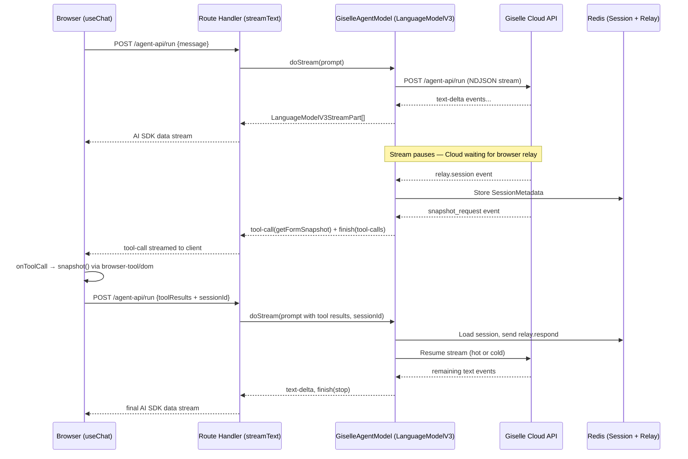
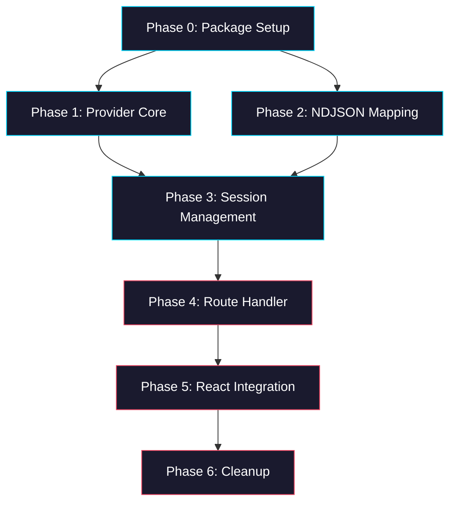

# Epic: Plan A — Custom AI SDK Provider for Giselle Cloud API

> **GitHub Epic:** #5331 · **Sub-issues:** #5332–#5338 (Phases 0–6)

## Goal

Replace the current custom streaming architecture (`useAgent` + NDJSON + SSE relay) with a standard **AI SDK** integration by implementing a custom `LanguageModelV3` provider. After this epic is complete, the React frontend uses `useChat` from `@ai-sdk/react`, and browser-tool operations flow through the AI SDK's `onToolCall` mechanism.

## Why

The current architecture requires a bespoke React hook (`useAgent`) that manually manages NDJSON streaming, SSE relay subscriptions, and relay responses. This is fragile, hard to extend, and does not benefit from the AI SDK ecosystem (middleware, telemetry, tool abstractions). By wrapping the Giselle Cloud API as a `LanguageModelV3`, we get:

- Standard `useChat` / `streamText` usage
- Client-side tool calls via `onToolCall` (no custom relay event wiring)
- AI SDK middleware compatibility (logging, rate limiting, etc.)
- Cleaner separation between transport and UI

## Architecture Overview



## Two-Layer Session Management

| Layer | Storage | Content | Instance Sharing |
|---|---|---|---|
| **SessionMetadata** | Redis (TTL 600s) | `geminiSessionId`, `sandboxId`, relay credentials, `pendingRequestId` | ✅ Shared across all Vercel instances |
| **LiveConnection** | `globalThis` Map | NDJSON reader, text buffer, relay Redis subscription | ❌ Process-local only |

- **Hot Resume:** Same Vercel instance handles the follow-up request → reuse the saved NDJSON reader from the `globalThis` Map.
- **Cold Resume:** Different instance → send `relay.respond` via Redis, reconnect to Cloud API with `session_id`.

## Package Structure

```
packages/
├── giselle-provider/          ← NEW (this epic)
│   ├── src/
│   │   ├── index.ts           ← giselle() factory + re-exports
│   │   ├── giselle-agent-model.ts  ← LanguageModelV3 implementation
│   │   ├── ndjson-mapper.ts   ← NDJSON → StreamPart mapping
│   │   ├── session-manager.ts ← Redis + globalThis session management
│   │   └── types.ts           ← GiselleProviderDeps, SessionMetadata, etc.
│   ├── package.json
│   ├── tsconfig.json
│   └── tsup.ts
├── browser-tool/              ← EXISTING (no changes in Phases 0–4)
│   └── src/
│       ├── types.ts           ← SnapshotField, BrowserToolAction schemas (referenced)
│       └── relay/             ← relay-store.ts, relay-handler.ts (kept as-is)
├── sandbox-agent/             ← EXISTING (deleted in Phase 6)
│   └── src/
│       ├── client/stream-agent.ts  ← absorb extractJsonObjects pattern, then delete
│       └── react/use-agent.ts      ← replaced by useChat, then delete
└── web/
    └── app/agent-api/
        ├── run/route.ts       ← rewritten in Phase 4
        └── relay/             ← kept as-is
```

## Task Dependency Graph



- **Phase 0 and Phase 2** can run in parallel (no dependency between them).
- **Phase 1** depends on Phase 0 (needs the package and types).
- **Phase 3** depends on both Phase 1 and Phase 2.
- **Phase 4–6** are sequential.

## Task Status

| Phase | Task File | Status | Description |
|---|---|---|---|
| 0 | [phase-0-package-setup.md](./phase-0-package-setup.md) | ✅ DONE | Create `packages/giselle-provider`, DI types, build config |
| 1 | [phase-1-provider-core.md](./phase-1-provider-core.md) | ✅ DONE | `GiselleAgentModel` implementing `LanguageModelV3`, `doStream`, factory |
| 2 | [phase-2-ndjson-mapping.md](./phase-2-ndjson-mapping.md) | ✅ DONE | NDJSON parser + event → `LanguageModelV3StreamPart` mapper |
| 3 | [phase-3-session-management.md](./phase-3-session-management.md) | ✅ DONE | Redis metadata + `globalThis` live connections + relay integration |
| 4 | [phase-4-route-handler.md](./phase-4-route-handler.md) | ✅ DONE | Add `/api/chat` route using `streamText()` + `giselle()` |
| 5 | [phase-5-react-integration.md](./phase-5-react-integration.md) | 🔲 TODO | Replace `useAgent` with `useChat` + `onToolCall` |
| 6 | [phase-6-cleanup.md](./phase-6-cleanup.md) | 🔲 TODO | Delete legacy `stream-agent.ts`, `use-agent.ts`, update exports |

> **How to work on this epic:** Read this file first to understand the full architecture. Then check the status table above. Pick the first `🔲 TODO` task whose dependencies (see dependency graph) are `✅ DONE`. Open that task file and follow its instructions. When done, update the status in this table to `✅ DONE`.

## Key Conventions

- **Monorepo:** pnpm workspaces, `tsup` for building, `biome` for formatting
- **TypeScript:** `strict`, target `ES2022`, module `ESNext`, moduleResolution `Bundler`
- **Zod version:** `4.3.6` (used throughout the monorepo)
- **Redis:** `ioredis@5.9.3` (matching `browser-tool`)
- **globalThis pattern:** Follow `browser-tool/src/relay/relay-store.ts` (`__browserToolRelayRedis`)
- **AI SDK:** `@ai-sdk/provider` and `@ai-sdk/provider-utils` for `LanguageModelV3` interface

## Existing Code Reference

These files contain patterns and types that the new provider must reference or absorb:

| File | Relevance |
|---|---|
| `packages/sandbox-agent/src/client/stream-agent.ts` | `extractJsonObjects()` parser to reuse; `streamAgent()` fetch pattern to absorb |
| `packages/sandbox-agent/src/react/use-agent.ts` | Current React hook with SSE relay — replacement target; shows NDJSON event types |
| `packages/browser-tool/src/types.ts` | `SnapshotField`, `BrowserToolAction`, all relay Zod schemas |
| `packages/browser-tool/src/relay/relay-store.ts` | Redis session management, `globalThis` pattern, relay dispatch/response flow |
| `packages/browser-tool/src/relay/relay-handler.ts` | Relay HTTP + SSE handlers (kept as-is) |
| `packages/web/app/agent-api/run/route.ts` | Current run route — rewrite target in Phase 4 |
| `packages/web/app/agent-api/relay/[[...relay]]/route.ts` | Relay route — keep as-is |

## NDJSON Event Types from Cloud API

| Event Type | Key Fields | Purpose |
|---|---|---|
| `init` | `session_id` | Gemini session ID for resumption |
| `sandbox` | `sandbox_id` | Vercel Sandbox ID |
| `relay.session` | `sessionId`, `token`, `expiresAt`, `relayUrl` | Relay session credentials |
| `message` | `role`, `content`, `delta` | Text content (assistant/user) |
| `tool_use` | `tool_id`, `tool_name`, `parameters` | Tool invocation started |
| `tool_result` | `tool_id`, `status`, `output` | Tool invocation completed |
| `stderr` | `content` | Stderr log output |
| `snapshot_request` | `requestId`, `instruction`, `document` | Relay: get form snapshot |
| `execute_request` | `requestId`, `actions`, `fields` | Relay: execute form actions |
