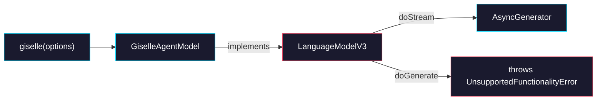

# Phase 1: Provider Core — GiselleAgentModel

> **GitHub Issue:** #5333 · **Epic:** [AGENTS.md](./AGENTS.md)
> **Dependencies:** Phase 0 (package setup must be complete)
> **Blocks:** Phase 3

## Objective

Implement `GiselleAgentModel`, a class that satisfies the AI SDK `LanguageModelV3` interface. This is the central piece that `streamText()` will call. In this phase, `doStream` creates a stub async generator — the actual NDJSON parsing (Phase 2) and session management (Phase 3) will be wired in later.

## What You're Building



## Deliverables

### 1. `src/giselle-agent-model.ts`

Implement the `LanguageModelV3` interface. Key design decisions:

| Property/Method | Value | Rationale |
|---|---|---|
| `specificationVersion` | `"v3"` | LanguageModelV3 requirement |
| `provider` | `"giselle"` | Provider identifier |
| `modelId` | `"giselle-agent"` | Model identifier |
| `defaultObjectGenerationMode` | `undefined` | Not an object-generation model |
| `doGenerate()` | Throws `UnsupportedFunctionalityError` | This model is streaming-only |
| `doStream()` | Returns `LanguageModelV3CallResponse` with `stream` | Core streaming method |

#### `doStream` Signature

```typescript
async doStream(
  options: Parameters<LanguageModelV3["doStream"]>[0]
): Promise<ReturnType<LanguageModelV3["doStream"]>> {
  // Extract providerOptions to get sessionId for resume
  const providerSessionId = options.providerOptions?.giselle?.sessionId as string | undefined;

  // For now, return a minimal working stream
  // Phase 2 will replace this with real NDJSON mapping
  // Phase 3 will add session resume logic

  const stream = this.createStream(options, providerSessionId);

  return {
    stream,
    rawCall: {
      rawPrompt: null,
      rawSettings: {},
    },
    rawResponse: undefined,
    request: { body: undefined },
    warnings: [],
  };
}
```

#### Stub Stream (to be replaced in Phase 2/3)

For now, `createStream` should return a `ReadableStream<LanguageModelV3StreamPart>` that immediately emits `finish` with `reason: "stop"`:

```typescript
private createStream(
  options: Parameters<LanguageModelV3["doStream"]>[0],
  providerSessionId: string | undefined,
): ReadableStream<LanguageModelV3StreamPart> {
  return new ReadableStream({
    start(controller) {
      controller.enqueue({
        type: "finish",
        finishReason: "stop",
        usage: { inputTokens: 0, outputTokens: 0 },
      });
      controller.close();
    },
  });
}
```

### 2. `src/index.ts` — `giselle()` Factory Function

Add the factory function that creates the model instance:

```typescript
import { GiselleAgentModel } from "./giselle-agent-model";
import type { GiselleProviderOptions } from "./types";

export function giselle(options: GiselleProviderOptions) {
  return new GiselleAgentModel(options);
}

// Re-export types
export type { GiselleProviderOptions, /* ... other types from Phase 0 ... */ } from "./types";
export { GiselleAgentModel } from "./giselle-agent-model";
```

### 3. Understanding `LanguageModelV3`

Before implementing, read the AI SDK provider source to understand the exact interface. Key things to verify:

```bash
# After pnpm install, check the actual type definition:
cat node_modules/@ai-sdk/provider/dist/index.d.ts | grep -A 50 "LanguageModelV3"
```

The interface requires at minimum:
- `specificationVersion: "v3"`
- `provider: string`
- `modelId: string`
- `doStream(options): Promise<{ stream: ReadableStream<LanguageModelV3StreamPart>, ... }>`
- `doGenerate(options): Promise<{ ... }>` (can throw `UnsupportedFunctionalityError`)

#### `LanguageModelV3StreamPart` Types You'll Need

| StreamPart Type | When Emitted |
|---|---|
| `text-start` | Beginning of a text block |
| `text-delta` | Incremental text content |
| `text-end` | End of a text block |
| `tool-call` | A tool invocation (with `toolCallId`, `toolName`, `args`) |
| `finish` | Stream completion (`finishReason: "stop" \| "tool-calls"`) |
| `response-metadata` | Optional metadata (modelId, timestamp, headers) |

### 4. `UnsupportedFunctionalityError`

Import from `@ai-sdk/provider`:

```typescript
import { UnsupportedFunctionalityError } from "@ai-sdk/provider";
```

Use in `doGenerate`:

```typescript
async doGenerate(): Promise<never> {
  throw new UnsupportedFunctionalityError({
    functionality: "doGenerate",
  });
}
```

## Verification

```bash
# 1. Build
pnpm --filter @giselles-ai/giselle-provider build

# 2. Type-check
pnpm --filter @giselles-ai/giselle-provider typecheck

# 3. Quick smoke test — import and instantiate
node -e "
  const { giselle } = require('./packages/giselle-provider/dist/index.js');
  const model = giselle({ cloudApiUrl: 'https://example.com' });
  console.log('provider:', model.provider);
  console.log('modelId:', model.modelId);
  console.log('specificationVersion:', model.specificationVersion);
"
```

Expected output:
```
provider: giselle
modelId: giselle-agent
specificationVersion: v3
```

## AI SDK Source Code Tips

To understand how `streamText()` calls the model:

1. **`streamText` entry:** Look at how `streamText` calls `model.doStream()` — it passes the prompt, tools, and providerOptions.
2. **Tool handling:** In `run-tools-transformation.ts`, when a tool has no `execute` function and `providerExecuted !== true`, the `tool-call` is emitted to the client without server-side execution. This is the mechanism we rely on.
3. **Multi-step loop:** In `stream-text.ts`, the step loop stops when `clientToolOutputs < clientToolCalls` — meaning if we emit a `tool-call` and finish with `tool-calls`, the client sends back tool results, and `streamText` calls `doStream` again with the updated prompt.

## Files to Create/Modify

| File | Action |
|---|---|
| `packages/giselle-provider/src/giselle-agent-model.ts` | **Create** |
| `packages/giselle-provider/src/index.ts` | **Modify** (add factory + class export) |

## Done Criteria

- [ ] `GiselleAgentModel` class implements `LanguageModelV3` with all required properties
- [ ] `doGenerate()` throws `UnsupportedFunctionalityError`
- [ ] `doStream()` returns a valid response with a `ReadableStream<LanguageModelV3StreamPart>`
- [ ] `giselle()` factory function creates and returns a `GiselleAgentModel`
- [ ] `pnpm --filter @giselles-ai/giselle-provider build` succeeds
- [ ] `pnpm --filter @giselles-ai/giselle-provider typecheck` passes
- [ ] Update the status in [AGENTS.md](./AGENTS.md) to `✅ DONE`
