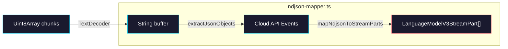

# Phase 2: NDJSON → LanguageModelV3StreamPart Mapping

> **GitHub Issue:** #5334 · **Epic:** [AGENTS.md](./AGENTS.md)
> **Dependencies:** Phase 0 (needs types from `types.ts`)
> **Parallel with:** Phase 1
> **Blocks:** Phase 3

## Objective

Build two modules:
1. **`extractJsonObjects()`** — a streaming NDJSON parser (reuse the proven pattern from `stream-agent.ts`)
2. **`mapNdjsonToStreamParts()`** — a mapper that converts parsed Cloud API events into `LanguageModelV3StreamPart` objects

These are pure functions with no I/O dependencies, making them easy to test in isolation.

## What You're Building



## Deliverables

### 1. `src/ndjson-mapper.ts`

#### `extractJsonObjects(buffer: string)`

Copy the exact implementation from `packages/sandbox-agent/src/client/stream-agent.ts` lines 16–70. This function handles streaming JSON parsing with proper brace-depth tracking, string escaping, and partial buffer retention.

```typescript
export function extractJsonObjects(buffer: string): {
  objects: string[];
  rest: string;
} {
  // Copy from packages/sandbox-agent/src/client/stream-agent.ts
  // This is a proven, battle-tested implementation.
}
```

#### Cloud API Event Type

Define a minimal type for parsed NDJSON events:

```typescript
type CloudApiEvent = {
  type?: string;
  [key: string]: unknown;
};
```

#### Mapping Context

The mapper needs to track state across events (e.g., whether a text block is currently open). Use a mutable context object:

```typescript
export type NdjsonMapperContext = {
  textBlockOpen: boolean;
  lastAssistantContent: string;
};

export function createMapperContext(): NdjsonMapperContext {
  return {
    textBlockOpen: false,
    lastAssistantContent: "",
  };
}
```

#### `mapNdjsonEvent(event, context)` — The Core Mapper

This function takes a single Cloud API event and returns zero or more `LanguageModelV3StreamPart` objects, plus optional side-effect metadata.

```typescript
import type { LanguageModelV3StreamPart } from "@ai-sdk/provider";

export type MapResult = {
  /** StreamParts to emit to the AI SDK stream. */
  parts: LanguageModelV3StreamPart[];
  /** Side-effect: session metadata to store (handled by caller). */
  sessionUpdate?: Partial<SessionMetadata>;
  /** Side-effect: a relay request that should trigger a tool-call pause. */
  relayRequest?: Record<string, unknown>;
};

export function mapNdjsonEvent(
  event: CloudApiEvent,
  context: NdjsonMapperContext,
): MapResult {
  // ... mapping logic per event type
}
```

### 2. Event Mapping Table

This is the complete mapping from Cloud API NDJSON events to AI SDK stream parts:

| Cloud API Event | Condition | StreamParts Emitted | Side Effects |
|---|---|---|---|
| `message` | `role === "assistant"`, `delta === true` | 1. If `!textBlockOpen`: emit `text-start` then `text-delta` <br> 2. If `textBlockOpen`: emit `text-delta` | Set `textBlockOpen = true`, append to `lastAssistantContent` |
| `message` | `role === "assistant"`, `delta !== true`, non-empty content | Close current text block if open, emit `text-start` + `text-delta` + `text-end` | Reset `lastAssistantContent` |
| `message` | `role === "user"` | None (skip) | — |
| `init` | — | `response-metadata` with `modelId` | `sessionUpdate.geminiSessionId = event.session_id` |
| `sandbox` | — | `response-metadata` | `sessionUpdate.sandboxId = event.sandbox_id` |
| `relay.session` | — | None (internal only) | `sessionUpdate.relaySessionId`, `.relayToken`, `.relayUrl` |
| `snapshot_request` | — | Close text block if open, then `tool-call(getFormSnapshot)` + `finish(tool-calls)` | `relayRequest = event`, `sessionUpdate.pendingRequestId` |
| `execute_request` | — | Close text block if open, then `tool-call(executeFormActions)` + `finish(tool-calls)` | `relayRequest = event`, `sessionUpdate.pendingRequestId` |
| `tool_use` | — | None (internal Cloud API tool, not our relay tool) | — |
| `tool_result` | — | None (internal Cloud API tool result) | — |
| `stderr` | — | None (optionally log) | — |
| Stream end | — | Close text block if open, then `finish(stop)` | — |

### 3. Tool Call Mapping Details

When a `snapshot_request` or `execute_request` arrives from the relay, emit:

#### For `snapshot_request`:

```typescript
// 1. Close text block if open
if (context.textBlockOpen) {
  parts.push({ type: "text-end" });
  context.textBlockOpen = false;
}

// 2. Emit tool-call
parts.push({
  type: "tool-call",
  toolCallId: event.requestId,      // Use relay requestId as toolCallId
  toolName: "getFormSnapshot",
  args: JSON.stringify({
    instruction: event.instruction,
    document: event.document,
  }),
});

// 3. Emit finish with tool-calls reason
parts.push({
  type: "finish",
  finishReason: "tool-calls",
  usage: { inputTokens: 0, outputTokens: 0 },
});
```

#### For `execute_request`:

```typescript
parts.push({
  type: "tool-call",
  toolCallId: event.requestId,
  toolName: "executeFormActions",
  args: JSON.stringify({
    actions: event.actions,
    fields: event.fields,
  }),
});

parts.push({
  type: "finish",
  finishReason: "tool-calls",
  usage: { inputTokens: 0, outputTokens: 0 },
});
```

### 4. `finishStream(context)` Helper

Call this when the NDJSON stream ends to emit final close events:

```typescript
export function finishStream(context: NdjsonMapperContext): LanguageModelV3StreamPart[] {
  const parts: LanguageModelV3StreamPart[] = [];

  if (context.textBlockOpen) {
    parts.push({ type: "text-end" });
    context.textBlockOpen = false;
  }

  parts.push({
    type: "finish",
    finishReason: "stop",
    usage: { inputTokens: 0, outputTokens: 0 },
  });

  return parts;
}
```

## Verification

Write a test file `src/__tests__/ndjson-mapper.test.ts` (or verify manually). Here are the key scenarios to verify:

### Test 1: Text-only stream

```typescript
const ctx = createMapperContext();

// Simulate: init → message(delta) → message(delta) → stream end
const r1 = mapNdjsonEvent({ type: "init", session_id: "s1" }, ctx);
// Expect: response-metadata, sessionUpdate.geminiSessionId = "s1"

const r2 = mapNdjsonEvent({ type: "message", role: "assistant", content: "Hello ", delta: true }, ctx);
// Expect: text-start + text-delta("Hello ")

const r3 = mapNdjsonEvent({ type: "message", role: "assistant", content: "world!", delta: true }, ctx);
// Expect: text-delta("world!")

const r4 = finishStream(ctx);
// Expect: text-end + finish(stop)
```

### Test 2: Relay tool call interruption

```typescript
const ctx = createMapperContext();

const r1 = mapNdjsonEvent({ type: "message", role: "assistant", content: "Filling ", delta: true }, ctx);
// Expect: text-start + text-delta

const r2 = mapNdjsonEvent({
  type: "snapshot_request",
  requestId: "req-1",
  instruction: "Fill the login form",
}, ctx);
// Expect: text-end + tool-call(getFormSnapshot) + finish(tool-calls)
// Expect: relayRequest is set, sessionUpdate.pendingRequestId = "req-1"
```

### Test 3: extractJsonObjects handles partial buffers

```typescript
const { objects, rest } = extractJsonObjects('{"a":1}\n{"b":2}\n{"c":');
// Expect: objects = ['{"a":1}', '{"b":2}'], rest = '{"c":'
```

```bash
# Build and type-check
pnpm --filter @giselles-ai/giselle-provider build
pnpm --filter @giselles-ai/giselle-provider typecheck
```

## Files to Create/Modify

| File | Action |
|---|---|
| `packages/giselle-provider/src/ndjson-mapper.ts` | **Create** |
| `packages/giselle-provider/src/index.ts` | **Modify** (add exports for mapper functions) |

## Done Criteria

- [ ] `extractJsonObjects()` correctly parses streaming NDJSON with partial buffer handling
- [ ] `mapNdjsonEvent()` handles all event types per the mapping table
- [ ] `finishStream()` properly closes open text blocks
- [ ] Tool-call mapping uses relay `requestId` as `toolCallId`
- [ ] Text block state tracking works (open/close text-start/text-end)
- [ ] `pnpm --filter @giselles-ai/giselle-provider build` succeeds
- [ ] `pnpm --filter @giselles-ai/giselle-provider typecheck` passes
- [ ] Update the status in [AGENTS.md](./AGENTS.md) to `✅ DONE`
