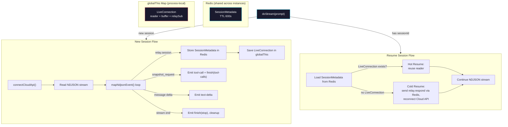
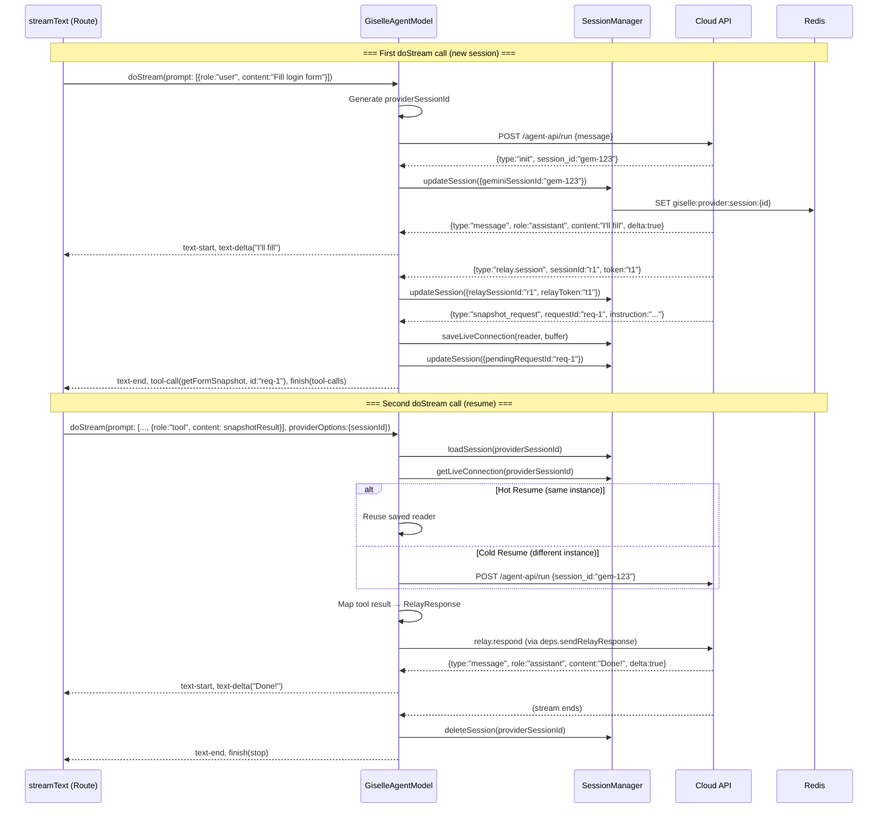

# Phase 3: Session Management & Relay Integration

> **GitHub Issue:** #5335 · **Epic:** [AGENTS.md](./AGENTS.md)
> **Dependencies:** Phase 1 (provider core) + Phase 2 (NDJSON mapping)
> **Blocks:** Phase 4

## Objective

Implement the two-layer session management system and wire together `GiselleAgentModel.doStream` with real NDJSON parsing, relay subscriptions, and session resume logic. After this phase, the provider can handle the full lifecycle: new session → text streaming → relay tool call → resume → completion.

## What You're Building



## Deliverables

### 1. `src/session-manager.ts`

#### Redis Key Convention

```
giselle:provider:session:{providerSessionId}
```

TTL: 600 seconds (10 minutes), matching the relay session TTL.

#### `globalThis` Map

Follow the pattern in `packages/browser-tool/src/relay/relay-store.ts` where `globalThis.__browserToolRelayRedis` is used:

```typescript
declare global {
  var __giselleProviderSessions: Map<string, LiveConnection> | undefined;
}

function getLiveConnectionMap(): Map<string, LiveConnection> {
  if (!globalThis.__giselleProviderSessions) {
    globalThis.__giselleProviderSessions = new Map();
  }
  return globalThis.__giselleProviderSessions;
}
```

#### Redis Client

Reuse the same `ioredis` pattern as `relay-store.ts`. Read environment variables (`REDIS_URL`, `KV_URL`, etc.) to create a shared Redis client via `globalThis`:

```typescript
declare global {
  var __giselleProviderRedis: Redis | undefined;
}
```

> **Important:** Use the same env var candidates as `relay-store.ts` for consistency.

#### Core Functions

```typescript
/** Generate a new provider session ID and store initial metadata in Redis. */
export async function createSession(metadata: SessionMetadata): Promise<void>;

/** Load session metadata from Redis. Returns null if expired/missing. */
export async function loadSession(providerSessionId: string): Promise<SessionMetadata | null>;

/** Update session metadata in Redis (partial update, re-sets TTL). */
export async function updateSession(
  providerSessionId: string,
  updates: Partial<SessionMetadata>,
): Promise<void>;

/** Delete session from Redis and remove LiveConnection from globalThis. */
export async function deleteSession(providerSessionId: string): Promise<void>;

/** Save a LiveConnection to the globalThis Map. */
export function saveLiveConnection(providerSessionId: string, connection: LiveConnection): void;

/** Get a LiveConnection from the globalThis Map. Returns undefined if not found. */
export function getLiveConnection(providerSessionId: string): LiveConnection | undefined;

/** Remove a LiveConnection from the globalThis Map and close its resources. */
export async function removeLiveConnection(providerSessionId: string): Promise<void>;
```

### 2. Wire `doStream` in `giselle-agent-model.ts`

Replace the stub stream from Phase 1 with real logic. The `doStream` method now has two paths:

#### Path A: New Session (no `providerSessionId` in options)

```
1. Generate providerSessionId = crypto.randomUUID()
2. Extract user message from prompt (last user message content)
3. Call deps.connectCloudApi() to start NDJSON stream
4. Create a ReadableStream that:
   a. Reads chunks from the NDJSON reader
   b. Uses extractJsonObjects() to parse events
   c. For each event, call mapNdjsonEvent()
   d. Handle side effects:
      - sessionUpdate → updateSession() in Redis
      - relayRequest → save LiveConnection to globalThis, pause stream
   e. Emit all parts to the controller
   f. On stream end, call finishStream() and cleanup
5. Emit response-metadata with providerSessionId at stream start
```

#### Path B: Resume Session (has `providerSessionId`)

```
1. loadSession(providerSessionId) from Redis
2. Extract tool results from prompt (the AI SDK passes them as tool-result messages)
3. Map tool results back to RelayResponse format:
   - getFormSnapshot result → { type: "snapshot_response", requestId, fields }
   - executeFormActions result → { type: "execute_response", requestId, report }
4. Try Hot Resume:
   a. getLiveConnection(providerSessionId)
   b. If found: send relay.respond via deps, continue reading from saved reader
5. Fall back to Cold Resume:
   a. Send relay.respond via Redis (deps.sendRelayResponse)
   b. Call deps.connectCloudApi() with session_id to reconnect
   c. Create new reader and continue
6. Continue NDJSON stream processing (same as new session from step 4 onward)
```

#### Tool Result → Relay Response Mapping

When the AI SDK sends tool results back, extract them from the prompt and convert:

```typescript
function toolResultToRelayResponse(
  toolName: string,
  toolCallId: string, // This is the relay requestId
  result: unknown,
): Record<string, unknown> {
  if (toolName === "getFormSnapshot") {
    return {
      type: "snapshot_response",
      requestId: toolCallId,
      fields: (result as { fields: unknown }).fields,
    };
  }

  if (toolName === "executeFormActions") {
    return {
      type: "execute_response",
      requestId: toolCallId,
      report: (result as { report: unknown }).report,
    };
  }

  return {
    type: "error_response",
    requestId: toolCallId,
    message: `Unknown tool: ${toolName}`,
  };
}
```

### 3. Extracting Data from AI SDK Prompt

The AI SDK passes the full conversation history as `options.prompt` — an array of messages. You need to extract:

- **User message:** The last message with `role: "user"` contains the text to send to the Cloud API.
- **Tool results:** Messages with `role: "tool"` contain the results of client-side tool calls.

```typescript
// options.prompt is LanguageModelV3Prompt (array of LanguageModelV3Message)
// Each message has: role, content (array of parts)

function extractUserMessage(prompt: LanguageModelV3Prompt): string {
  // Find last user message, concatenate text parts
}

function extractToolResults(prompt: LanguageModelV3Prompt): Array<{
  toolName: string;
  toolCallId: string;
  result: unknown;
}> {
  // Find tool-result messages
}
```

> **Important:** Read the actual `LanguageModelV3Prompt` type from `@ai-sdk/provider` to understand the exact structure. The types may have changed — always verify against the installed version.

### 4. `providerSessionId` via `response-metadata`

The provider needs to communicate the `providerSessionId` back to the route handler so it can pass it to the client. Emit it as a `response-metadata` stream part:

```typescript
controller.enqueue({
  type: "response-metadata",
  headers: {
    "x-giselle-session-id": providerSessionId,
  },
});
```

The route handler (Phase 4) will extract this from the stream and pass it to the client as `providerOptions`.

## Data Flow: Full Round-Trip



## Verification

### Test 1: New session → text-only stream

```
1. Mock deps.connectCloudApi to return a stream of: init → message(delta) → message(delta) → stream end
2. Call doStream with a simple user message
3. Verify: response-metadata, text-start, text-delta, text-delta, text-end, finish(stop)
4. Verify: session created in Redis, cleaned up after stream ends
```

### Test 2: New session → tool call pause

```
1. Mock stream: init → relay.session → message(delta) → snapshot_request → (stream pauses)
2. Call doStream
3. Verify: text-delta emitted, then text-end + tool-call + finish(tool-calls)
4. Verify: LiveConnection saved in globalThis
5. Verify: SessionMetadata in Redis has pendingRequestId
```

### Test 3: Resume → hot path

```
1. Pre-populate: SessionMetadata in Redis + LiveConnection in globalThis
2. Mock the saved reader to continue returning: message(delta) → stream end
3. Call doStream with providerSessionId + tool results
4. Verify: deps.sendRelayResponse called with correct RelayResponse
5. Verify: text-delta, text-end, finish(stop)
6. Verify: session cleaned up
```

```bash
pnpm --filter @giselles-ai/giselle-provider build
pnpm --filter @giselles-ai/giselle-provider typecheck
```

## Files to Create/Modify

| File | Action |
|---|---|
| `packages/giselle-provider/src/session-manager.ts` | **Create** |
| `packages/giselle-provider/src/giselle-agent-model.ts` | **Modify** (replace stub with real doStream) |
| `packages/giselle-provider/src/index.ts` | **Modify** (add session-manager exports if needed) |

## Done Criteria

- [ ] `SessionManager` stores/loads/deletes metadata in Redis with 600s TTL
- [ ] `LiveConnection` stored in `globalThis` Map, retrieved, and cleaned up properly
- [ ] `doStream` handles new session flow (connect → stream → emit parts)
- [ ] `doStream` handles resume flow (load session → send relay response → continue stream)
- [ ] Hot resume reuses saved reader from `globalThis`
- [ ] Cold resume reconnects to Cloud API with `session_id`
- [ ] Tool results correctly mapped back to `RelayResponse` format
- [ ] `providerSessionId` emitted via `response-metadata`
- [ ] `pnpm --filter @giselles-ai/giselle-provider build` succeeds
- [ ] `pnpm --filter @giselles-ai/giselle-provider typecheck` passes
- [ ] Update the status in [AGENTS.md](./AGENTS.md) to `✅ DONE`
