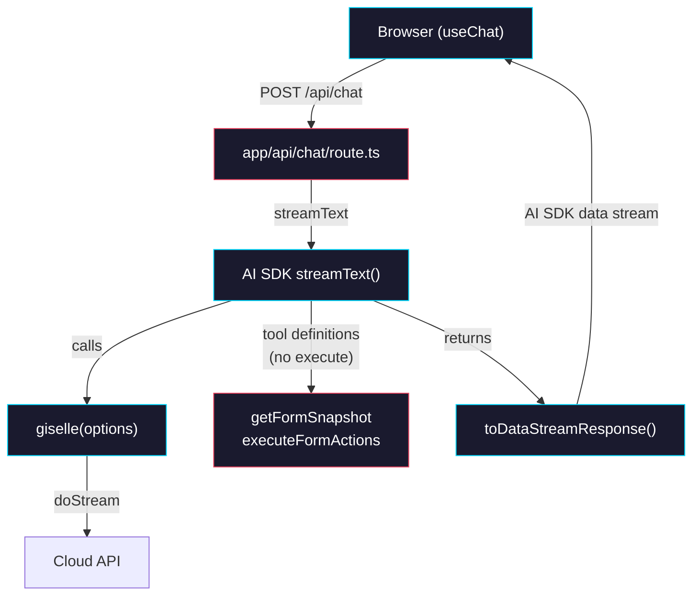
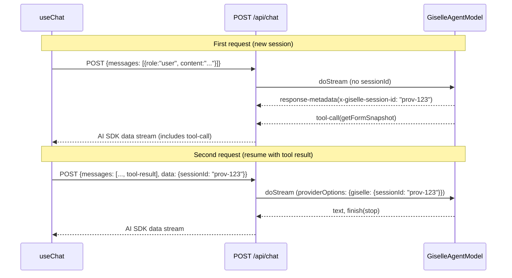

# Phase 4: Route Handler — `streamText()` + `giselle()`

> **GitHub Issue:** #5336 · **Epic:** [AGENTS.md](./AGENTS.md)
> **Dependencies:** Phase 3 (session management must be complete)
> **Blocks:** Phase 5

## Objective

Rewrite `packages/web/app/agent-api/run/route.ts` to use the AI SDK's `streamText()` with the `giselle()` provider. Define the browser tools (`getFormSnapshot`, `executeFormActions`) as client-side tools (no `execute` function). The relay route (`/agent-api/relay/`) is kept as-is.

## What You're Building



## Current vs New Architecture

### Before (current `run/route.ts`)

```
POST /agent-api/run
  → parseRunInput
  → createRelaySession (Redis)
  → createGeminiSandboxAgent (Vercel Sandbox)
  → runChat (start sandbox, stream output)
  → mergeRelaySessionStream (prepend relay.session event)
  → Return NDJSON Response
```

The current route creates a Vercel Sandbox with Gemini CLI, runs a chat, and streams raw NDJSON back. The client-side `useAgent` hook parses this NDJSON manually.

### After (new route)

```
POST /api/chat (AI SDK convention)
  → Parse AI SDK request body
  → streamText({
      model: giselle({ cloudApiUrl, headers }),
      tools: { getFormSnapshot, executeFormActions },  // no execute
      providerOptions: { giselle: { sessionId } },
    })
  → toDataStreamResponse()
```

The new route uses `streamText` which calls `giselle().doStream()` internally. The AI SDK handles the data stream protocol.

## Deliverables

### 1. New Route File

Create `packages/web/app/api/chat/route.ts` (following AI SDK convention for `useChat`):

> **Note:** `useChat` defaults to `POST /api/chat`. We use this path to align with the AI SDK convention. The old `/agent-api/run` route will be kept temporarily for backward compatibility and removed in Phase 6.

```typescript
import { streamText, tool } from "ai";
import { giselle } from "@giselles-ai/giselle-provider";
import { z } from "zod";
import {
  snapshotFieldSchema,
  browserToolActionSchema,
  executionReportSchema,
} from "@giselles-ai/browser-tool";

export const runtime = "nodejs";
export const dynamic = "force-dynamic";

const CLOUD_API_URL = "https://studio.giselles.ai";

function requiredEnv(name: string): string {
  const value = process.env[name]?.trim();
  if (!value) {
    throw new Error(`Missing required environment variable: ${name}`);
  }
  return value;
}

function buildCloudApiHeaders(): Record<string, string> {
  const headers: Record<string, string> = {
    authorization: `Bearer ${requiredEnv("EXTERNAL_AGENT_API_BEARER_TOKEN")}`,
  };

  const bypass = process.env.EXTERNAL_AGENT_API_PROTECTION_BYPASS?.trim();
  if (bypass) {
    headers["x-vercel-protection-bypass"] = bypass;
  }

  return headers;
}

export async function POST(request: Request): Promise<Response> {
  const result = streamText({
    model: giselle({
      cloudApiUrl: CLOUD_API_URL,
      headers: buildCloudApiHeaders(),
    }),
    tools: {
      getFormSnapshot: tool({
        description: "Capture the current state of form fields on the page",
        parameters: z.object({
          instruction: z.string().describe("What to look for in the form"),
          document: z.string().optional().describe("Additional context document"),
        }),
        // No execute — this is a client-side tool
      }),
      executeFormActions: tool({
        description: "Execute fill/click/select actions on form fields",
        parameters: z.object({
          actions: z.array(browserToolActionSchema).describe("Actions to perform"),
          fields: z.array(snapshotFieldSchema).describe("Current field state"),
        }),
        // No execute — this is a client-side tool
      }),
    },
    // The AI SDK request body includes messages + any providerOptions
    // streamText will pass these through to doStream
    ...(await parseRequestOptions(request)),
  });

  return result.toDataStreamResponse();
}
```

### 2. Request Parsing

The AI SDK's `useChat` sends a standard request body. Parse it:

```typescript
async function parseRequestOptions(request: Request) {
  const body = await request.json();

  // The AI SDK sends: { messages, ...options }
  // We need to extract providerOptions for sessionId
  return {
    messages: body.messages,
    providerOptions: body.providerOptions,
  };
}
```

> **Important:** Check how `useChat` structures the request body. Read `@ai-sdk/react` source or the AI SDK docs. The exact shape may vary — the key fields are `messages` and any custom data.

### 3. Add AI SDK Dependencies to `packages/web`

Update `packages/web/package.json`:

```json
{
  "dependencies": {
    "ai": "^5.0.0",
    "@ai-sdk/react": "^2.0.0",
    "@giselles-ai/giselle-provider": "workspace:*",
    // ... existing deps
  }
}
```

> **Note:** Check the actual latest versions of `ai` and `@ai-sdk/react`. Run `npm view ai version` and `npm view @ai-sdk/react version`.

### 4. Export Zod Schemas from `browser-tool`

The route imports `snapshotFieldSchema`, `browserToolActionSchema`, and `executionReportSchema` from `@giselles-ai/browser-tool`. Verify these are exported from the package's root export (`packages/browser-tool/src/index.ts`). If not, add the exports.

Check:
```bash
grep -n "snapshotFieldSchema\|browserToolActionSchema\|executionReportSchema" packages/browser-tool/src/index.ts
```

### 5. `providerOptions` Flow

The `providerSessionId` must flow from the provider → route → client → back to the route on the next request:



> **Key question for implementation:** How does `streamText` pass `response-metadata` headers back to the client? And how does the client read the `providerSessionId` to send it back on the next request? This may require using `onFinish`, custom headers on the Response, or the AI SDK's `data` channel. Investigate `streamText` options and `toDataStreamResponse` options.

## Verification

### Test 1: Text-only request

```bash
curl -X POST http://localhost:3000/api/chat \
  -H "Content-Type: application/json" \
  -d '{"messages":[{"role":"user","content":"Hello"}]}'
```

Expected: AI SDK data stream format with text deltas.

### Test 2: Tool call round-trip

```
1. Send initial message
2. Receive tool-call for getFormSnapshot in the stream
3. Send follow-up with tool result + sessionId
4. Receive remaining text + finish(stop)
```

### Build verification

```bash
# Install new deps
pnpm install

# Build all packages
pnpm build

# Type-check the web package
pnpm --filter demo typecheck

# Start dev server and test manually
pnpm --filter demo dev
```

## Files to Create/Modify

| File | Action |
|---|---|
| `packages/web/app/api/chat/route.ts` | **Create** |
| `packages/web/package.json` | **Modify** (add `ai`, `@ai-sdk/react`, `@giselles-ai/giselle-provider`) |
| `packages/browser-tool/src/index.ts` | **Modify** (ensure schemas are exported, if not already) |

> **Do NOT delete** `packages/web/app/agent-api/run/route.ts` yet — that happens in Phase 6.

## Done Criteria

- [ ] `packages/web/app/api/chat/route.ts` exists with `streamText()` + `giselle()` + tool definitions
- [ ] Tools defined without `execute` (client-side tools)
- [ ] Zod schemas from `browser-tool` used for tool parameter validation
- [ ] AI SDK dependencies added to `packages/web/package.json`
- [ ] `pnpm build` succeeds for all packages
- [ ] `pnpm --filter demo typecheck` passes
- [ ] Basic curl test returns AI SDK data stream format
- [ ] Update the status in [AGENTS.md](./AGENTS.md) to `✅ DONE`
