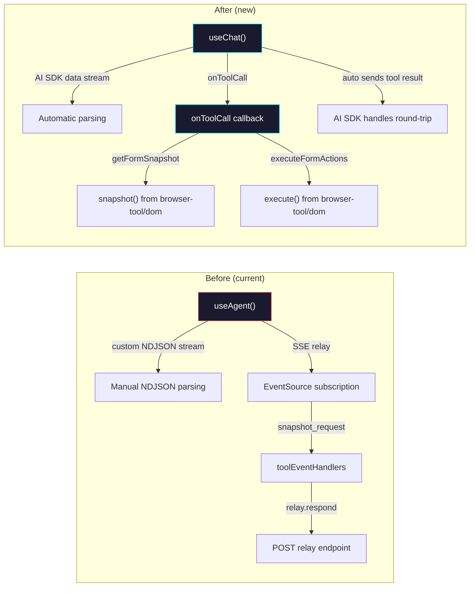

# Phase 5: React Integration — `useChat` + `onToolCall`

> **GitHub Issue:** #5337 · **Epic:** [AGENTS.md](./AGENTS.md)
> **Dependencies:** Phase 4 (route handler must be complete)
> **Blocks:** Phase 6

## Objective

Replace the custom `useAgent` hook with the AI SDK's `useChat` hook. Browser tool operations (form snapshotting, action execution) are handled via the standard `onToolCall` callback, using the existing `browser-tool/dom` package.

## What You're Building



## Key Concept: How `useChat` + `onToolCall` Works

1. `useChat` sends messages to `POST /api/chat`
2. The server streams back AI SDK data (text deltas, tool calls)
3. When a `tool-call` arrives, `useChat` invokes the `onToolCall` callback
4. The callback executes the tool client-side and returns the result
5. `useChat` automatically sends the tool result back to the server
6. The server calls `doStream` again (resume flow), continuing the conversation

This replaces the entire SSE relay subscription + manual relay response flow.

## Deliverables

### 1. Identify the Page Component Using `useAgent`

Find the React component(s) that currently use `useAgent`. Check:

```bash
grep -rn "useAgent" packages/web/
```

This will show you which components need to be updated.

### 2. Replace `useAgent` with `useChat`

```typescript
"use client";

import { useChat } from "@ai-sdk/react";

// From browser-tool/dom — the existing DOM interaction functions
import { snapshot, execute } from "@giselles-ai/browser-tool/dom";

export function AgentChat() {
  const {
    messages,
    input,
    handleInputChange,
    handleSubmit,
    status,
    error,
  } = useChat({
    api: "/api/chat",
    onToolCall: async ({ toolCall }) => {
      if (toolCall.toolName === "getFormSnapshot") {
        const args = toolCall.args as {
          instruction: string;
          document?: string;
        };
        // snapshot() is from browser-tool/dom — captures form fields
        const fields = await snapshot(args.instruction, args.document);
        return { fields };
      }

      if (toolCall.toolName === "executeFormActions") {
        const args = toolCall.args as {
          actions: unknown[];
          fields: unknown[];
        };
        // execute() is from browser-tool/dom — performs form actions
        const report = await execute(args.actions, args.fields);
        return { report };
      }

      return { error: `Unknown tool: ${toolCall.toolName}` };
    },
    onError: (error) => {
      console.error("Chat error:", error);
    },
  });

  // ... render messages, input, etc.
}
```

### 3. Understand the `browser-tool/dom` Package

Before implementing, check what functions `browser-tool/dom` exports:

```bash
cat packages/browser-tool/src/dom/index.ts
```

The DOM package should have functions for:
- Capturing form field snapshots (reads DOM, returns `SnapshotField[]`)
- Executing form actions (fills inputs, clicks buttons, selects options)

If the function signatures don't match the tool parameters exactly, you may need to adapt the `onToolCall` callback.

### 4. `providerSessionId` Handling

The provider emits a `providerSessionId` via `response-metadata`. This needs to be sent back on subsequent requests. Check how `useChat` supports this:

**Option A: Custom headers on response**
If the route sets a custom header on the Response, `useChat` may not automatically capture it.

**Option B: AI SDK `data` stream**
Use `streamText`'s `onFinish` or data annotations to embed the session ID in the stream.

**Option C: `body` option on `useChat`**
`useChat` may support a `body` option to send extra data with each request.

> **Action:** Investigate the AI SDK docs/source for the best pattern. This is the most important design decision in this phase. The `providerSessionId` must survive the round-trip: server → client → server.

Likely approach:

```typescript
const { messages, ... } = useChat({
  api: "/api/chat",
  // Send extra data with each request
  body: {
    providerOptions: {
      giselle: {
        sessionId: currentSessionId, // managed via state
      },
    },
  },
  onToolCall: async ({ toolCall }) => { ... },
});
```

### 5. State Mapping

Map the current `useAgent` state to `useChat` equivalents:

| `useAgent` State | `useChat` Equivalent | Notes |
|---|---|---|
| `messages` | `messages` | Direct mapping, AI SDK message format |
| `status` | `status` | `"idle"`, `"submitted"`, `"streaming"`, `"error"`, `"ready"` |
| `error` | `error` | Error object |
| `tools` (ToolEvent[]) | N/A | No longer needed — tools are transparent |
| `warnings` | N/A | Can be extracted from tool results if needed |
| `stderrLogs` | N/A | Not available through AI SDK (acceptable loss) |
| `sandboxId` | N/A | Managed server-side only |
| `geminiSessionId` | N/A | Managed server-side only (via providerSessionId) |
| `sendMessage(msg)` | `handleSubmit()` / `append()` | Standard AI SDK methods |

### 6. Document Context

The current `useAgent` supports sending a `document` alongside the message. With `useChat`, this can be sent via:

```typescript
// Option 1: body parameter
useChat({
  body: { document: currentDocument },
});

// Option 2: Append to message content
// Less clean but works without body extension
```

> Check which approach the AI SDK supports natively.

## Verification

### Manual Testing

1. Start the dev server: `pnpm --filter demo dev`
2. Open the app in a browser
3. Send a message that triggers form interaction
4. Verify:
   - Text streams in real-time
   - Tool call triggers `snapshot()` from browser-tool/dom
   - Tool result is sent back automatically
   - Agent continues with form-filling actions
   - `executeFormActions` triggers `execute()` from browser-tool/dom
   - Conversation completes successfully

### Regression Check

- [ ] Text-only messages work (no tool calls)
- [ ] Multi-turn conversations work
- [ ] Error states are displayed correctly
- [ ] The UI renders messages correctly with AI SDK message format

### Build Verification

```bash
pnpm build
pnpm --filter demo typecheck
```

## Files to Create/Modify

| File | Action |
|---|---|
| Component(s) using `useAgent` | **Modify** (replace with `useChat`) |
| `packages/web/package.json` | **Verify** `@ai-sdk/react` is in dependencies (should be from Phase 4) |

> **Do NOT delete** `use-agent.ts` or `stream-agent.ts` yet — that happens in Phase 6.

## Done Criteria

- [ ] All components using `useAgent` are migrated to `useChat`
- [ ] `onToolCall` handles `getFormSnapshot` and `executeFormActions`
- [ ] `providerSessionId` flows correctly through the round-trip
- [ ] Text streaming works in the browser
- [ ] Tool call → client execution → resume flow works end-to-end
- [ ] `pnpm build` succeeds
- [ ] `pnpm --filter demo typecheck` passes
- [ ] Manual testing confirms the full flow works
- [ ] Update the status in [AGENTS.md](./AGENTS.md) to `✅ DONE`
