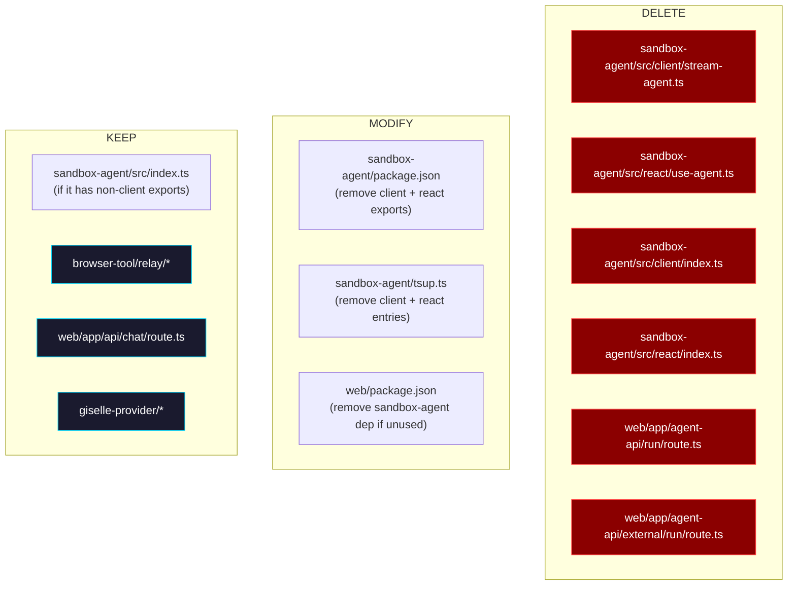

# Phase 6: Cleanup — Remove Legacy Code

> **GitHub Issue:** #5338 · **Epic:** [AGENTS.md](./AGENTS.md)
> **Dependencies:** Phase 5 (React integration must be complete and verified)

## Objective

Remove the legacy streaming and hook code that has been fully replaced by the AI SDK provider. This is a pure deletion phase — no new features.

## What You're Removing



## Pre-Cleanup Checklist

Before deleting anything, verify that no code still references the legacy modules:

```bash
# Check for imports of the old modules
grep -rn "from.*sandbox-agent.*client" packages/web/
grep -rn "from.*sandbox-agent.*react" packages/web/
grep -rn "useAgent" packages/web/
grep -rn "streamAgent\|toNdjsonResponse" packages/web/
grep -rn "@giselles-ai/sandbox-agent" packages/web/

# Check if any route still uses the old agent-api/run path
grep -rn "agent-api/run" packages/web/
grep -rn "agent-api/external" packages/web/
```

If any references remain, migrate them first before proceeding with deletion.

## Deliverables

### 1. Delete Legacy Files

| File | Reason for Deletion |
|---|---|
| `packages/sandbox-agent/src/client/stream-agent.ts` | Absorbed into `giselle-provider/ndjson-mapper.ts` |
| `packages/sandbox-agent/src/client/index.ts` | Re-export barrel for deleted module |
| `packages/sandbox-agent/src/react/use-agent.ts` | Replaced by `useChat` from `@ai-sdk/react` |
| `packages/sandbox-agent/src/react/index.ts` | Re-export barrel for deleted module |
| `packages/web/app/agent-api/run/route.ts` | Replaced by `app/api/chat/route.ts` |
| `packages/web/app/agent-api/external/run/route.ts` | Proxy route for external API, no longer needed |

### 2. Update `packages/sandbox-agent/package.json`

Remove the `"./client"` and `"./react"` export entries:

```diff
  "exports": {
    ".": {
      "types": "./dist/index.d.ts",
      "import": "./dist/index.js",
      "default": "./dist/index.js"
-   },
-   "./client": {
-     "types": "./dist/client/index.d.ts",
-     "import": "./dist/client/index.js",
-     "default": "./dist/client/index.js"
-   },
-   "./react": {
-     "types": "./dist/react/index.d.ts",
-     "import": "./dist/react/index.js",
-     "default": "./dist/react/index.js"
    }
  }
```

Also remove `react` and `react-dom` from `peerDependencies` if the core package doesn't use them.

### 3. Update `packages/sandbox-agent/tsup.ts`

Remove the `client` and `react` entry points from the tsup configuration.

### 4. Update `packages/web/package.json`

If `@giselles-ai/sandbox-agent` is no longer imported anywhere in the web package, remove it from `dependencies`.

### 5. Clean Up Empty Directories

After deleting files, remove empty directories:

```bash
# These directories should be empty after file deletion
rmdir packages/sandbox-agent/src/client 2>/dev/null || true
rmdir packages/sandbox-agent/src/react 2>/dev/null || true
rmdir packages/web/app/agent-api/run 2>/dev/null || true
rmdir packages/web/app/agent-api/external/run 2>/dev/null || true
rmdir packages/web/app/agent-api/external 2>/dev/null || true
```

Check if `packages/web/app/agent-api/` still has content (the relay route should remain):
```bash
ls packages/web/app/agent-api/
# Should show: relay/
```

### 6. Check if `sandbox-agent` Package is Still Needed

After removing the client and react sub-packages, check what remains in `sandbox-agent/src/index.ts`:

```bash
cat packages/sandbox-agent/src/index.ts
```

If it still exports useful code (e.g., `createGeminiAgent`, `runChat`), keep the package. If it's empty or only re-exports deleted modules, consider deleting the entire package — but be careful to check all consumers first.

The current `run/route.ts` uses `createGeminiAgent` and `runChat` from `@giselles-ai/sandbox-agent`. If the new route (Phase 4) no longer uses these, the package may be fully obsolete.

## Verification

```bash
# 1. Build all packages
pnpm build

# 2. Type-check everything
pnpm typecheck

# 3. Verify no dangling imports
grep -rn "stream-agent\|use-agent\|StreamAgentEvent\|StreamAgentOptions" packages/
# Should return zero results

# 4. Verify the new flow still works
pnpm --filter demo dev
# Manual test: send a message, verify text streaming + tool calls work

# 5. Verify relay still works
# The relay route (/agent-api/relay) should be unaffected
```

## Done Criteria

- [ ] All files listed in "Delete Legacy Files" are removed
- [ ] `sandbox-agent/package.json` exports are updated
- [ ] `sandbox-agent/tsup.ts` entry points are updated
- [ ] `web/package.json` dependencies are updated
- [ ] No remaining references to deleted modules in the codebase
- [ ] `pnpm build` succeeds for all packages
- [ ] `pnpm typecheck` passes for all packages
- [ ] Manual testing confirms the app works end-to-end
- [ ] Update the status in [AGENTS.md](./AGENTS.md) to `✅ DONE`
- [ ] 🎉 Epic complete!
