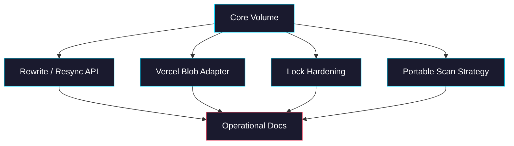
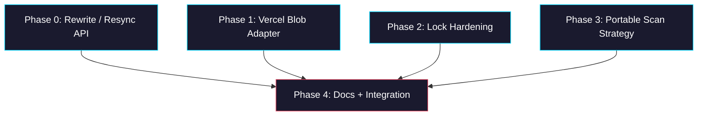

# Epic: sandbox-volume backlog

> **GitHub Epic:** TBD · **Sub-issues:** TBD (Phases 0–4)

## Goal

Finish the next practical layer of `@giselles-ai/sandbox-volume` after the core transaction flow and include/exclude support. After this epic is complete, the package has a clearer migration story when rules change, a first real storage adapter path, stronger locking guidance, and fewer environment assumptions.

## Why

The core works, but several release-relevant gaps remain.

- Real users need at least one non-memory adapter path
- Narrowing path filters currently leaves historical out-of-scope storage untouched until a rewrite
- Locking is minimal and not yet production-oriented
- File scanning still assumes `bash` + `find`
- The package needs a clearer operational story for these edges

## Architecture Overview



## Package / Directory Structure

```text
packages/
└── sandbox-volume/                         ← EXISTING
    ├── src/
    │   ├── sandbox-volume.ts               ← EXISTING
    │   ├── transaction.ts                  ← EXISTING
    │   ├── adapters/
    │   │   ├── memory.ts                   ← EXISTING
    │   │   └── vercel-blob.ts              ← NEW
    │   ├── scan-strategy.ts                ← NEW or merged into sandbox-files.ts
    │   └── __tests__/                      ← EXISTING (extend)
    ├── README.md                           ← EXISTING
    └── package.json                        ← EXISTING
tasks/
└── sandbox-volume-backlog/                ← NEW epic plan
```

## Task Dependency Graph



- Phases 0–3 are mostly independent.
- Phase 4 closes the story once the concrete capabilities are in place.

## Task Status

| Phase | Task File | Status | Description |
|---|---|---|---|
| 0 | [phase-0-rewrite-resync-api.md](./phase-0-rewrite-resync-api.md) | ✅ DONE | Add an explicit rewrite/resync path for rule changes and cleanup |
| 1 | [phase-1-vercel-blob-adapter.md](./phase-1-vercel-blob-adapter.md) | ✅ DONE | Add a first real storage adapter for Vercel Blob |
| 2 | [phase-2-lock-hardening.md](./phase-2-lock-hardening.md) | ✅ DONE | Clarify and harden lock semantics beyond the minimal interface |
| 3 | [phase-3-portable-scan-strategy.md](./phase-3-portable-scan-strategy.md) | ✅ DONE | Reduce dependence on `bash` + `find` |
| 4 | [phase-4-docs-and-integration.md](./phase-4-docs-and-integration.md) | ✅ DONE | Document and validate the operational story end-to-end |

> **How to work on this epic:** Read this file first to understand the full architecture. Then check the status table above. Pick the first `🔲 TODO` task whose dependencies (see dependency graph) are `✅ DONE`. Open that task file and follow its instructions. When done, update the status in this table to `✅ DONE`.

## Key Conventions

- Keep the core storage-agnostic
- Prefer additive APIs over breaking the existing transaction flow
- New public APIs must be documented in README and covered by tests
- Networked adapter work may require dependency installation and package export updates

## Existing Code Reference

| File | Relevance |
|---|---|
| `packages/sandbox-volume/src/sandbox-volume.ts` | Current public API surface |
| `packages/sandbox-volume/src/transaction.ts` | Current lifecycle and commit logic |
| `packages/sandbox-volume/src/sandbox-files.ts` | Current scan assumptions |
| `packages/sandbox-volume/src/adapters/memory.ts` | Reference adapter shape |
| `packages/sandbox-volume/README.md` | Current operational docs |

## Domain-Specific Reference

### Recommended Next Order

1. Rewrite/resync API
2. Vercel Blob adapter
3. Lock hardening
4. Portable scan strategy
5. Docs/integration polish
