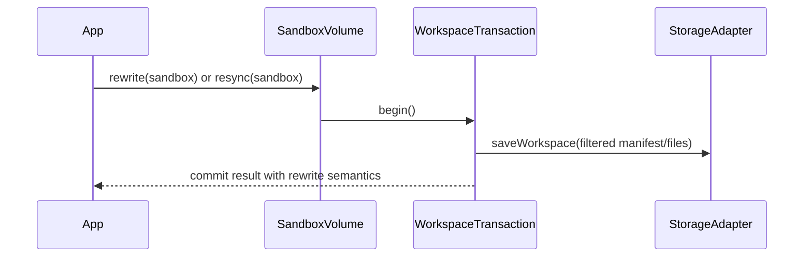

# Phase 0: Rewrite / Resync API

> **GitHub Issue:** TBD · **Epic:** [AGENTS.md](./AGENTS.md)
> **Dependencies:** None
> **Parallel with:** Phase 1, Phase 2, Phase 3
> **Blocks:** Phase 4

## Objective

Add an explicit API for rewriting the persisted workspace from the current in-scope view so callers can clean up historical out-of-scope entries after changing `include` / `exclude`.

## What You're Building



## Deliverables

1. Add a public API to rewrite persisted state from the current filtered view.
2. Add tests covering rule narrowing and explicit cleanup.
3. Document the difference between normal no-op commit and explicit rewrite/resync.

## Verification

```bash
pnpm -F sandbox-volume format
pnpm -F sandbox-volume test
pnpm -F sandbox-volume typecheck
pnpm -F sandbox-volume build
```

## Files to Create/Modify

| File | Action |
|---|---|
| `packages/sandbox-volume/src/sandbox-volume.ts` | **Modify** |
| `packages/sandbox-volume/src/transaction.ts` | **Modify** |
| `packages/sandbox-volume/src/__tests__/integration.test.ts` | **Modify** |
| `packages/sandbox-volume/README.md` | **Modify** |

## Done Criteria

- [ ] Callers have an explicit cleanup/rewrite path
- [ ] Rule-narrowing caveat has a concrete mitigation
- [ ] All checks pass
- [ ] Update the status in [AGENTS.md](./AGENTS.md) to `✅ DONE`
