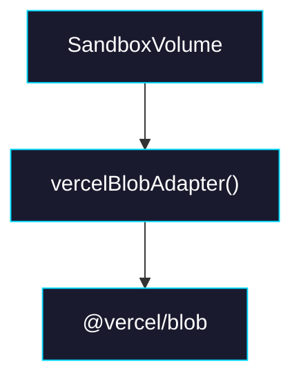

# Phase 1: Vercel Blob Adapter

> **GitHub Issue:** TBD · **Epic:** [AGENTS.md](./AGENTS.md)
> **Dependencies:** None
> **Parallel with:** Phase 0, Phase 2, Phase 3
> **Blocks:** Phase 4

## Objective

Add a concrete Vercel Blob adapter as the first real non-memory backend.

## What You're Building



## Deliverables

1. Add adapter implementation and export entrypoint.
2. Add tests around manifest/file roundtrip at the adapter boundary.
3. Update package exports/docs/install instructions.

## Verification

```bash
pnpm -F sandbox-volume format
pnpm -F sandbox-volume test
pnpm -F sandbox-volume typecheck
pnpm -F sandbox-volume build
```

## Files to Create/Modify

| File | Action |
|---|---|
| `packages/sandbox-volume/src/adapters/vercel-blob.ts` | **Create** |
| `packages/sandbox-volume/src/index.ts` | **Modify** |
| `packages/sandbox-volume/package.json` | **Modify** |
| `packages/sandbox-volume/README.md` | **Modify** |

## Done Criteria

- [ ] A first real storage adapter ships
- [ ] Export/install/docs are aligned
- [ ] All checks pass
- [ ] Update the status in [AGENTS.md](./AGENTS.md) to `✅ DONE`
