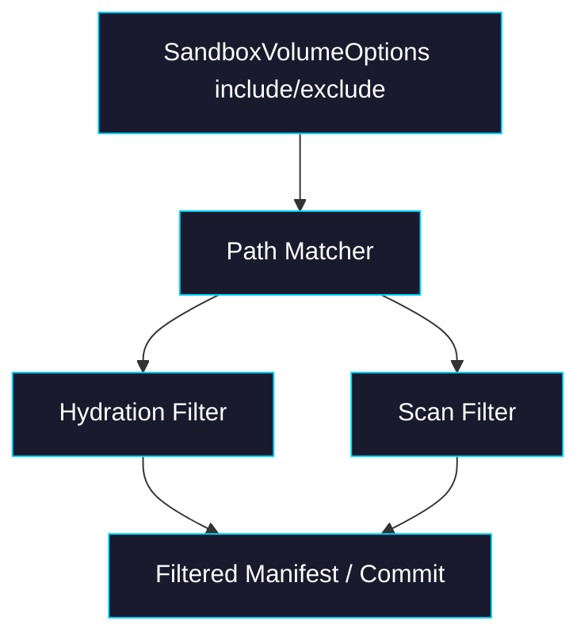
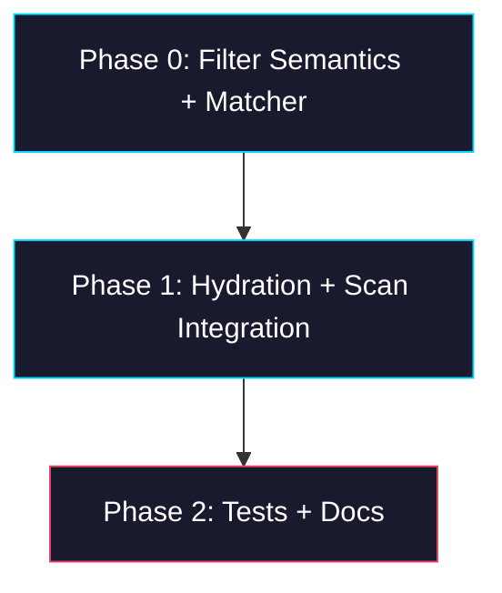

# Epic: sandbox-volume include/exclude

> **GitHub Epic:** TBD · **Sub-issues:** TBD (Phases 0–2)

## Goal

Implement `include` / `exclude` filtering in `@giselles-ai/sandbox-volume` so that workspace hydration, diffing, and commits operate only on the intended subset of files. After this epic is complete, path filters behave consistently across load, scan, delete detection, and docs/tests.

## Why

The package surface already exposes `include` and `exclude`, but the implementation ignores them. That leaves the API misleading and makes selective sync impossible.

- Makes the existing public options real
- Prevents accidental persistence of large or irrelevant files
- Keeps delete detection scoped to files the volume actually owns
- Aligns README and runtime behavior

## Architecture Overview



## Package / Directory Structure

```text
packages/
└── sandbox-volume/                         ← EXISTING
    ├── src/
    │   ├── types.ts                        ← EXISTING (filter option contracts)
    │   ├── sandbox-volume.ts               ← EXISTING (option plumbing)
    │   ├── sandbox-files.ts                ← EXISTING (hydration + scan integration)
    │   ├── transaction.ts                  ← EXISTING (diff/commit flow)
    │   ├── path-rules.ts                   ← NEW matcher helpers
    │   └── __tests__/
    │       ├── transaction-hydration.test.ts   ← EXISTING (extend)
    │       ├── transaction-commit.test.ts      ← EXISTING (extend)
    │       └── path-rules.test.ts              ← NEW
    └── README.md                           ← EXISTING (document actual semantics)
tasks/
└── sandbox-volume-include-exclude/        ← NEW epic plan
```

## Task Dependency Graph



## Task Status

| Phase | Task File | Status | Description |
|---|---|---|---|
| 0 | [phase-0-filter-semantics-and-matcher.md](./phase-0-filter-semantics-and-matcher.md) | 🔲 TODO | Define exact filter semantics and implement reusable path matching |
| 1 | [phase-1-hydration-and-scan-integration.md](./phase-1-hydration-and-scan-integration.md) | 🔲 TODO | Apply filters during hydration, scan, diff, and commit |
| 2 | [phase-2-tests-and-docs.md](./phase-2-tests-and-docs.md) | 🔲 TODO | Add edge-case coverage and document the shipped behavior |

> **How to work on this epic:** Read this file first to understand the full architecture. Then check the status table above. Pick the first `🔲 TODO` task whose dependencies (see dependency graph) are `✅ DONE`. Open that task file and follow its instructions. When done, update the status in this table to `✅ DONE`.

## Key Conventions

- Monorepo uses `pnpm` workspaces, `tsup`, `biome`, and strict TypeScript
- `sandbox-volume` already treats paths as sandbox-relative POSIX paths
- Keep filtering backend-neutral; adapters should not need glob logic
- Deletes should only be inferred for paths inside the managed sync set

## Existing Code Reference

| File | Relevance |
|---|---|
| `packages/sandbox-volume/src/types.ts` | Existing `include` / `exclude` option surface |
| `packages/sandbox-volume/src/sandbox-files.ts` | Current hydration and scan behavior |
| `packages/sandbox-volume/src/transaction.ts` | Current diff and commit flow |
| `packages/sandbox-volume/src/__tests__/transaction-hydration.test.ts` | Hydration behavior tests to extend |
| `packages/sandbox-volume/src/__tests__/transaction-commit.test.ts` | Commit behavior tests to extend |
| `packages/sandbox-volume/README.md` | Needs to reflect final semantics |

## Domain-Specific Reference

### Assumed Semantics

| Topic | Decision |
|---|---|
| `include` | Allow-list. If omitted or empty, all paths are allowed unless excluded |
| `exclude` | Deny-list applied after `include` |
| Precedence | `exclude` wins over `include` |
| Scope | Apply to hydration, scan, diff, and commit |
| Manifest contents | Only tracked sync-target files appear in the persisted manifest |
| Delete detection | Only applies to previously tracked, still-in-scope paths |

### Open-but-Not-Blocking Questions

| Topic | Default assumption for implementation |
|---|---|
| Glob engine | Use a small explicit dependency or existing matcher only if already present; otherwise add one narrowly |
| Directory patterns | `src/**` and `dist/**` style patterns must work |
| Root files | Plain filenames like `package.json` must work |
| Out-of-scope historic entries | Dropped from future persisted manifests once filters exclude them |
