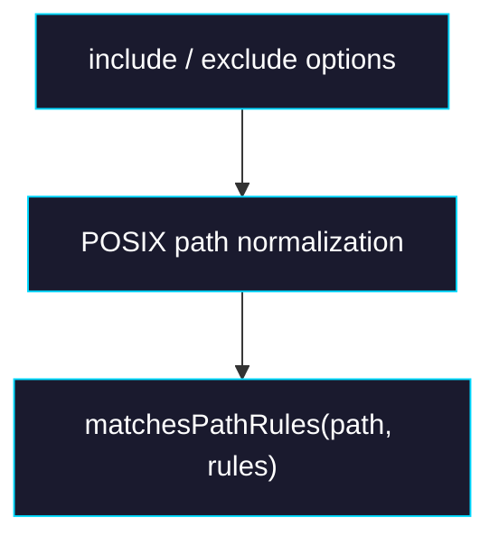

# Phase 0: Filter Semantics + Matcher

> **GitHub Issue:** TBD · **Epic:** [AGENTS.md](./AGENTS.md)
> **Dependencies:** None
> **Parallel with:** None
> **Blocks:** Phase 1

## Objective

Lock the exact semantics of `include` / `exclude` and implement a reusable path-matching helper that all later phases can share.

## What You're Building



## Deliverables

1. `packages/sandbox-volume/src/path-rules.ts`

Create a small matcher module that:

- normalizes paths to the package's existing relative POSIX convention
- evaluates `include` and `exclude`
- exports helpers such as `matchesPathRules()` and `filterPathsByRules()`

2. `packages/sandbox-volume/src/types.ts`

Refine option docs or helper types if needed so semantics are explicit.

3. `packages/sandbox-volume/src/__tests__/path-rules.test.ts`

Cover:

- include-only behavior
- exclude-only behavior
- exclude-overrides-include
- root file matching (`package.json`)
- nested glob matching (`src/**`)

## Verification

1. **Automated checks**

```bash
pnpm -F sandbox-volume test
pnpm -F sandbox-volume typecheck
```

2. **Manual test scenarios**

1. `include=["src/**"]`, path=`src/index.ts` → matcher → `true`
2. `include=["src/**"]`, `exclude=["src/generated/**"]`, path=`src/generated/a.ts` → matcher → `false`

## Files to Create/Modify

| File | Action |
|---|---|
| `packages/sandbox-volume/src/path-rules.ts` | **Create** |
| `packages/sandbox-volume/src/types.ts` | **Modify** if helper types/docs need tightening |
| `packages/sandbox-volume/src/__tests__/path-rules.test.ts` | **Create** |

## Done Criteria

- [ ] Path rule semantics are encoded in one reusable module
- [ ] Precedence and glob behavior are covered by tests
- [ ] `pnpm -F sandbox-volume test` and `typecheck` pass
- [ ] Update the status in [AGENTS.md](./AGENTS.md) to `✅ DONE`
