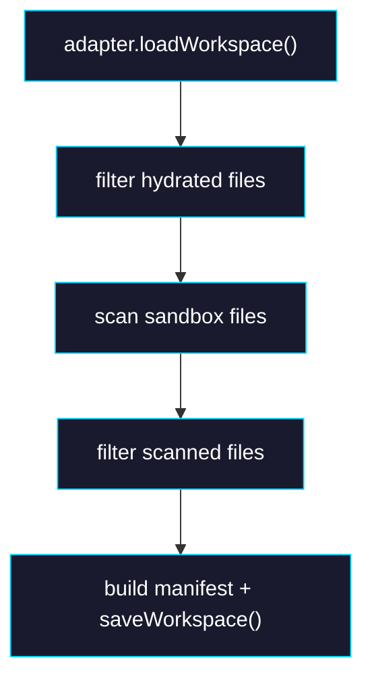

# Phase 1: Hydration + Scan Integration

> **GitHub Issue:** TBD · **Epic:** [AGENTS.md](./AGENTS.md)
> **Dependencies:** Phase 0
> **Parallel with:** None
> **Blocks:** Phase 2

## Objective

Apply path rules to the real transaction flow so the volume only hydrates, scans, diffs, and persists in-scope files.

## What You're Building



## Deliverables

1. `packages/sandbox-volume/src/sandbox-volume.ts`

Ensure the transaction gets the configured path rules.

2. `packages/sandbox-volume/src/transaction.ts`

Apply rules to:

- hydrated baseline files
- scanned workspace file paths
- commit payload / next manifest
- delete detection boundary

3. `packages/sandbox-volume/src/sandbox-files.ts`

Add helper entry points as needed so scan/hydration can accept rules without duplicating filtering logic.

4. `packages/sandbox-volume/src/__tests__/transaction-hydration.test.ts`

Extend with assertions that excluded files are not written into the sandbox.

5. `packages/sandbox-volume/src/__tests__/transaction-commit.test.ts`

Extend with assertions that:

- excluded files are ignored during scan/commit
- newly excluded historical files do not produce bogus deletes beyond the managed set

## Verification

1. **Automated checks**

```bash
pnpm -F sandbox-volume test
pnpm -F sandbox-volume typecheck
pnpm -F sandbox-volume build
```

2. **Manual test scenarios**

1. Stored files include `src/a.ts` and `dist/a.js`, rules exclude `dist/**` → begin transaction → only `src/a.ts` is hydrated
2. Sandbox contains `src/a.ts` and `coverage/out.json`, rules exclude `coverage/**` → commit → only `src/a.ts` is persisted

## Files to Create/Modify

| File | Action |
|---|---|
| `packages/sandbox-volume/src/sandbox-volume.ts` | **Modify** |
| `packages/sandbox-volume/src/transaction.ts` | **Modify** |
| `packages/sandbox-volume/src/sandbox-files.ts` | **Modify** |
| `packages/sandbox-volume/src/__tests__/transaction-hydration.test.ts` | **Modify** |
| `packages/sandbox-volume/src/__tests__/transaction-commit.test.ts` | **Modify** |

## Done Criteria

- [ ] Hydration and commit both honor path rules
- [ ] Delete detection stays scoped to managed files
- [ ] `pnpm -F sandbox-volume test`, `typecheck`, and `build` pass
- [ ] Update the status in [AGENTS.md](./AGENTS.md) to `✅ DONE`
