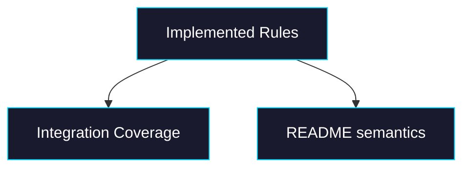

# Phase 2: Tests + Docs

> **GitHub Issue:** TBD · **Epic:** [AGENTS.md](./AGENTS.md)
> **Dependencies:** Phase 1
> **Parallel with:** None
> **Blocks:** None

## Objective

Close the feature with edge-case tests and README updates so the public API and shipped behavior match.

## What You're Building



## Deliverables

1. `packages/sandbox-volume/src/__tests__/integration.test.ts`

Add one end-to-end scenario proving filtered persistence across multiple transactions.

2. `packages/sandbox-volume/README.md`

Document:

- actual include/exclude semantics
- precedence
- current limitations if any

3. Optional cleanup in `types.ts` or helper exports

Expose any matcher helpers only if they are useful as public API; otherwise keep them internal.

## Verification

1. **Automated checks**

```bash
pnpm -F sandbox-volume format
pnpm -F sandbox-volume test
pnpm -F sandbox-volume typecheck
pnpm -F sandbox-volume build
```

2. **Manual test scenarios**

1. `include=["src/**","package.json"]`, `exclude=["src/generated/**"]` across two transactions → persisted workspace contains only allowed paths
2. README quick-start review → compare docs to implementation → no claim depends on unimplemented filter behavior

## Files to Create/Modify

| File | Action |
|---|---|
| `packages/sandbox-volume/src/__tests__/integration.test.ts` | **Modify** |
| `packages/sandbox-volume/README.md` | **Modify** |
| `packages/sandbox-volume/src/index.ts` | **Modify** only if exports change |

## Done Criteria

- [ ] Edge cases are covered by integration-style tests
- [ ] README accurately documents include/exclude behavior
- [ ] `pnpm -F sandbox-volume format`, `test`, `typecheck`, and `build` pass
- [ ] Update the status in [AGENTS.md](./AGENTS.md) to `✅ DONE`
