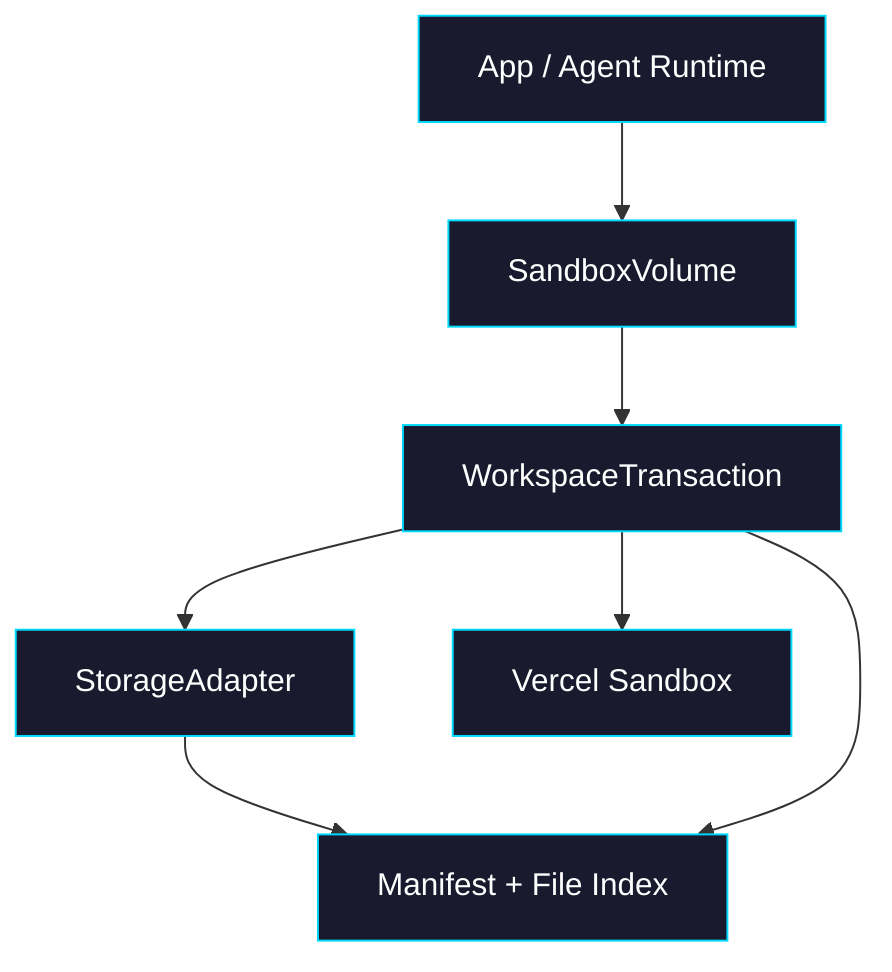
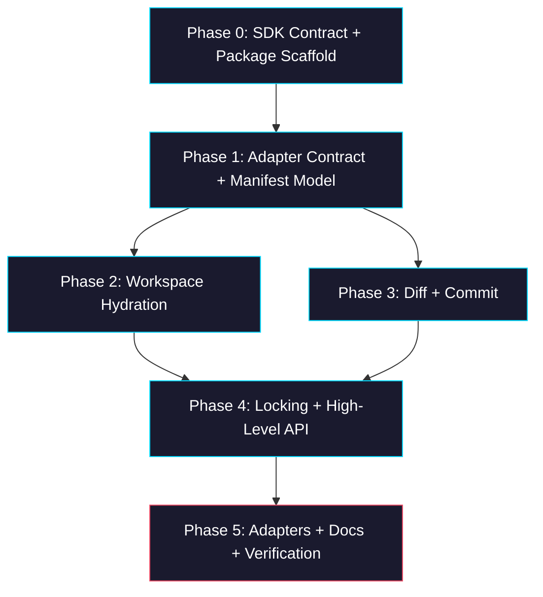

# Epic: sandbox-volume

> **GitHub Epic:** TBD · **Sub-issues:** TBD (Phases 0–5)

## Goal

Implement `packages/sandbox-volume` as a small TypeScript package that adds persistent workspace semantics on top of `@vercel/sandbox`. After this epic is complete, consumers can create a `SandboxVolume`, hydrate a workspace into a sandbox, run code, inspect a diff, and commit file changes back through a pluggable storage adapter without coupling the package to any app-specific database, orchestration, or UI model.

## Why

The current `packages/sandbox-volume/README.md` defines the intended product shape, but there is no package, no adapter contract, and no verified mapping between the README API and the actual `@vercel/sandbox` SDK surface. This epic makes that design buildable in small, testable steps.

- Establishes a real package boundary for persistent workspace sync
- Forces the README API to reconcile with the actual Sandbox SDK (`writeFiles`, `readFileToBuffer`, `runCommand`, `snapshot`, `stop`)
- Separates storage concerns behind adapters instead of hard-wiring one backend
- Makes diff, delete tracking, and commit semantics explicit before adding locks and convenience APIs
- Produces a foundation that can later grow into blob, S3, or Supabase adapters without redesigning the core

## Architecture Overview



- `SandboxVolume` owns package-level options, adapter wiring, and convenience APIs such as `mount()`
- `WorkspaceTransaction` owns one hydration / diff / commit cycle against one sandbox
- `StorageAdapter` owns durable reads and writes for archive or file objects plus manifest metadata
- `Manifest` is the source of truth for what was last committed, including deletions
- `@vercel/sandbox` remains the execution substrate; this package never pretends to be a true filesystem mount

## Package / Directory Structure

```text
packages/
├── sandbox-volume/                     ← EXISTING directory; currently README only
│   ├── AGENTS.md                       ← NEW package-local implementation guidance
│   ├── README.md                       ← EXISTING to-be contract
│   ├── package.json                    ← NEW
│   ├── tsconfig.json                   ← NEW
│   ├── tsup.ts                         ← NEW
│   ├── src/                            ← NEW
│   │   ├── index.ts                    ← public exports
│   │   ├── sandbox-volume.ts           ← `SandboxVolume` facade
│   │   ├── transaction.ts              ← transaction lifecycle + commit flow
│   │   ├── manifest.ts                 ← manifest schema, hashing, diff helpers
│   │   ├── sandbox-files.ts            ← sandbox read/write/list helpers
│   │   ├── adapters/
│   │   │   ├── types.ts                ← storage adapter contract
│   │   │   └── memory.ts               ← test adapter
│   │   └── __tests__/                  ← NEW Vitest coverage
│   └── examples/ or fixtures/          ← NEW if needed for tests
├── agent-kit/                          ← EXISTING reference for Sandbox SDK usage
├── agent/                              ← EXISTING reference for file read/write APIs
└── browser-tool/                       ← EXISTING packaging/build reference
tasks/
└── sandbox-volume/                     ← NEW epic plan
```

## Task Dependency Graph



- **Phase 2 and Phase 3** can run in parallel after Phase 1
- **Phase 4** depends on both hydration and commit semantics being stable
- **Phase 5** is final because adapters and docs should sit on top of the real API, not placeholders

## Task Status

| Phase | Task File | Status | Description |
|---|---|---|---|
| 0 | [phase-0-sdk-contract-and-scaffold.md](./phase-0-sdk-contract-and-scaffold.md) | ✅ DONE | Reconcile README API with real Sandbox SDK and create package skeleton |
| 1 | [phase-1-adapter-contract-and-manifest.md](./phase-1-adapter-contract-and-manifest.md) | ✅ DONE | Define adapter interface, manifest schema, and diff model |
| 2 | [phase-2-workspace-hydration.md](./phase-2-workspace-hydration.md) | ✅ DONE | Load stored workspace into the sandbox mount path |
| 3 | [phase-3-diff-and-commit.md](./phase-3-diff-and-commit.md) | ✅ DONE | Detect changed and deleted files and persist a new manifest |
| 4 | [phase-4-locking-and-mount-api.md](./phase-4-locking-and-mount-api.md) | ✅ DONE | Add transaction lifecycle, mount callback API, and locking hooks |
| 5 | [phase-5-adapters-docs-and-verification.md](./phase-5-adapters-docs-and-verification.md) | ✅ DONE | Add bundled adapter(s), tests, README alignment, and end-to-end verification |

> **How to work on this epic:** Read this file first to understand the full architecture. Then check the status table above. Pick the first `🔲 TODO` task whose dependencies (see dependency graph) are `✅ DONE`. Open that task file and follow its instructions. When done, update the status in this table to `✅ DONE`.

## Key Conventions

- Monorepo uses `pnpm` workspaces and package-local `tsconfig.json`
- Package builds use `tsup` with ESM output and declaration files
- TypeScript is `strict` via `tsconfig.base.json`
- Existing sandbox usage patterns live in `packages/agent` and `packages/agent-kit`
- Prefer explicit schemas and discriminated unions over loose objects
- Keep `sandbox-volume` storage-agnostic; bundled adapters are add-ons, not core assumptions
- Treat the README as product intent, not as already-validated API truth

## Existing Code Reference

| File | Relevance |
|---|---|
| `packages/sandbox-volume/README.md` | To-be product contract and public API target |
| `packages/agent-kit/src/build-snapshot.ts` | Canonical repo example for `Sandbox.create`, `writeFiles`, and sandbox file bootstrapping |
| `packages/agent-kit/src/sandbox-utils.ts` | Existing command wrapper pattern for `runCommand` error handling |
| `packages/agent/src/build.ts` | Existing use of `sandbox.writeFiles()` and `sandbox.snapshot()` |
| `packages/agent/src/agent-api.ts` | Existing use of `sandbox.readFileToBuffer()` for file retrieval |
| `packages/agent/package.json` | Packaging conventions for public workspace packages |
| `packages/browser-tool/package.json` | Export map and tsup conventions for multi-entry packages |

## Domain-Specific Reference

### README API Mismatches To Resolve

| README item | Current issue | Resolution target |
|---|---|---|
| `adatper` option in example | Typo | `adapter` |
| `SandboxVolume.create(options)` duplicated | Duplicate section | Collapse to one canonical constructor contract |
| `sandbox.runCommand("npm", ["test"])` style | Valid overload exists, but callback examples mix styles | Choose one style in docs and tests |
| `find -newer` based diff description | Likely insufficient for deletes and rename semantics | Replace with manifest-based diff model |
| “Only changed files are written back” | Needs manifest and delete tracking to be true | Define persisted manifest and commit algorithm explicitly |

### Sandbox SDK Surface To Design Around

Use the official Vercel Sandbox SDK reference plus installed type definitions as the implementation ground truth:

- `Sandbox.create({ runtime, timeout, source })`
- `sandbox.runCommand(...)`
- `sandbox.mkDir(path)`
- `sandbox.writeFiles([{ path, content }])`
- `sandbox.readFileToBuffer({ path })`
- `sandbox.downloadFile(...)`
- `sandbox.stop()`
- `sandbox.snapshot()`

The package should assume file persistence is implemented in userland on top of these primitives, not via any native mount capability.
