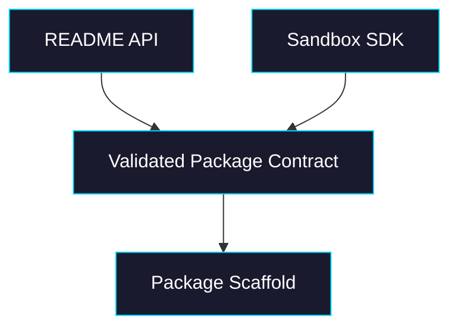

# Phase 0: SDK Contract + Package Scaffold

> **GitHub Issue:** TBD · **Epic:** [AGENTS.md](./AGENTS.md)
> **Dependencies:** None
> **Parallel with:** None
> **Blocks:** Phase 1

## Objective

Create the initial `packages/sandbox-volume` package structure and lock the public API against the real `@vercel/sandbox` SDK. This phase exists to eliminate guesswork before any persistence logic is written.

## What You're Building



## Deliverables

1. `packages/sandbox-volume/package.json`

Create a publishable workspace package following `packages/agent/package.json` conventions:

- Name: `@giselles-ai/sandbox-volume`
- Scripts: `build`, `clean`, `typecheck`, `test`, `format`
- Dependency on `@vercel/sandbox`
- Dev dependencies for `tsup`, `typescript`, `vitest`, `@types/node`
- Export map for `.` and any bundled adapter entrypoints that are planned now

2. `packages/sandbox-volume/tsconfig.json` and `packages/sandbox-volume/tsup.ts`

Mirror existing package conventions:

- `tsconfig.json` extends `../../tsconfig.base.json`
- Include `src/**/*.ts`
- `tsup.ts` builds ESM + d.ts from `src/index.ts`

3. `packages/sandbox-volume/src/index.ts`

Add a thin export surface with placeholder type exports only for APIs validated in this phase:

- `SandboxVolume`
- `SandboxVolumeOptions`
- `StorageAdapter`
- `WorkspaceTransaction`

4. `packages/sandbox-volume/src/types.ts` or equivalent

Define the initial public contract and explicitly document every place where the README is aspirational rather than already backed by SDK primitives.

## Verification

1. **Automated checks**

```bash
pnpm --filter @giselles-ai/sandbox-volume typecheck
pnpm --filter @giselles-ai/sandbox-volume build
```

2. **Manual test scenarios**

1. README example audit → compare constructor and callback signatures → every public symbol in the README has a matching exported type or is marked planned
2. Fresh package build → run build command → `dist/index.js` and `dist/index.d.ts` are produced

## Files to Create/Modify

| File | Action |
|---|---|
| `packages/sandbox-volume/package.json` | **Create** |
| `packages/sandbox-volume/tsconfig.json` | **Create** |
| `packages/sandbox-volume/tsup.ts` | **Create** |
| `packages/sandbox-volume/src/index.ts` | **Create** |
| `packages/sandbox-volume/src/types.ts` | **Create** |
| `packages/sandbox-volume/README.md` | **Modify** only if needed to correct obvious API typos discovered in this phase |

## Done Criteria

- [ ] Package builds and typechecks as an empty-but-valid package
- [ ] Public API names are reconciled with the current Sandbox SDK
- [ ] README/API mismatches are recorded, not silently ignored
- [ ] Update the status in [AGENTS.md](./AGENTS.md) to `✅ DONE`
