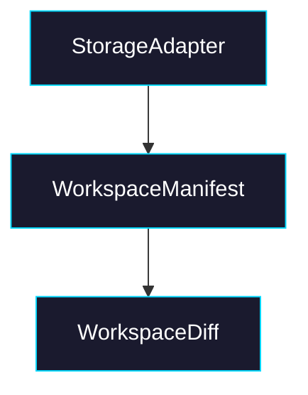

# Phase 1: Adapter Contract + Manifest Model

> **GitHub Issue:** TBD · **Epic:** [AGENTS.md](./AGENTS.md)
> **Dependencies:** Phase 0
> **Parallel with:** None
> **Blocks:** Phase 2, Phase 3

## Objective

Define the durable model for a workspace commit. This phase should answer what storage backends must implement and what metadata the core package needs to detect creates, updates, and deletes without relying on VM state.

## What You're Building



## Deliverables

1. `packages/sandbox-volume/src/adapters/types.ts`

Define a storage contract that is explicit enough for blob-like backends:

- `loadWorkspace(key): Promise<StoredWorkspace | null>`
- `saveWorkspace(key, commit): Promise<StoredWorkspaceRef>`
- Optional lock hooks for later phases
- No backend-specific assumptions in the core types

2. `packages/sandbox-volume/src/manifest.ts`

Define:

- manifest schema version
- file record shape (`path`, `size`, `hash`, `mtime` or logical commit timestamp)
- deleted path tracking
- helper functions for comparing stored vs current file state

3. `packages/sandbox-volume/src/types.ts`

Add the user-facing diff and commit types:

- `WorkspaceDiff`
- `WorkspaceFileChange`
- `WorkspaceCommitResult`
- lock mode enum / union for later use

4. `packages/sandbox-volume/src/__tests__/manifest.test.ts`

Add focused tests for diff classification:

- unchanged file
- changed file
- new file
- deleted file

## Verification

1. **Automated checks**

```bash
pnpm --filter @giselles-ai/sandbox-volume test
pnpm --filter @giselles-ai/sandbox-volume typecheck
```

2. **Manual test scenarios**

1. Stored manifest + identical next state → run diff helper → no changes reported
2. Stored manifest + missing path → run diff helper → delete is reported explicitly

## Files to Create/Modify

| File | Action |
|---|---|
| `packages/sandbox-volume/src/adapters/types.ts` | **Create** |
| `packages/sandbox-volume/src/manifest.ts` | **Create** |
| `packages/sandbox-volume/src/types.ts` | **Modify** |
| `packages/sandbox-volume/src/__tests__/manifest.test.ts` | **Create** |
| `packages/sandbox-volume/src/index.ts` | **Modify** to export new public types |

## Done Criteria

- [ ] Adapter contract is storage-agnostic and versioned where needed
- [ ] Manifest schema can represent deletes without sandbox-local state
- [ ] Diff tests cover create/update/delete/no-op cases
- [ ] Update the status in [AGENTS.md](./AGENTS.md) to `✅ DONE`
