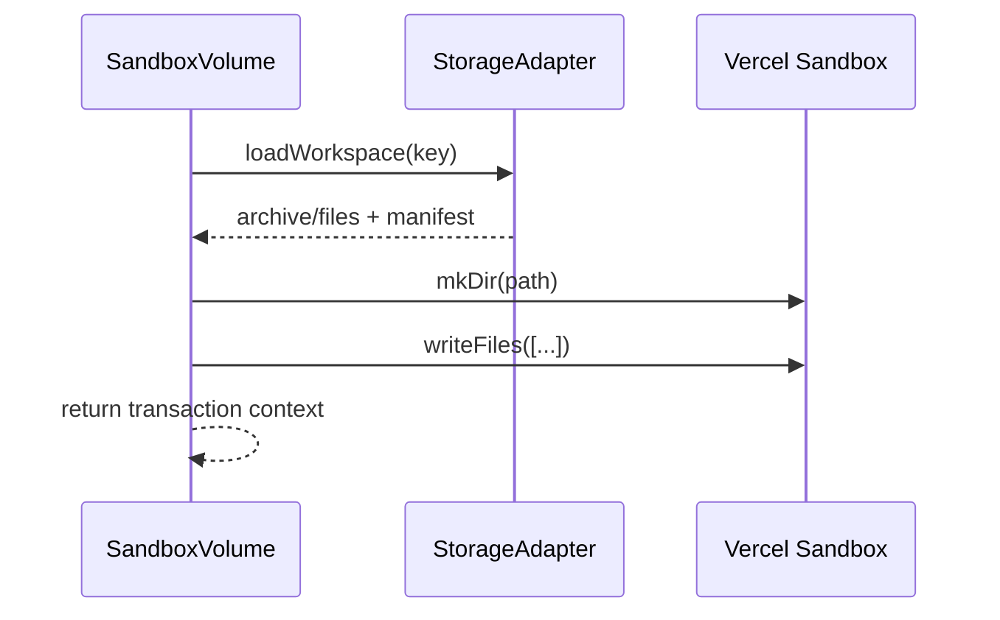

# Phase 2: Workspace Hydration

> **GitHub Issue:** TBD · **Epic:** [AGENTS.md](./AGENTS.md)
> **Dependencies:** Phase 1
> **Parallel with:** Phase 3
> **Blocks:** Phase 4

## Objective

Implement the read path: load a stored workspace through the adapter and materialize it into the sandbox mount path in a way that works with the actual Sandbox SDK.

## What You're Building



## Deliverables

1. `packages/sandbox-volume/src/sandbox-files.ts`

Add helpers for sandbox file materialization:

- ensure mount root exists
- normalize mount paths to absolute sandbox paths
- batch file writes with `sandbox.writeFiles`

2. `packages/sandbox-volume/src/transaction.ts`

Implement transaction startup:

- load current workspace via adapter
- hydrate files into sandbox mount path
- hold baseline manifest in memory for later diff

3. `packages/sandbox-volume/src/__tests__/transaction-hydration.test.ts`

Use a memory adapter and a mocked sandbox interface to verify:

- empty workspace bootstraps cleanly
- stored files are written to the expected mount path
- include/exclude rules are applied at hydration time if they are part of the API

## Verification

1. **Automated checks**

```bash
pnpm --filter @giselles-ai/sandbox-volume test
pnpm --filter @giselles-ai/sandbox-volume typecheck
```

2. **Manual test scenarios**

1. Empty backend → begin transaction → mount path exists and no files are written
2. Backend with `src/index.ts` → begin transaction → sandbox receives a write for `<mount>/src/index.ts`

## Files to Create/Modify

| File | Action |
|---|---|
| `packages/sandbox-volume/src/sandbox-files.ts` | **Create** |
| `packages/sandbox-volume/src/transaction.ts` | **Modify** |
| `packages/sandbox-volume/src/__tests__/transaction-hydration.test.ts` | **Create** |
| `packages/sandbox-volume/src/index.ts` | **Modify** |

## Done Criteria

- [ ] Transaction startup can hydrate a workspace into the sandbox
- [ ] Mount path handling is explicit and tested
- [ ] Hydration works without any snapshot-specific assumptions
- [ ] Update the status in [AGENTS.md](./AGENTS.md) to `✅ DONE`
