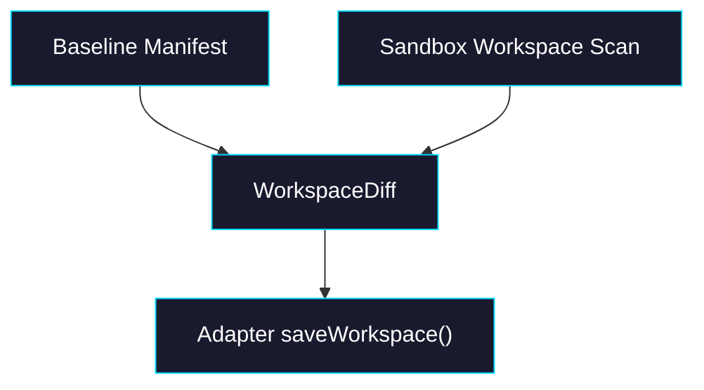

# Phase 3: Diff + Commit

> **GitHub Issue:** TBD · **Epic:** [AGENTS.md](./AGENTS.md)
> **Dependencies:** Phase 1
> **Parallel with:** Phase 2
> **Blocks:** Phase 4

## Objective

Implement the write path: inspect the sandbox workspace after execution, derive a precise diff against the baseline manifest, and commit a new durable workspace through the adapter.

## What You're Building



## Deliverables

1. `packages/sandbox-volume/src/sandbox-files.ts`

Add workspace scan helpers. If the SDK lacks directory listing APIs, use a command-driven approach intentionally:

- `find` or equivalent to enumerate files under the mount path
- `readFileToBuffer()` to retrieve changed file contents
- normalized relative paths for manifest comparison

2. `packages/sandbox-volume/src/transaction.ts`

Implement:

- `diff()`
- `commit()`
- delete tracking
- no-op commit handling

3. `packages/sandbox-volume/src/__tests__/transaction-commit.test.ts`

Cover:

- modify existing file
- add new file
- delete file
- commit with no changes

## Verification

1. **Automated checks**

```bash
pnpm --filter @giselles-ai/sandbox-volume test
pnpm --filter @giselles-ai/sandbox-volume typecheck
```

2. **Manual test scenarios**

1. Baseline file edited in sandbox → call `diff()` → one modified path reported
2. Baseline file removed in sandbox → call `commit()` → saved manifest records deletion and omits removed file content

## Files to Create/Modify

| File | Action |
|---|---|
| `packages/sandbox-volume/src/sandbox-files.ts` | **Modify** |
| `packages/sandbox-volume/src/transaction.ts` | **Modify** |
| `packages/sandbox-volume/src/__tests__/transaction-commit.test.ts` | **Create** |
| `packages/sandbox-volume/src/types.ts` | **Modify** if diff result types need refinement |

## Done Criteria

- [ ] Core package can compute diffs from sandbox state
- [ ] Deletes are preserved across commits
- [ ] No-op commits are handled deterministically
- [ ] Update the status in [AGENTS.md](./AGENTS.md) to `✅ DONE`
